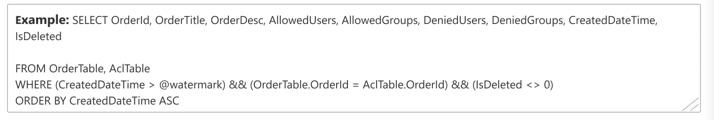
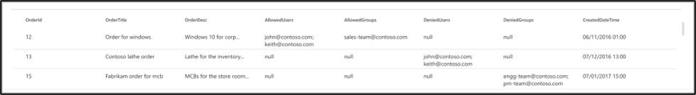
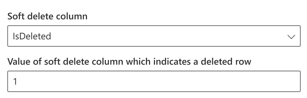
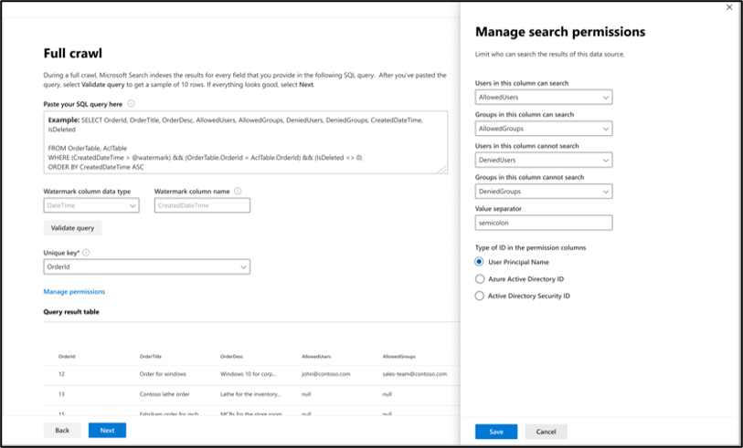

# Oracle SQL Microsoft Graph connector

The Oracle SQL Microsoft Graph connector allows your organization to discover and index data from an on-premises Oracle database. The connector indexes specified content in Microsoft Search and Microsoft Copilot 365. To keep the index up to date with source data, it supports periodic full and incremental crawls. With the Oracle SQL Microsoft Graph connector, you can also restrict access to search results for certain users.

This article is for anyone who configures, runs, and monitors an Oracle SQL Microsoft Graph connector. It supplements the general setup process and shows instructions that apply only to the Oracle SQL Microsoft Graph connector. It also includes information about [Troubleshooting](#troubleshooting) and [Limitations](#limitations).

## Before you get started

### Install the connector agent

In order to access your on-premises third-party data, you must install and configure the Microsoft Graph connector agent. For more information, see [Install the Microsoft Graph connector agent](graph-connector-agent.md).

## Step 1: Add a connector in the Microsoft 365 admin center

[Add the Oracle SQL Microsoft Graph connector](https://admin.microsoft.com/adminportal/home#/MicrosoftSearch/Connectors/add?ms_search_referrer=MicrosoftSearchDocs_OracleSqlConnector&type=OracleSqlConnector​)

Follow the general [setup instructions](./configure-connector.md).
<!---If the above phrase does not apply, delete it and insert specific details for your data source that are different from general setup instructions.-->

## Step 2: Name the connection

Follow the general [setup instructions](./configure-connector.md).
<!---If the above phrase does not apply, delete it and insert specific details for your data source that are different from general setup instructions.-->

## Step 3: Configure the connection settings

To connect your Oracle SQL Microsoft Graph connector to a data source, you must configure the database server you want to be crawled and the on-premises Microsoft Graph connector agent. You can then connect to the database with the required authentication method.

For the Oracle SQL Microsoft Graph connector, you need to specify the hostname, port, and service (database) name along with the preferred authentication method, username, and password.

If the service name is not available and you connect using SID, the service name can be derived using one of the following commands (to be executed as sys admin).
* select SERVICE_NAME from gv$session where sid in (select sid from v$MYSTAT);
* select sys_context('userenv','service_name') from dual;

> [!NOTE]
> Your database must run Oracle database version 11g or later for the connector to be able to connect. The connector supports the Oracle database hosted on Windows, Linux, and Azure VM platforms.

To search your database content, you must specify SQL queries when you configure the connector. These SQL queries need to name all the database columns that you want to index (that is, source properties), including any SQL joins that need to be performed to get all the columns. To restrict access to search results, you must specify Access Control Lists (ACLs) within SQL queries when you configure the connector.

## Step 3a: Full crawl (required)

In this step, you configure the SQL query that runs a full crawl of the database. The full crawl selects all the columns or properties where you want to select the options **Query**, **Search**, or **Retrieve**. You can also specify ACL columns to restrict access to search results to specific users or groups.

> [!Tip]
> To get all the columns that you need, you can join multiple tables.

### Select data columns (required) and ACL columns (optional)

The example demonstrates a selection of five data columns that hold the data for the search: orderId, orderTitle, orderDesc, createdDateTime, and isDeleted. To set view permissions for each row of data, you can optionally select these ACL columns: allowedUsers, allowedGroups, deniedUsers, and deniedGroups. For all these data columns you can select the options to **Query**, **Search**, or **Retrieve**.

Select data columns as shown in this example query.
 `SELECT OrderId, orderTitle, orderDesc, allowedUsers, allowedGroups, deniedUsers, deniedGroups, createdDateTime, isDeleted`.

To manage access to the search results, you can specify one or more ACL columns in the query. The SQL connector allows you to control access at per record level. You can choose to have the same access control for all records in a table. If the ACL information is stored in a separate table, you might have to do a join with those tables in your query.

The use of each of the ACL columns in the above query is described below. The following list explains the four **access control mechanisms**.

* **allowedUsers**: This option specifies the list of user IDs who can access the search results. In the following example, a list of users: john@contoso.com, keith@contoso.com, and lisa@contoso.com would only have access to a record with OrderId = 12.
* **allowedGroups**: This option specifies the group of users who can access the search results. In the following example, group sales-team@contoso.com would only have access to record with OrderId = 12.
* **deniedUsers**: This option specifies the list of users who do **not** have access to the search results. In the following example, users john@contoso.com and keith@contoso.com do not have access to the record with OrderId = 13, whereas everyone else has access to this record.
* **deniedGroups**: This option specifies the group of users who do **not** have access to the search results. In the following example, groups engg-team@contoso.com and pm-team@contoso.com do not have access to a record with OrderId = 15, whereas everyone else has access to this record.  

### Supported data types

This table summarizes the data types that are supported by the Oracle SQL Microsoft Graph connector. The table also summarizes the indexing data type for the supported SQL data type. To learn more about Microsoft Graph connectors supported data types for indexing, refer to the documentation on [property resource types](/graph/api/resources/property?preserve-view=true&view=graph-rest-beta#properties).

| Category | Source data type | Indexing data type |
| ------------ | ------------ | ------------ |
| Number datatype | NUMBER(p,0) | int64 (for p <= 18)   double (for p > 18). |
| Floating-point number datatype | NUMBER(p,s)   FLOAT(p) | double. |
| Date datatype | DATE   TIMESTAMP   TIMESTAMP(n) | datetime. |
| Character datatype | CHAR(n)   VARCHAR   VARCHAR2   LONG   CLOB   NCLOB | string. |
| Unicode character datatype | NCHAR   NVARCHAR | string. |
| RowID datatype | ROWID   UROWID | string. |

For any other data type currently not directly supported, the column needs to be explicitly cast to a supported data type.

### Watermark (required)

To prevent overloading the database, the connector batches and resumes full-crawl queries with a full-crawl watermark column. By using the value of the watermark column, each subsequent batch is fetched, and querying is resumed from the last checkpoint. Essentially this is a mechanism to control data refresh for full crawls.

Create query snippets for watermarks as shown in these examples:

* `WHERE (CreatedDateTime > @watermark)`. Cite the watermark column name with the reserved keyword `@watermark`. You can only sort the watermark column in ascending order.
* `ORDER BY CreatedDateTime ASC`. Sort on the watermark column in ascending order.

In the configuration shown in the following image, `CreatedDateTime` is the selected watermark column. To fetch the first batch of rows, specify the data type of the watermark column. In this case, the data type is `DateTime`.

The first query fetches the first **N** number of rows by using: "CreatedDateTime > January 1, 1753 00:00:00" (min value of DateTime data type). After the first batch is fetched, the highest value of `CreatedDateTime` returned in the batch is saved as the checkpoint if the rows are sorted in ascending order. An example is March 1, 2019 03:00:00. Then the next batch of **N** rows is fetched by using "CreatedDateTime > March 1, 2019 03:00:00" in the query.

### Skipping soft-deleted rows (optional)

To exclude soft-deleted rows in your database from being indexed, specify the soft-delete column name and value that indicates the row is deleted.

### Full crawl: Manage search permissions

Select **Manage permissions** to choose the various access control (ACL) columns that specify the access control mechanism. Select the column name you specified in the full crawl SQL query.

Each of the ACL columns is expected to be a multi-valued column. These multiple ID values can be separated by separators such as semicolon (;), comma (,), and so on. You need to specify this separator in the **value separator** field.

The following ID types are supported for use as ACLs:

* **User Principal Name (UPN)**: A User Principal Name (UPN) is the name of a system user in an email address format. A UPN (for example: john.doe@domain.com) consists of the username (login name), separator (the @ symbol), and domain name (UPN suffix).
* **Microsoft Entra ID**: In Microsoft Entra ID, every user or group has an object ID that looks something like 'e0d3ad3d-0000-1111-2222-3c5f5c52ab9b'
* **Active Directory (AD) Security ID**: In an on-premises AD setup, every user and group have an immutable, unique security identifier that looks something like 'S-1-5-21-3878594291-2115959936-132693609-65242.'

## Step 3b: Incremental crawl (optional)

In this optional step, provide a SQL query to run an incremental crawl of the database. With this query, the SQL connector determines any changes to the data since the last incremental crawl. As in the full crawl, select between the options **Query**, **Search**, or **Retrieve**. Specify the same set of ACL columns that you specified in the full crawl query.

The components in the following image resemble the full crawl components with one exception. In this case, "ModifiedDateTime" is the selected watermark column. Review the [full crawl steps](#step-3a-full-crawl-required) to learn how to write your incremental crawl query and see the following image as an example.

## Step 4: Assign property labels

Follow the general [setup instructions](./configure-connector.md).
<!---If the above phrase does not apply, delete it and insert specific details for your data source that are different from general setup instructions.-->

## Step 5: Manage schema

Follow the general [setup instructions](./configure-connector.md).
<!---If the above phrase does not apply, delete it and insert specific details for your data source that are different from general setup instructions.-->

## Step 6: Manage search permissions

You can choose to use the [ACLs specified in the full crawl screen](#full-crawl-manage-search-permissions) or you can override them to make your content visible to everyone.

## Step 7: Choose refresh settings

The Oracle SQL Microsoft Graph connector supports refresh schedules for both full and incremental crawls. We recommend that you set both.

A full crawl schedule finds deleted rows that were previously synced to the Microsoft Search index and any rows that moved out of the sync filter. When you first connect to the database, a full crawl runs to sync all the rows retrieved from the full crawl query. To sync new rows and make updates, you need to schedule incremental crawls.

## Step 8: Review connection

Follow the general [setup instructions](./configure-connector.md).
<!---If the above phrase does not apply, delete it and insert specific details for your data source that are different from general setup instructions.-->

<!--- ## Next steps: Customize the search results page

Create your own verticals and result types, so end users can view search results from new connections. Without this step, data from your connection won't show up on the search results page.

To learn more about how to create your verticals and MRTs, see [Search results page customization](customize-search-page.md). -->

## Limitations

The Oracle SQL Microsoft Graph connector has these limitations in the preview release:

* The on-premises database must run Oracle Database version 11g or later.
* ACLs are only supported by using a User Principal Name (UPN), Microsoft Entra ID, or Active Directory Security.
* Indexing rich content inside database columns is not supported. Examples of such content are HTML, JSON, XML, blobs, and document parsings that exist as links inside the database columns.

## Troubleshooting
After publishing your connection, you can review the status under the **Data sources** tab in the [admin center](https://admin.microsoft.com). To learn how to make updates and deletions, see [Manage your connector](manage-connector.md).
You can find troubleshooting steps for commonly seen issues [here](troubleshoot-oraclesql-connector.md).

If you have any other issues or want to provide feedback, write to us [aka.ms/TalkToGraphConnectors](https://aka.ms/TalkToGraphConnectors).

