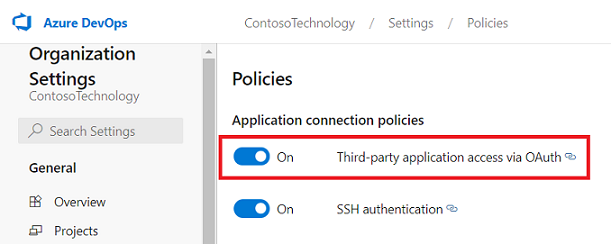
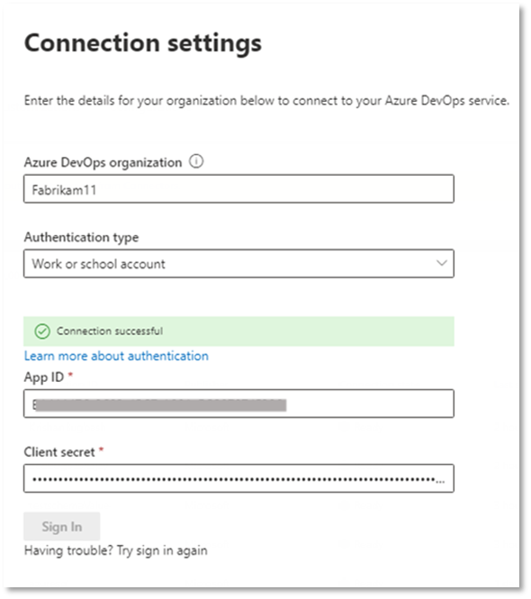
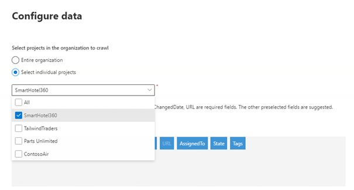
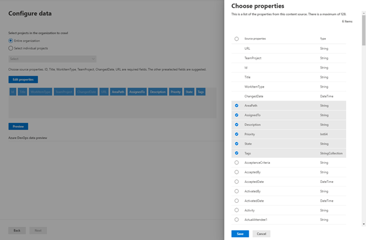

--- 
ms.date: 06/11/2020
title: "Azure DevOps Work Items Microsoft Graph connector for Microsoft Search" 
ms.author: mecampos 
author: mecampos 
manager: lsheppard 
audience: Admin
ms.audience: Admin 
ms.topic: article 
ms.service: mssearch 
ms.localizationpriority: medium 
search.appverid: 
- BFB160 
- MET150 
- MOE150 
description: "Set up the Azure DevOps Work Items Microsoft Graph connector for Microsoft Search" 
---
<!---Previous ms.author: shgrover --->

# Azure DevOps Work Items Microsoft Graph connector

The Azure DevOps Graph connector allows your organization to index work items in its instance of the Azure DevOps service. After you configure the connector and index content from Azure DevOps, end users can search for those items in Microsoft Search.

> [!NOTE]
> Read the [**Setup for your Microsoft Graph connector**](configure-connector.md) article to understand the general connectors setup instructions.

This article is for anyone who configures, runs, and monitors an Azure DevOps connector. It supplements the general setup process, and shows instructions that apply only for this connector.

>[!IMPORTANT]
>The Azure DevOps connector supports only the Azure DevOps cloud service. Azure DevOps Server 2019, TFS 2018, TFS 2017, TFS 2015, and TFS 2013 are not supported by this connector.

<!---## Before you get started-->
## Before you get started
You must be the admin for your organization's M365 tenant as well as the admin for your organization's Azure DevOps instance.

To allow the connector to connect to your Azure DevOps Organization, you must enable **Third-party application access via OAuth**. Refer Azure DevOps documentation to [manage security policies](/azure/devops/organizations/accounts/change-application-access-policies?view=azure-devops#manage-a-policy&preserve-view=true) to learn more.

You will need the following permissions granted to the user account whose credentials are used during the connector configuration:

| Permission name | Permission type | Required for |
| ------------ | ------------ | ------------ |
| View project-level information | [Project permission](/azure/devops/organizations/security/permissions?view=azure-devops&tabs=preview-page#project-level-permissions&preserve-view=true) | Crawling Azure DevOps Work Items. This permission is **mandatory** for the projects that need to be indexed. |
| _View analytics_ | [Project permission](/azure/devops/organizations/security/permissions?view=azure-devops&tabs=preview-page#project-level-permissions&preserve-view=true) | Crawling Azure DevOps Work Items. This permission is **mandatory** for the projects that need to be indexed. |
| _View work items in this node_ | [Area path](/azure/devops/organizations/security/permissions?view=azure-devops&tabs=preview-page#area-path-object-level&preserve-view=true) | Crawling Work Items in an area path. This permission is **optional**. Only those area paths will be crawled for which the user account has permissions. |

>[!IMPORTANT]
>The user account must have **Basic** access level. To learn more about access levels in Azure DevOps, read [supported access levels](/azure/devops/organizations/security/access-levels?view=azure-devops#supported-access-levels&preserve-view=true).

## Step 1: Add a connector in the Microsoft 365 admin center

[Add Azure DevOps connector](https://admin.microsoft.com/adminportal/home#/MicrosoftSearch/Connectors/add?ms_search_referrer=MicrosoftSearchDocs_AzureDevOps&type=AzureDevOps)

(See general [setup instructions](./configure-connector.md) for more details)
<!---If the above phrase does not apply, delete it and insert specific details for your data source that are different from general setup 
instructions.-->

## Step 2: Name the connection

Follow the general [setup instructions](./configure-connector.md).
<!---If the above phrase does not apply, delete it and insert specific details for your data source that are different from general setup 
instructions.-->

## Step 3: Configure the connection settings

To connect to your Azure DevOps instance, you need your Azure DevOps [organization](/azure/devops/organizations/accounts/create-organization) name, its App ID, and client secret for OAuth authentication.

### Register an app

Register an app in Azure DevOps so that the Microsoft Search app can access the instance. To learn more, see Azure DevOps documentation on how to [register an app](/azure/devops/integrate/get-started/authentication/oauth?preserve-view=true&view=azure-devops#register-your-app).

The following table provides guidance on how to fill out the app registration form:

Mandatory Fields | Description | Recommended Value
--- | --- | ---
| Company Name         | The name of your company. | Use an appropriate value   |
| Application name     | A unique value that identifies the application that you're authorizing.    | Microsoft Search     |
| Application website  | The URL of the application that will request access to your Azure DevOps instance during connector setup. (Required).  | For **M365 Enterprise**: https://gcs.office.com/,  For **M365 Government**: https://gcsgcc.office.com/
| Authorization callback URL        | A required callback URL that the authorization server redirects to. | For **M365 Enterprise**: https://gcs.office.com/v1.0/admin/oauth/callback,  For **M365 Government**: https://gcsgcc.office.com/v1.0/admin/oauth/callback |
| Authorized scopes | The scope of access for the application | Select the following scopes: Identity (read), Work Items (read), Variable Groups (read), Project and team (read), Graph (read), Analytics (read)|

>[!IMPORTANT]
>The authorized scopes that you select for the app should match the scopes exactly as listed above. If you omit one of the authorized scopes in the list, or add another scope, the authorization will fail.

On registering the app with the details above, you'll get the **App ID** and **Client Secret** that will be used to configure the connector.

>[!NOTE]
>To revoke access to any app registered in Azure DevOps, go to User settings at the right top of your Azure DevOps instance. Select Profile and then select Authorizations in the Security section of the side pane. Hover over an authorized OAuth app to see the Revoke button at the corner of the app details.

### Connection settings

After registering the Microsoft Search app with Azure DevOps, you can complete the connection settings step. Enter your organization name, App ID, and Client secret.

### Configure data: select projects and fields

You can choose for the connection to index either the entire organization or specific projects.

If you choose to index the entire organization, items in all projects in the organization will get indexed. New projects and items will be indexed during the next crawl after they're created.

If you choose individual projects, only work items in those projects will be indexed.

> [!NOTE]
> Azure DevOps projects can be crawled after granting them the _View project-level information_ and _View analytics_ permissions.

Next, select which fields you want the connection to index and preview data in these fields before proceeding.

## Step 4: Manage search permissions

The Azure DevOps connector supports search permissions visible to **Only people with access to this data source** or **Everyone**. If you choose **Only people with access to this data source**, indexed data will appear in the search results for users who have access to them based on permissions to users or groups at the Organization, Project or Area path level in Azure DevOps. If you choose **Everyone**, indexed data will appear in the search results for all users.

## Step 5: Assign property labels

Follow the general [setup instructions](./configure-connector.md).

## Step 6: Manage schema

Follow the general [setup instructions](./configure-connector.md).

## Step 7: Choose refresh settings

The Azure DevOps connector supports refresh schedules for both full and incremental crawls.
The recommended schedule is one hour for an incremental crawl and one day for a full crawl.

## Step 8: Review connection

Follow the general [setup instructions](./configure-connector.md).

>[!TIP]
>**Default Result type**
>* The Azure DevOps connector automatically registers a [result type](./customize-search-page.md#step-2-create-result-types) once the connector is published. The result type uses a dynamically generated [result layout](./customize-results-layout.md) based on the fields selected in step 3. 
>* You can manage the result type by navigating to [**Result types**](https://admin.microsoft.com/Adminportal/Home#/MicrosoftSearch/resulttypes) in the [Microsoft 365 admin center](https://admin.microsoft.com). The default result type will be named as "`ConnectionId`Default". For example, if your connection id is `AzureDevOps`, your result layout will be named: "AzureDevOpsDefault"
>* Also, you can choose to create your own result type if needed.

<!---If the above phrase does not apply, delete it and insert specific details for your data source that are different from general setup 
instructions.-->

<!---## Limitations-->
<!---Insert limitations for this data source-->

## Troubleshooting
After publishing your connection, you can review the status under the **Data Sources** tab in the [admin center](https://admin.microsoft.com). To learn how to make updates and deletions, see [Manage your connector](manage-connector.md).
You can find troubleshooting steps for commonly seen issues [here](troubleshoot-azure-devops-connector.md).

If you have any other issues or want to provide feedback, reach out to us at [Microsoft Graph | Support](https://developer.microsoft.com/en-us/graph/support)
