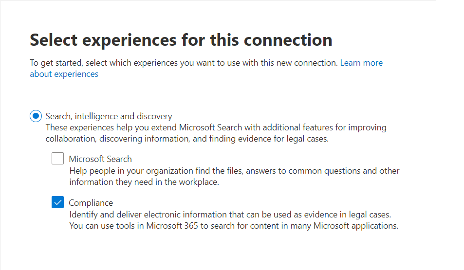
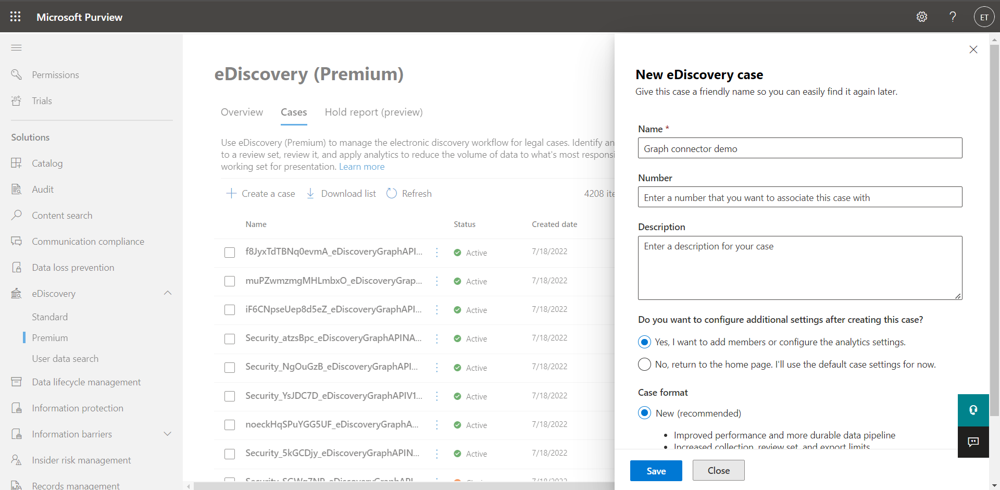
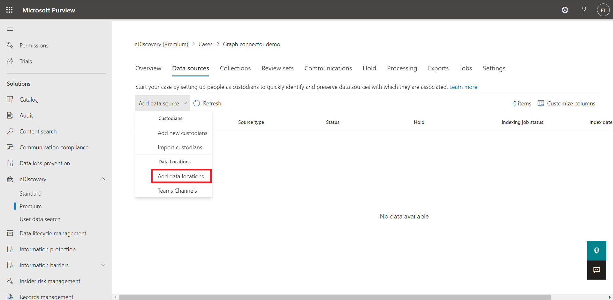
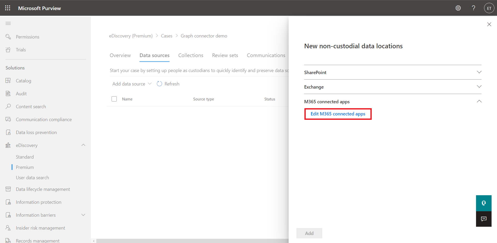
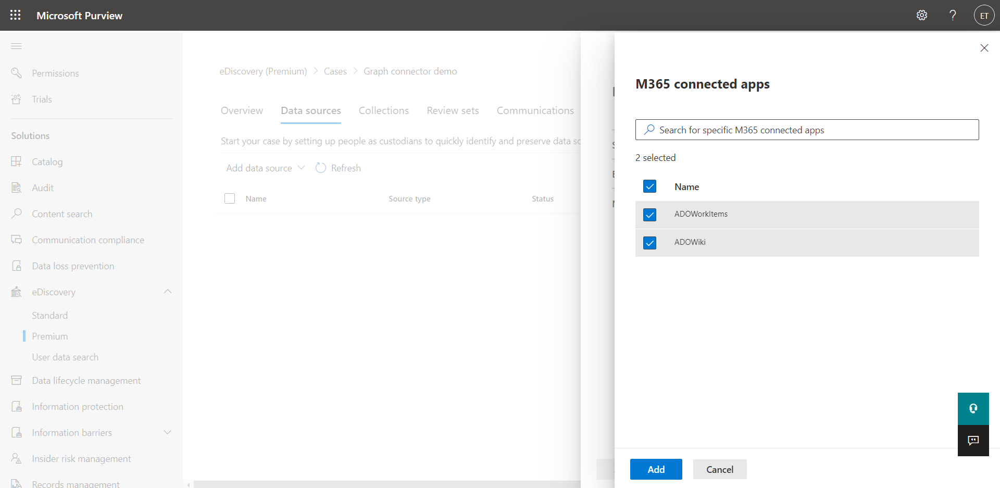
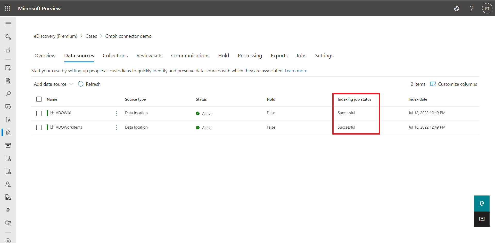
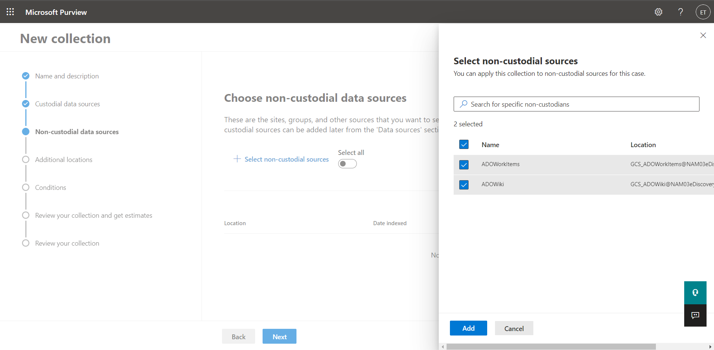
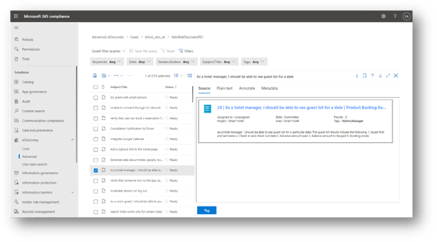

--- 

title: "Compliance solutions with Microsoft Graph connectors" 

ms.author: vivg 
author: vivg 
manager: harshkum 
audience: Admin
ms.audience: Admin 
ms.topic: article 
ms.service: mssearch 
localization_priority: Normal 
search.appverid: 
- BFB160 
- MET150 
- MOE150 
description: "Microsoft Graph connectors overview for eDiscovery" 
ms.date: 07/18/2022
---

# Microsoft Graph connectors overview for eDiscovery (Preview)

Electronic discovery, or eDiscovery, is the process of identifying and delivering electronic information that can be used as evidence in legal cases. You can use eDiscovery tools in Microsoft Purview to search for content in [Microsoft 365](https://www.microsoft.com/microsoft-365). With Microsoft Graph connectors, your organization can index third-party data and include it in an eDiscovery premium case for Collection, Review and Export.

This article is intended to help Microsoft 365 administrators set up Graph connectors for eDiscovery.

## Before you get started
* To access and manage your Microsoft Graph connectors, you must be designated as a **search administrator** for your tenant. For more information, see [Assign admin roles](/office365/admin/add-users/assign-admin-roles).
* **eDiscovery premium** is required to include Graph connector content in a case. 

## Supported data sources

### Microsoft Graph connectors

You can connect to the following data sources by using connectors created by Microsoft:

<!---Add links below when new docs are created--->
* [Azure DevOps Work Items](azure-devops-connector.md)
* [Azure DevOps Wiki](azure-devops-wiki-connector.md)

## Graph connector configuration steps for eDiscovery
Complete the following steps to configure any of the Microsoft Graph connectors:

1. Sign in to your admin account in the [Microsoft 365 admin center](https://admin.microsoft.com).

2. In the navigation pane, select **Settings**, and then select **Search & intelligence**. Select the [Data sources tab](https://admin.microsoft.com/Adminportal/Home#/MicrosoftSearch/Connectors).

3. Select **+Add**, and then select any [eDiscovery supported data source](#supported-data-sources) of your choice from the menu of available options.

4. In the **Select experiences** step, choose **Compliance** under **Search, intelligence and discovery**.

> [!NOTE]
> 
> You can choose both **Microsoft Search** and **Compliance** options for the connection.

5. Read the [Setup your Microsoft Graph connector](configure-connector.md) article to understand the general connectors setup instructions. Complete the connector setup and publish the connection.

## eDiscovery on Graph connector content

### Add Graph Connector as a data source within a case

Once Graph Connectors are established for an organization and eDiscovery is enabled, the option to add the Graph Connector data source to the case will be available under non-Microsoft 365 locations. Only the connectors that have been established and enabled will be available to the eDiscovery manager for inclusion in a case.  

Complete the following steps to create a case:

1. Go to <a href="https://go.microsoft.com/fwlink/p/?linkid=2077149" target="_blank">compliance portal</a> and sign in using the credentials for user account that has been assigned eDiscovery permissions. Members of the Organization Management role group can also create eDiscovery (Premium) cases.

2. In the left navigation pane of the compliance portal, click **Show all**, and then select **eDiscovery** > **Premium**, and then select the  <a href="https://go.microsoft.com/fwlink/p/?linkid=2173764" target="_blank">**Cases** tab</a>.

3. Select **Create a case**.

4. On the **New eDiscovery case** flyout page, give the case a name (required), and then type an optional case number and description. The case name must be unique in your organization.

5. Click **Save** to create the case.

6. Select **Data sources** tab. Click **Add data source** and select **Add data locations**.

7. Under **M365 connected apps** and click **Edit M365 connected apps**.

8. Select the connections you want to add and click **Add**.

9. Click **Add**.

10. Wait until the **Indexing job status** is changed to *Successful*.

> [!NOTE]
> 
> For detailed guidance to create and manage a Microsoft Purview eDiscovery (Premium) case, refer documentation to [create and manage eDiscovery (Premium) cases in Microsoft 365](/microsoft-365/compliance/create-and-manage-advanced-ediscoveryv2-case)

### Collect Graph Connectors content 

Upon adding Graph Connectors content as a data source, this content is then available for search and collection. Within the collection wizard, select the Graph Connector content as a **non-custodial data source**, use conditions such as date range, keywords and more to search across the connected content to collect only the content of interest. Upon completion of the wizard get estimates for the amount of content that contains hits to your search criteria, and commit the collection to the review set.

### Review content 

Once collected to a review set, eDiscovery managers can review content from Graph Connectors to understand more about the content, and work to assess if the information is critical and relevant to the case.

### Export content 

Once validated that the content collected into review is the correct content, this content is then available for export from the review set directly. Select export options and submit the export job for the Connectors content to be exported from the review set. 

<!---## Troubleshooting-->
<!---Insert troubleshooting recommendations-->

## Limitations

1. Reviewing sample of graph connectors content is not supported.

2. Placing graph connectors content on legal hold as part of eDiscovery case is not supported.

## Resources

[Use Graph connectors with eDiscovery (Premium)](/microsoft-365/compliance/ediscovery-graph-connector)
