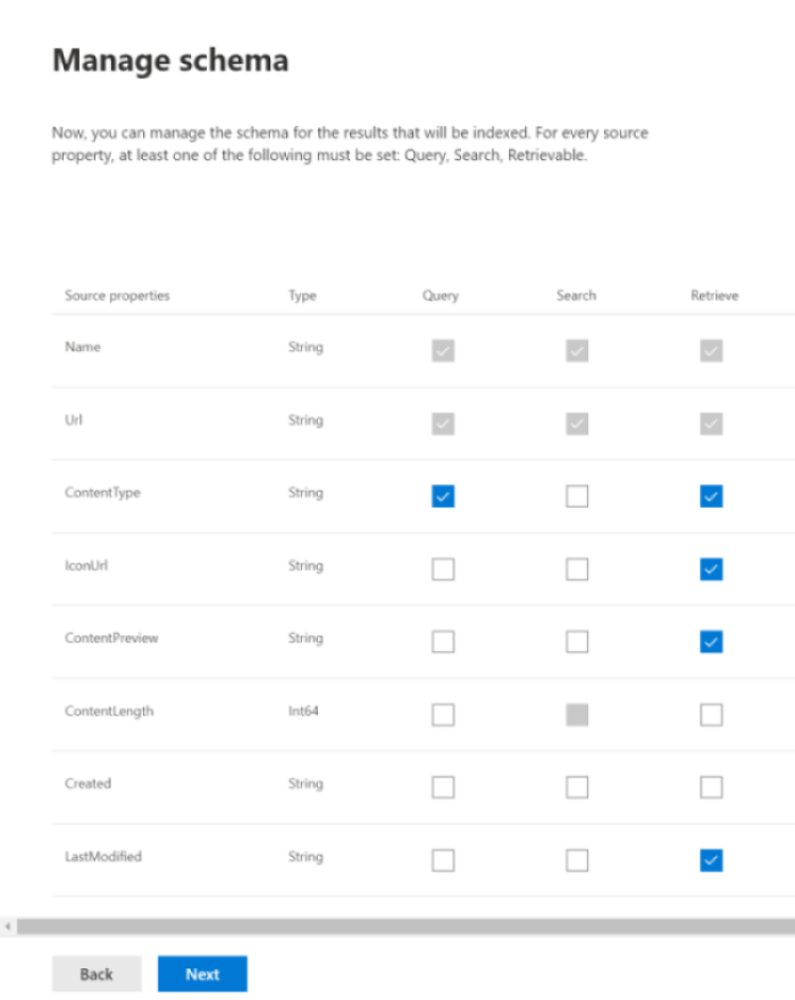

<!-- markdownlint-disable no-trailing-punctuation -->

# General setup instructions for Graph connectors by Microsoft 

This article summarizes the basic process required to use the [Microsoft 365 admin center](https://admin.microsoft.com) to setup any of the Graph connectors by Microsoft. The basic process includes the following steps:  
<!---Add links to each section in the doc--->

1. Add a Graph connector in the Microsoft 365 admin center.
2. Name the connection.
3. Configure the connection settings.
4. Manage search permissions.
5. Assign property labels.
6. Manage schema.
7. Choose refresh settings.
8. Review the connection.

It is important to note that the setup process is very similar for all the Graph connectors by Microsoft but is not exactly the same. **In addition to reading this article, be sure to read the connector-specific for your data source.**  

## Step 1: Add a Graph connector in the Microsoft 365 admin center

Complete the following steps to configure any of the Microsoft-built connectors.

1. Sign into your admin account in the [Microsoft 365 admin center](https://admin.microsoft.com)
2. Go to the [Connectors tab](https://admin.microsoft.com/Adminportal/Home#/MicrosoftSearch/Connectors) by selecting **Settings**, then **Search & intelligence** in the navigation menu.
3. Select **+Add**.
4. Select the data source of your choice from the menu of available options.

>[!Note:] You can add a maximum of ten Graph connections to each tenant.

## Step 2: Name the connection
You will need to specify these attributes: 

* Name  
* Connection ID 
* Description (optional) 

The connection ID creates implicit properties for your connector. It must contain only alphanumeric characters and be a maximum of 32 characters. 

## Step 3: Configure the connection settings

The process to configure the Connection settings varies based on the type of data source. See the Connector-specific information for the type of data source you want to add to your tenant to complete this step in the setup process.  

To learn more about connecting to an on-premises data source, see [Install an on-premises data gateway](https://aka.ms/configuregateway).

## Step 4: Manage search permissions

Access Control Lists (ACLs) determine which users in your organization can access each item of data.  

Some connectors like [Microsoft SQL](MSSQL-connector.md) and [Azure Data Lake Storage Gen2](azure-data-lake-connector.md) natively support [Azure Active Directory (Azure AD)](https://docs.microsoft.com/azure/active-directory/) ACLs.

Other connectors like [ServiceNow](servicenow-connector.md), [Azure DevOps](azure-devops-connector.md), and [Salesforce](salesforce-connector.md) support syncing of non-Azure AD users and groups.  

## Step 5: Assign property labels
You can assign semantic labels to your source properties on the "Assign property labels" page. Labels are well known tags provided by Microsoft that provide semantic meaning. They allow Microsoft to integrate your connector data into Microsoft 365 experiences such as enhanced search, people cards, intelligent discovery, and more.  

The following table lists the currently supported labels and their descriptions.  

Label | Description
--- | ---  
**title** | The title for the item that you want shown in search and other experiences 
**url** | The target url of the item in the source system 
**createdBy** | Name of the person who created the item 
**lastModifiedBy** | Name of the person who most recently edited the item 
**authors** | Name of the people who participated/collaborated on the item 
**createdDateTime** | When was the item created 
**lastModifiedDateTime** | When was the item most recently edited 
**fileName** | Name of the file item 
**fileExtension** | Type of file item such as .pdf or .word 

The properties on this page are pre-selected based on your data source, but you can change this selection if there is a different property that is better suited for a particular label.  

The label **title** is the most important label. It is **strongly recommended** that you have a property assigned to this label in order for your connection to participate in the [result cluster experience](result-cluster.md).

Incorrectly mapping labels will cause a deteriorated search experience. It is okay for some labels to not have a property assigned to it.  

## Step 6: Manage schema

### Content property

It is strongly recommended that you select a **Content Property" from the drop-down menu of options, or keep the default if one is present. This property is used for full-text indexing of content, search results page snippet generation, [result cluster](result-cluster.md) participation, language detection, HTML/text support, ranking and relevance, and query formulation.

If you select a content property, you will have the option of using the system-generated property **ResultSnippet** when you [create your result type](customize-results-layout.md). This property serves as a placeholder for the dynamic snippets that are generated from the content property at query time. If you use this property in your result type, snippets will be generated in your search results.

### Creating aliases for source properties

You can add aliases to your properties under the "Alias" column on the "Manage schema" page. Aliases are friendly names for your properties. They are used in queries and in the creation of filters. They are also used to normalize source properties from multiple connections such that they have the same name. That way you can create a single filter for a vertical with multiple connections. See [Customize the search results page](customize-search-page.md) for more information.  

### Search schema attributes

You can set the search schema attributes to control search functionality of each source property. A search schema helps determine what results display on the search results page and what information end users can view and access.

Search schema attributes include **searchable**, **queryable**, **retrievable**, and **refinable**. The following table lists each of the attributes that Microsoft Graph connectors support and explains their functions.

Search schema attribute | Function | Example
--- | --- | ---
SEARCHABLE | Makes the text content of a property searchable. Property contents are included in the full-text index. | If the property is **title**, a query for **Enterprise** returns answers that contain the word **Enterprise** in any text or title.
QUERYABLE | Searches by query for a match for a particular property. The property name can then be specified in the query either programmatically or verbatim. |  If the **Title** property is queryable, then the query **Title: Enterprise** is supported. 
RETRIEVABLE | Only retrievable properties can be used in the result type and display in the search result. |
REFINABLE | Refinable properties can be used as in the Microsoft Search results page. | Users in your organization can [filter](custom-filters.md) by **lastModifiedDateTime** in the search results page if the property is marked refinable during connection setup

For all connectors except the File share connector, custom types must be set manually. To activate search capabilities for each field, you need a search schema mapped to a list of properties. The connection wizard automatically selects a search schema based on the set of source properties you choose. You can modify this schema by selecting the check boxes for each property and attribute in the search schema page.

 
### Restrictions and recommendations for search schema settings

* The **content** property is searchable only. Once selected in the dropdown, this property cannot be marked **retrievable** or **queryable**.

* Significant performance issues occur when search results render with the **content** property. An example is the **Text** content field for a [ServiceNow](https://www.servicenow.com) knowledge-base article.

* Only properties marked as retrievable render in the search results and can be used to create modern result types (MRTs).

* Only string properties can be marked searchable.

> [!NOTE]
> After you create a connection, you **can't** modify the schema. To do that, you need to delete your connection and create a new one.

## Step 7: Refresh settings

The refresh interval determines how often your data is synced between the data source and Microsoft Search. Each type of data source has a different set of optimal refresh schedules based on how often data is modified and the type of modifications.

There are two types of refresh intervals, which are **Full refresh** and **Incremental refresh**, but incremental refreshes are not available for some data sources.

With a full refresh, the search engine processes and indexes every item in the content source, regardless of previous crawls. A full refresh works best for these situations:

* Detecting deletions of data.
* The incremental refresh failed to update content due to errors.
* ACLs were modified.
* Crawl rules were modified.
* When schema for the connection has been updated (schema updates are not yet supported)

With an **Incremental refresh**, the search engine can process and index only the items that were created or modified since the last successful crawl. Therefore, not all the data in the content source is re-indexed. Incremental refreshes work best to detect content, metadata, permission, and other updates.

Incremental refreshes are much faster than full refreshes because unchanged items aren’t processed. However, if you choose to run incremental refreshes, you will still need to run full refreshes periodically to maintain an accurate data sync between the content source and the search index.

<!---Change screenshot for one that shows both options in new UI (try ServiceNow)--->

## Step 8: Review connection

You can review your entire configuration and edit settings as needed before completing the connection. **Be sure to read the connector-specific information for your data source if you have not already done so.** Select **Finish updating** when you are ready to complete the connection.

## How do I know the connection setup worked?

Go to the list of your published connections under the **Connectors** tab in the [admin center](https://admin.microsoft.com). To learn how to make updates and deletions, see [Manage your connector](manage-connector.md).
