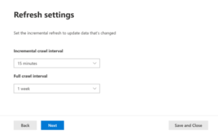

<!-- Previous ms.author: monaray -->

<!-- markdownlint-disable no-trailing-punctuation -->

# Set up Microsoft Graph connectors in the Microsoft 365 admin center

This article shows the basic process required to set up Microsoft Graph connectors in the [Microsoft 365 admin center](https://admin.microsoft.com). The basic process includes the following steps:

1. [Add a Microsoft Graph connector in the Microsoft 365 admin center](#step-1-add-a-graph-connector-in-the-microsoft-365-admin-center)
2. [Name the connection](#step-2-name-the-connection)
3. [Configure the connection settings](#step-3-configure-the-connection-settings)
4. [Select properties](#step-4-select-properties)
5. [Manage search permissions](#step-5-manage-search-permissions)
6. [Assign property labels](#step-6-assign-property-labels)
7. [Manage schema](#step-7-manage-schema)
8. [Refresh settings](#step-8-refresh-settings)
9. [Review connection](#step-9-review-connection)

This article also includes the following information:

* [Troubleshooting](#troubleshooting)
* [Limitations](#limitations)
* [Next steps](#next-steps)

> [!NOTE]
> The setup process is similar for all the Microsoft Graph connectors but is not exactly the same. In addition to reading this article, be sure to read the connector-specific information for your data source.

<!---## Before you get started-->

<!---Insert "Before you get started" recommendations for this data source-->

## Step 1: Add a Microsoft Graph connector in the Microsoft 365 admin center

Complete the following steps to configure any of the Microsoft Graph connectors:

1. Sign into your admin account in the [Microsoft 365 admin center](https://admin.microsoft.com).

2. In the navigation pane, select **Settings**, and then select **Search & intelligence**. Select the [Data sources tab](https://admin.microsoft.com/Adminportal/Home#/MicrosoftSearch/Connectors).

3. Select **+Add**, and then select the data source of your choice from the menu of available options.

   > [!div class="mx-imgBorder"]
   > 

> [!NOTE]
> You can add a maximum of ten Microsoft Graph connections to each tenant.

## Step 2: Name the connection

Specify these attributes:

* Name (required)
* Connection ID (required)
* Description (optional)
* Select check box (required)

The connection ID creates implicit properties for your connector. It must contain only alphanumeric characters and be a maximum of 32 characters.

## Step 3: Configure the connection settings

The process to configure the connection settings varies based on the type of data source. For the type of data source to add to your tenant to complete this step in the setup process, see the [Connector-specific information](/microsoftsearch/servicenow-connector#step-31-basic-authentication).

To learn more about connecting to an on-premises data source, see [Set up the Microsoft Graph Connector Agent](/microsoftsearch/graph-connector-agent).

## Step 4: Select properties

You can choose the properties that are indexed by Microsoft Search.

The ServiceNow query can be used to filter your data before it is indexed by Microsoft Search; this gives you more control over the data that can be searched. For more information, see [Learn about ServiceNow queries](https://go.microsoft.com/fwlink/?linkid=2151447).

## Step 5: Manage search permissions

Access control lists (ACLs) determine which users in your organization can access each item.  

Some connectors such as [Microsoft SQL](MSSQL-connector.md) and [Azure Data Lake Storage Gen2](azure-data-lake-connector.md) natively support [Azure Active Directory (Azure AD)](/azure/active-directory/) ACLs.

Other connectors such as [ServiceNow Knowledge](servicenow-knowledge-connector.md), [ServiceNow Catalog](servicenow-catalog-connector.md), [Azure DevOps](azure-devops-connector.md), and [Salesforce](salesforce-connector.md) support syncing of non-Azure AD users and groups.  

Selecting everyone allows everyone in your organization to see search results from this data source.

## Step 6: Assign property labels

You can assign semantic labels to your source properties on the "Assign property labels" page. Labels are well-known tags provided by Microsoft that provide semantic meaning. They allow Microsoft to integrate your connector data into Microsoft 365 experiences such as enhanced search, people cards, intelligent discovery, and more.  

The following table lists the currently supported labels and their descriptions.  

Label | Description
--- | ---  
**title** | The title for the item that you want shown in search and other experiences
**url** | The target URL of the item in the source system
**Created By** | Name of the person who created the item
**Last modified by** | Name of the person who most recently edited the item
**Authors** | Name of the people who participated/collaborated on the item
**Created date time** | Time when the item was created
**Last modified date time** | Time when the item was most recently edited
**File name** | Name of the file item
**File extension** | Type of file item such as .pdf or .word

The properties on this page are pre-selected based on your data source, but you can change this selection if there's a different property that is better suited for a particular label.  

The label **title** is the most important label. We *strongly recommend* that you have a property assigned to this label for your connection to participate in the [result cluster experience](result-cluster.md).

Incorrectly mapping labels causes a deteriorated search experience. It's okay for some labels to not have a property assigned to it.  

## Step 7: Manage schema

### Content property

We recommend that you select a **Content Property** from the drop-down menu of options, or keep the default if one is present. This property is used for full-text indexing of content, search results page snippet generation, [result cluster](result-cluster.md) participation, language detection, HTML/text support, ranking and relevance, and query formulation.

If you select a content property, you have the option of using the system-generated property **ResultSnippet** when you [create your result type](customize-results-layout.md). This property serves as a placeholder for the dynamic snippets that are generated from the content property at query time. If you use this property in your result type, snippets are generated in your search results.

### Aliases for source properties

You can add aliases to your properties under the "Alias" column on the "Manage schema" page. Aliases are friendly names for your properties. They are used in queries and in the creation of filters. They're also used to normalize source properties from multiple connections such that they have the same name. That way you can create a single filter for a vertical with multiple connections. For more information, see [Customize the search results page](customize-search-page.md).  

### Search schema attributes

You can set the search schema attributes to control the search functionality of each source property. A search schema helps determine what results display on the search results page and what information end users can view and access.

Search schema attributes include options to **Query**, **Search**, **Retrieve**, and **Refine**. The following table lists each of the attributes that Microsoft Graph connectors support and explains their functions.

Search schema attribute | Function | Example
--- | --- | ---
SEARCH | Makes the text content of a property searchable. Property contents are included in the full-text index. | If the property is **title**, a query for **Enterprise** returns answers that contain the word **Enterprise** in any text or title.
QUERY | Searches by query for a match for a particular property. The property name can then be specified in the query either programmatically or verbatim. |  If the **Title** property can be queried, then the query **Title: Enterprise** is supported.
RETRIEVE | Only retrievable properties can be used in the result type and displayed in the search result. |
REFINE | The refine option can be used as on the Microsoft Search results page. | Users in your organization can [filter](custom-filters.md) by **URL** on the search results page if the refine property is marked during connection setup.

For all connectors except the File share connector, custom types must be set manually. To activate search capabilities for each field, you need a search schema mapped to a list of properties. The connection wizard automatically selects a search schema based on the set of source properties you choose. You can modify this schema by selecting the check boxes for each property and attribute on the search schema page.

:::image type="content" alt-text="Schema for a connector can be customized by adding or removing Query, Search, and Retrieve functions." source="media/manageschema.png" lightbox="media/manageschema.png":::

### Restrictions and recommendations for search schema settings

* The **content** property is searchable only. After you select it in the dropdown, this property cannot be used with the options **retrieve** or **query**.

* Significant performance issues occur when search results render with the **content** property. An example is the **Text** content field for a [ServiceNow](https://www.servicenow.com) knowledge-base article.

* Only properties marked as retrievable render in the search results and can be used to create modern result types (MRTs).

* Only string properties can be marked searchable.

> [!NOTE]
> After you create a connection, you *can't* modify the schema. To do that, you need to delete your connection and create a new one.

## Step 8: Refresh settings

The refresh interval determines how often your data is synced between the data source and Microsoft Search. Each type of data source has a different set of optimal refresh schedules based on how often data is modified and the type of modifications.

There are two types of refresh intervals, **Full refresh** and **Incremental refresh**, but incremental refreshes aren't available for some data sources.

With a full refresh, the search engine processes and indexes the items that have changed in the content source, regardless of previous crawls. A full refresh works best for these situations:

* Detecting deletions of data.
* The incremental refresh found errors, and failed.
* ACLs were modified.
* Crawl rules were modified.
* The schema for the connection has been updated (schema updates aren't yet supported).

With an **Incremental refresh**, the search engine can process and index only the items that were created or modified since the last successful crawl. As a result, not all the data in the content source is reindexed. Incremental refreshes work best to detect content, metadata, permission, and other updates.

> [!NOTE]
> Incremental crawls do not currently support processing of updates to **permissions**.

Incremental refreshes are much faster than full refreshes because unchanged items aren't processed. However, if you choose to run incremental refreshes, you still need to run full refreshes periodically to maintain correct data sync between the content source and the search index.

> [!div class="mx-imgBorder"]
> 

<!---Change screenshot for one that shows both options in new UI (try ServiceNow)--->

## Step 9: Review connection

You can review your entire configuration and edit settings as needed before completing the connection. *Be sure to read the connector-specific information for your data source if you haven't already done so.* When you're ready to complete the connection, select **Finish updating**.

### Confirm if the connection setup worked

Go to the list of your published connections under the **Connectors** tab in the [admin center](https://admin.microsoft.com). To learn how to make updates and deletions, see [Monitor your connections](manage-connector.md).

## Troubleshooting
<!---Insert troubleshooting recommendations for this data source-->
Read the connector-specific information for your data source.

> [!NOTE]
> Currently, not all connector-specific articles include troubleshooting recommendations.

## Limitations
<!---Insert limitations for this data source-->
To learn about limitations that apply to all data sources, see the [Overview of Microsoft Graph connectors](connectors-overview.md) article.

See the connector-specific information for your data source to find out if other limitations apply to that particular Microsoft Graph connector.

## Next steps

After publishing the connection, you need to customize the search results page with verticals and result types. To learn about customizing search results, review how to [manage verticals](manage-verticals.md) and [result types](manage-result-types.md).
