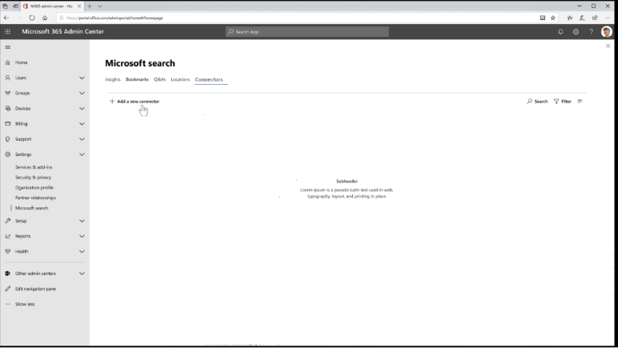

# Configure your built-in connector in the M365 admin portal

The purpose of this article is to guide search administrators through the general steps of configuring a Microsoft built-in connector. The steps outline the general flow of setting up your connector in the Microsoft 365 search admin portal. However, more detailed information with regards to setting up a specific Microsoft built-in connector can be found at the following links:

* [Azure data lake storage gen2](azure-data-lake-connector.md)
* [Enterprise website](enterprise-web-connector.md)
* [File share](file-share-connector.md)
* [MediaWiki](mediawiki-connector.md)
* [Microsoft SQL](MSSQL-connector.md)
* [ServiceNow](servicenow-connector.md)

## Get Started
For any of the Microsoft built-in connectors, you can begin configuring your connector by going to the Microsoft 365 admin portal. 

1.	In the [Microsoft 365 admin center](https://admin.microsoft.com), log into your account using the credentials of your M365 test tenant.
2.	Go to **Settings** > **Microsoft Search** > **Connectors**. 
3.	Select **Add a connector**.

4.	From the list of available connectors, select the connector of your choice.

## Step 1: Name the connector
When you first create a connection, you must specify:
1.	Name of the connection
2.	Description (optional)

The connection ID will be automatically generated based on the name you provide and is used for creating implicit properties. If you want to change the connection ID, it must only comprise of alphanumeric characters. Illegal characters include _________. 

## Step 2: Connect to data source
Based on the type of connector, the data connection process will vary. See [configure your gateway](configure-gateway.md) to learn more about connecting to your on-premises data source.

## Step 3: Select source properties 
Source properties are the data fields from your third-party data source that are ingested into the Microsoft Search index. However, you do have the option to modify this selection if you choose to do so by selecting “Edit properties” in the side bar. You can only select **up to 64 source properties**. 

## Step 4: Search schema
For all the connectors except the File-Share connector, user-defined-types (UDTs) must be manually determined. Thus a search schema is required to enable search capabilities for each field. We support searchable, queryable, and retrievable properties. To learn more about these properties, see the [connector concepts](connectors-concepts.md) section. 

The connection wizard will automatically select a search schema based on the set of source properties you choose. However, you can modify this schema before proceeding to the next step. 

Things to keep in mind:
* For connectors that ingest UDTs, we recommend **NOT** marking the field containing the main content retrievable. If selected, significant performance issues will occur when rendering the search results. A content field for a ServiceNow knowledge-based article for example would be the “Text” field; this field should not be marked retrievable. 
* Only properties marked retrievable can be rendered in the search results and utilized to create your modern result types (MRTs). 
* Only string properties can be marked searchable. if ingesting a knowledge-based article 

> [!NOTE]
> Once a connection is created, you **cannot** modify the schema. If you choose to do so, you must delete your connection and reinstate a new one. 

## Step 5: Manage search permissions (ACLs)
ACLs stands for Access Control Lists which determine who in your organization has access to each item of data. The file share connector only supports ACLs that can be mapped to the [Azure active directory (AAD)](https://docs.microsoft.com/en-us/azure/active-directory/). The rest of our connectors supports search permissions that are made visible to everyone.  
## Step 6: Set refresh schedule
The refresh schedule determines how often your data in the Microsoft Search index is synced with your original data store. This is done in two ways: with a full crawl and an incremental crawl.
* A **_full crawl_** allows the search engine to process and index every item in the content source, regardless of the previous crawls. It is primarily used for these situations:
    * Detecting deletions of data 
    * The incremental crawl failed to crawl content for errors
    * A software update for Microsoft Search is required
    *The search schema has been modified 
    * ACLs have been modified 
    * Crawl rules have been modified
* An **_incremental crawl_** allows the search engine to process and index only the items which have been newly created or modified since the last successful crawl. This means that not all the data in the content source is re-indexed. It is primarily used for to detect content updates, metadata updates, permission updates, and so on.

An incremental crawl takes much less time since unchanged items are not processed. However, we need both to execute periodically to ensure an accurate data sync between the content source and the search index. 

Each type of connector warrants a different default refresh schedule based on how often the data is typically modified and what types of modifications are made to the content. To find our more information about the default crawl schedules, see the special connector topic pages. 

## Step 7: Review connector settings
After you have set up all the settings to configure your connector, the admin portal will take you to a page that allows you to review your configuration. You are allowed to go back through the configuration process to edit any setting before confirming your connection. You can learn more about [managing your connector](manage-connector.md) in the Microsoft 365 admin portal.

## Next Steps: Search Results Page Customization
A search vertical allows the user to filter based on content type and manifests as a tab at the top of the search results page. A modern result type (MRT) is the UI designating how the search result is presented on the search results page. To learn more about how to create your verticals and modern result types, see Search results page customization.

> [!NOTE]
> Once you have established your connection, you must create a new vertical and modern result type. Without this step, data from your connection will not show up in the search results page.

## How do I know this worked?
In your M365 admin portal under the Connector tab, there is a list of your published connections. Once you have published a connection successfully, the connector will show up here. Refer to [manage your connector](manage-connector.md) to learn how to make updates and deletions. 

