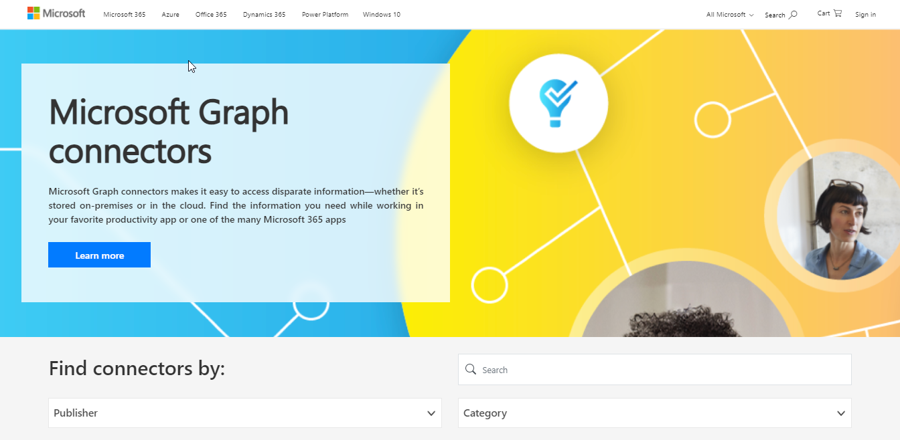

# Microsoft Graph connectors gallery

The [Microsoft Graph connectors gallery](https://www.microsoft.com/microsoft-search/connectors) includes a brief description of each of the connectors created by Microsoft and our partners, and a link to each partner's website.

With more than 100 connectors currently available, you can connect to popular Microsoft and non-Microsoft services such as Azure services, Box, Confluence, Google services, MediaWiki, Salesforce, ServiceNow, and many more.

Visit the connectors gallery to find all the information you need to get started using connectors.

 

