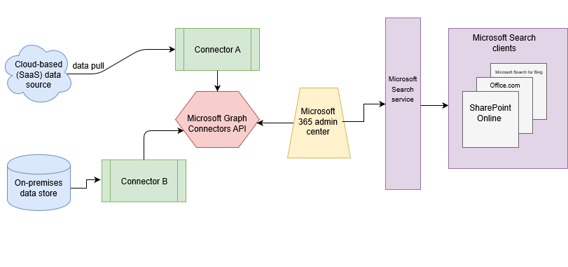

# Microsoft Graph connectors overview for Microsoft Search

Microsoft Search indexes all your [Microsoft 365](https://www.microsoft.com/microsoft-365) data to make it searchable for users. With Microsoft Graph connectors, your organization can index third-party data, ensuring it appears in Microsoft Search and Microsoft 365 Copilot results. This feature enhances the range of content sources searchable within your Microsoft 365 productivity apps and the broader Microsoft ecosystem. The third-party data can be hosted on-premises or in the public or private clouds. Microsoft Graph connectors respect the source permissions configured in your content source. As a result, users can only access content for which they have appropriate permissions

> [!NOTE]
> For details about how to build a Microsoft Graph connector that is integrated with Microsoft 365 Copilot, see [Microsoft 365 Copilot for Microsoft Graph connectors](../microsoft-365-copilot/extensibility/overview-graph-connector).

The Microsoft Graph connectors setup process for the Microsoft Search experience is explained in the following video.

> [!VIDEO https://www.microsoft.com/en-us/videoplayer/embed/RE4SjFa]

<!---link Microsoft Graph reference in line 19 when we have access to relevant documentation--->

This article is intended to help Microsoft 365 administrators locate the resources that are available to answer the following questions:

* [What data sources can be connected to Microsoft Search and Microsoft 365 Copilot?](#What-data-sources-can-be-connected-to-Microsoft-Search-and-Microsoft-365-Copilot)
* [How do I manage my connections?](#how-do-i-manage-my-connections)
* [What are the license requirements and terms of use for Microsoft Graph connectors?](#what-are-the-license-requirements-and-terms-of-use-for-connectors)
* [What are the preview features?](#what-are-the-preview-features)
* [How do I customize and configure search results?](#how-do-i-customize-and-configure-search-results)
* [How do I search my connector data from a custom application?](#how-do-i-search-my-connector-data-from-a-custom-application)
* [How do I customize search results?](#how-do-i-customize-and-configure-search-results)
* [What are the connector limitations?](#what-are-the-limitations-of-microsoft-graph-connectors)

## Architecture

The following architectural diagram of the Microsoft Graph platform shows how Microsoft Graph connector content flows through content indexing to user results in [Microsoft Search](./overview-microsoft-search.md) clients. The rest of this section explains each of the key building blocks in the diagram.

Microsoft Graph connectors can pull data from cloud-based (SaaS) data sources and on-premises data stores. The above diagram shows connections to only two data sources, but you can add connections to up to ten sources per tenant.

The Microsoft Graph Connectors API instantiates one connection per data source. Then, the API indexes and stores the data. Established connections interact with Microsoft Search and Microsoft 365 Copilot so that users can get search results.

You can use the Microsoft 365 [admin center](https://admin.microsoft.com) to set up and manage any of the Microsoft Graph connectors. The admin center has a simple user interface that makes it easy to establish a connection to your data source and monitor connection status and utilization.

To create a **connection** to a data source, admins need authenticated access to the data and the entire content repository. The data is fed to the graph connector service for indexing.--->

## What data sources can be connected to Microsoft Search and Microsoft 365 Copilot?

Microsoft provides 18 Microsoft Graph connectors, and our ecosystem partners have created over 100 more connectors. You can also build your own connector.

> [!TIP]
> **Product survey**
>
> To help us understand your requirements related to connecting more data sources to Microsoft 365 Copilot or Microsoft Search, we request you to take a few minutes to fill out this [survey form](https://forms.office.com/r/0Hh4GJNsJe). Based on the survey results, Microsoft will build connectors for the top-demanded data sources.

### Microsoft Graph connectors by Microsoft

You can connect to the following data sources by using connectors created by Microsoft:

* [Azure Data Lake Storage Gen2](azure-data-lake-connector.md)
* [Azure DevOps Work Items](azure-devops-connector.md)
* [Azure DevOps Wiki](azure-devops-wiki-connector.md)
* [Azure SQL and Microsoft SQL Server](MSSQL-connector.md)
* [Confluence Cloud](confluence-cloud-connector.md)
* [Confluence On-premises](confluence-onpremises-connector.md)
* [CSV](csv-connector.md)
* [Custom connector](/graph/custom-connector-sdk-sample-overview)
* [Enterprise websites](enterprise-web-connector.md)
* [Jira Cloud](jira-connector.md)
* [MediaWiki](mediawiki-connector.md)
* [File share](fileshare-connector.md)
* [Oracle SQL](OracleSQL-connector.md)
* [Salesforce](salesforce-connector.md)
* [ServiceNow Knowledge](servicenow-knowledge-connector.md)
* [ServiceNow Catalog](servicenow-catalog-connector.md)
* [ServiceNow Tickets](servicenow-tickets-connector.md)

The [Microsoft Graph connectors gallery](https://www.microsoft.com/microsoft-search/connectors) contains a brief description of each of these connectors. If you're ready to connect one of these data sources to your tenant, be sure to read the [Setup overview](configure-connector.md) and any other articles in the setup connectors by Microsoft section that apply to your data source.

### Microsoft Graph connectors by our partners

The [Microsoft Graph connectors gallery](https://www.microsoft.com/microsoft-search/connectors) includes a brief description of each of the connectors created by our partners and a link to each partner's website. To learn more, contact each partner directly.

### Build your own Microsoft Graph connector

You can build your own connector if you prefer. For developer documentation about building connectors, see [Microsoft Graph connectors overview](/graph/connecting-external-content-connectors-overview). For a quick start on building connectors, see [Build your first custom Microsoft Graph connector](/graph/connecting-external-content-build-quickstart).

## How do I manage my connections?

You can manage your connections on the [Connectors tab](https://admin.microsoft.com/Adminportal/Home#/MicrosoftSearch/Connectors) in the [Microsoft 365 admin center](https://admin.microsoft.com/). For more information about managing connections, see [Monitor your connections](manage-connector.md).

## What are the license requirements and terms of use for connectors?

For users in your organization to view data from connectors in their search results, you need a valid Microsoft 365 or Office 365 license and sufficient connectors quota.

To learn more, see [License requirements and pricing](licensing.md) and [Terms of use](terms-of-use.md).

## What are the preview features?

Although Microsoft Graph connectors and Microsoft Search APIs are now generally available, there are several features that are in preview.

The set of connectors and features in preview include:

* [Confluence On-premises connector](confluence-onpremises-connector.md)

## How do I customize and configure search results?

There are many ways to customize and configure search results. To learn more, see the following articles:

* [Manage search verticals](manage-verticals.md) and [result types](manage-result-types.md)
* [Manage connector results in All vertical](connectors-in-all-vertical.md)
* [Manage search result layouts](customize-results-layout.md)
* [Manage result cluster](result-cluster.md)
* [Manage custom filters](custom-filters.md)

## How do I search my connector data from a custom application?

After custom data is indexed, developers can [query this data](/graph/search-concept-custom-types). You can view your data in any application. For more information, see the [Overview of the Microsoft Search API in Microsoft Graph](/graph/search-concept-overview).

## What are the limitations of Microsoft Graph connectors?

* When you **publish** a Microsoft Graph connector, it can take a few minutes for the connection to be created. During that time, the connection shows its status as 'Publishing'.

* There's a connection limit. Each tenant can create up to 30 connections. If you need more connections reach out to us by filling this [form](https://aka.ms/GraphConnectorsHigherCapacity).

* There are limited edit capabilities supported after publishing a connection. If you need to change any details other than the ones enabled, you must delete and recreate the connection.

