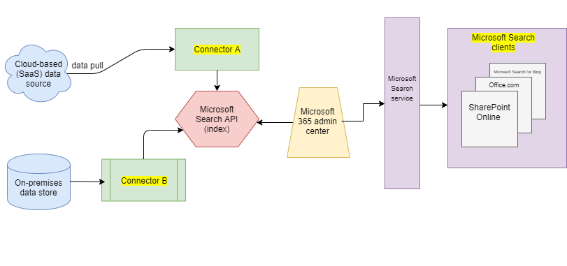

# Overview of Microsoft Graph connectors

Microsoft Search indexes all your [Microsoft 365](https://www.microsoft.com/microsoft-365) data to make it searchable for users. With Microsoft Graph connectors, your organization can index third-party data to appear in Microsoft Search results. The third-party data can be hosted on-premises or in the public or private clouds. Connectors expand the types of content sources that are searchable in your Microsoft 365 productivity apps and the broader Microsoft ecosystem.

> [!IMPORTANT]
> **DISCLAIMER**: Microsoft Graph connectors and Microsoft Search APIs (query and index) are currently in preview status available for tenants in Targeted release. To use connectors with Microsoft Search or to build connectors, opt into [Targeted release](https://docs.microsoft.com/office365/admin/manage/release-options-in-office-365?view=o365-worldwide). To learn more about the preview, see [connectors preview program](connectors-preview.md).

## Architecture

The following architectural diagram of the Microsoft Graph platform shows how connector content flows through content indexing to user results in [Microsoft Search](https://docs.microsoft.com/microsoftsearch/overview-microsoft-search) clients. This article explains each of the key building blocks in the Microsoft Graph connectors data flow process.

The API instantiates one connection per data source. Then the API indexes and stores the data. Established connections interact with Microsoft Search, so users can get search results.

You can configure all the Microsoft-built connectors in the Microsoft 365 [admin center](https://admin.microsoft.com). The admin center simplifies configuring your connector with a simple user interface.

To create a **connection** to a data source, admins need authenticated access to the data and the entire content repository. The data is fed to the graph connector service for indexing.

## Available connectors

There are currently 6 Microsoft-built connectors, and over 100 connectors are available from our ecosystem partners.

To preview connectors from one of our ecosystem partners, contact them directly. For more information, see the [Microsoft Graph connectors gallery](connectors-gallery.md).

You can also [build your own connector](https://docs.microsoft.com/graph/search-concept-overview).

### Connectors by Microsoft

The Microsoft Graph connectors preview release includes 6 Microsoft-built connectors. You can set them up in the [admin center](https://admin.microsoft.com) and learn how to [Set up your Microsoft-built connector](configure-connector.md).

The following sections provide brief descriptions for these Microsoft-built connectors. You can get more information in the linked articles for each connector.

- **[Azure Data Lake Storage Gen2](https://docs.microsoft.com/azure/storage/blobs/data-lake-storage-introduction)**. With this Microsoft Graph connector, users in your organization can search for files and content stored in Azure Blob containers. The Azure Data Lake Storage Gen2 connector also indexes hierarchy-enabled folders in Azure Data Lake Storage Gen2 accounts that you specify.
Learn more about the [Azure Data Lake Storage Gen2 connector](azure-data-lake-connector.md).

- **[Azure DevOps](https://azure.microsoft.com/services/devops)**. With this Microsoft Graph connector, users in your organization can search for work items from your Azure DevOps instance.
Learn more about the [Azure DevOps connector](azure-devops-connector.md).

- **[Azure SQL](https://azure.microsoft.com/services/sql-database)**. With this Microsoft Graph connector, users in your organization can search for data from your Azure SQL database.
Learn more about the [Azure SQL connector](MSSQL-connector.md).

- **Enterprise websites**. With this Microsoft Graph connector, users in your organization can search over pages in any non-SharePoint enterprise website.
Learn more about the [Enterprise websites connector](enterprise-web-connector.md).

- **[MediaWiki](https://www.mediawiki.org/wiki/MediaWiki)**. With this Microsoft Graph connector, users can search for knowledge-base articles on wiki sites your organization creates with MediaWiki.
Learn more about the [MediaWiki connector](mediawiki-connector.md).

- **[Microsoft SQL server](https://www.microsoft.com/sql-server/sql-server-2017)**. With this Microsoft Graph connector, users in your organization can search for data in on-premises SQL server databases.
Learn more about the [Microsoft SQL server connector](MSSQL-connector.md).

- **[ServiceNow](https://www.servicenow.com)**. With this Microsoft Graph connector, users in your organization can search for knowledge-base articles from your ServiceNow instance.
Learn more about the [ServiceNow connector](servicenow-connector.md).

### Connectors from our partners

There are over 100 connectors available for preview from our ecosystem partners. To preview connectors from one of our ecosystem partners, contact them directly.
Learn more about connectors from our partners in the [Microsoft Graph connectors gallery](connectors-gallery.md).

### Build your own connector

To index custom data types or files, developers can create connectors in [Microsoft Graph](https://developer.microsoft.com/graph/). A connector is an application that [creates a connection](https://docs.microsoft.com/graph/search-index-manage-connections) and pushes items into the Microsoft Search index. For more information, see the [Overview for extending the Microsoft Search experience for apps on Microsoft Graph](https://docs.microsoft.com/graph/search-concept-overview).

### Search results with your custom-built connector

After custom data is indexed, developers can [query this data](https://docs.microsoft.com/graph/search-concept-custom-types). You can view your data in any application. For more information, see the [Overview for extending the Microsoft Search experience for apps on Microsoft Graph](https://docs.microsoft.com/graph/search-concept-overview).

## License requirements

To view data from connectors in your search results, users must have one of the following Microsoft 365 or Office 365 subscriptions:

- [Microsoft 365 or Office 365 Enterprise E3 or E5](https://www.microsoft.com/microsoft-365/compare-all-microsoft-365-plans)

- [Microsoft 365 or Office 365 Education A3 or A5](https://www.microsoft.com/microsoft-365/academic/compare-office-365-education-plans?activetab=tab:primaryr1)
