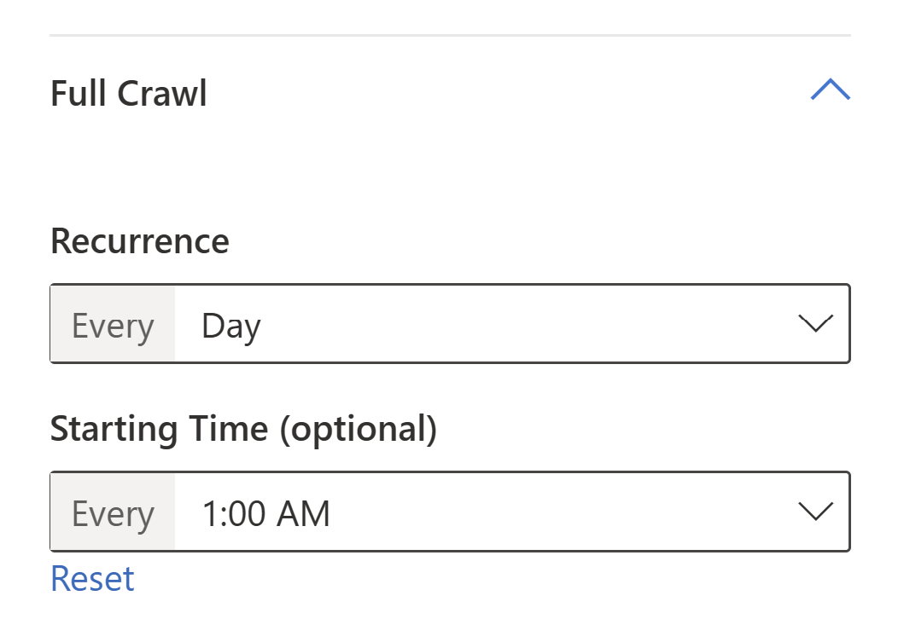

# Topics – Item Delete Notification

The following information pertains to our customers who are part of a preview offering wherein their ingested data from Microsoft Graph connectors will appear in the Topics card. This information is for when an item (e.g., file or another content) deleted from the source system should be processed and deleted from the Microsoft system within 30 days.

## Connector types

Third-party Microsoft Graph Connectors: for connectors, built by our partners and customers, we don't have any direct visibility for when an item is created, updated or deleted in the data source, and the first point of visibility we have is when the connector invokes our Publicly available APIs (behind Microsoft Graph API Gateway) for a CRUD (create, read, update, delete) operation on the API.

Microsoft Graph Connectors: for connectors built by Microsoft, we follow the crawl setting that is set by your company’s IT Administrator. Even then, we're dependent on the availability and the reliability of your underlying data source to process the request.  

## Steps to ensure data gets deleted in time

Given this, there may be delays between when an item is deleted or changed from the data source and when Microsoft first detects this operation.  

We encourage the IT Administrator to schedule either the “Incremental crawl” or “Full crawl” setting to under 14 days to improve detection, as illustrated in the following image:

Learn more about [Refresh Settings](configure-connector.md).
