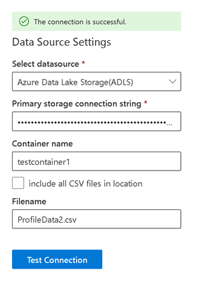

--- 

title: "CSV connector for Microsoft Search" 
ms.author: dawholl 
author: dawholl 
manager: kellis 
audience: Admin
ms.audience: Admin 
ms.topic: article 
ms.service: mssearch 
ms.localizationpriority: medium 
search.appverid: 
- BFB160 
- MET150 
- MOE150 
ROBOTS: NOINDEX, NOFOLLOW
description: "Set up the Microsoft Search CSV connector for SharePoint or Azure Data Lake Storage sources." 
---

# CSV connector (preview)

The CSV connector supports two data sources, Sharepoint and Azure Data Lake Storage (ADLS). After you configure the connector and index content from these sources, end users can find CSV files in Microsoft Search.

> [!NOTE]
> Read the [**Setup for your Graph connector**](configure-connector.md) article to understand the general Graph connectors setup instructions.

This article is for anyone who configures, runs, and monitors a CSV connector. It supplements the general setup process, and shows instructions that apply only for this connector.

<!---## Before you get started-->
## Before you get started

For a SharePoint data source, you'll need to create a SharePoint app with Oauth configuration. For an ADLS data source, you'll need to create an ADLS storage account.

### Create a SharePoint app with Oauth configuration

Verify the .csv files you want to index have been uploaded to a SharePoint document library. You can use an existing SharePoint site or create a new one. 

#### Create a SharePoint app
1. Go to  `https://Org-Name.sharepoint.com/Site-Name/_layouts/15/appregnew.aspx`.
2. On the Client Id and Client Secret fields, select **Generate**.
1. For Title, enter an app name.
1. In the App Domain field, enter www.gcs.com.
1. In the Redirect URL field, enter https://www.gcs.com.
1. Select **Create**.
1. Copy the app configuration information, including the Client ID and Client Secret. You'll need it when you set up the CSV connector.

#### Enable app permissions to allow CustomAppAuthentication
In PowerShell, run these commands in administrative mode. Use the email address of the admin configuring the connector and your organization name. When the password pop-up appears, the admin should enter their password.

```powershell
Install-Module -Name Microsoft.Online.SharePoint.PowerShell
$adminUPN=”<admin@contoso.onmicrosoft.com>”
$orgName=“<contoso>”
$userCredential = Get-Credential -UserName $adminUPN -Message "Enter your password.“
Connect-SPOService -Url https://$orgName-admin.sharepoint.com -Credential $userCredential
Set-spotenant –DisableCustomAppAuthentication $false
```

#### Complete the app configuration
1. Go to `https://Org-Name.sharepoint.com/Site-Name/_layouts/15/appinv.aspx`.
2. In the App Id field, paste the Client Id of the SharePoint app and select **Lookup**.
3. In Permission Request XML field, paste this code and select **Create**.

```xml
<AppPermissionRequests AllowAppOnlyPolicy="true">
    <AppPermissionRequest Scope="http://sharepoint/content/sitecollection/web" Right="Read" />
</AppPermissionRequests>
```

4. Select **Trust It**.

### Create an ADLS storage account

For step-by-step guidance, see [Create a storage account](https://docs.microsoft.com/azure/storage/common/storage-account-create#create-a-storage-account-1). To allow file storage capabilities, on the Advanced tab, select **Enable hierarchical namespace** and **Create a Container for this site**.

When you set up the CSV connector, you'll need to provide a primary storage connection string. To find it, open the storage account you created and select **Access Keys**. Select **Show Keys** and copy the connection string for Key1.

## Step 1: Add a Graph connector in the Microsoft 365 admin center

Follow the general [setup instructions](./configure-connector.md).
<!---If the above phrase does not apply, delete it and insert specific details for your data source that are different from general setup 
instructions.-->

## Step 2: Name the connection

Follow the general [setup instructions](./configure-connector.md).
<!---If the above phrase does not apply, delete it and insert specific details for your data source that are different from general setup 
instructions.-->

## Step 3: Configure connection settings

The data source settings are different for SharePoint and ADLS.

### For a SharePoint source

1. To control access on a file level, in **ACL setting**, enter the email addresses of the allowed users or groups.
1. In the Data Source settings, select **SharePoint** as your datasource.
1. In **SharePoint site**, enter the site URL, `https://Org-Name.sharepoint.com/Site-Name`, for example.
1. In **Document Library**, enter the name of the library where the .csv files are stored.
1. In **Authentication Type**, select **Oauth2.0 (client credential)**” for Authentication Type.
1. Enter the Client ID and Client Secret you copied when you created the SharePoint app.
1. Select **Test Connection**. You should get a **The connection is successful** message.


### For an ADLS source

1. To control access on a file level, in **ACL setting**, enter the email addresses of the allowed users or groups.
1. In the Data Source settings, select **ADLS** as your datasource.
1. In **Primary storage connection string**, enter the connection string you copied.
1. Enter the **Container name** and **Filename**.
1. Select **Test Connection**. You should get a **The connection is successful** message.



> [!NOTE]
> If your datasource contains multiple .csv files with the same headers, select **include all CSV files in location**.

## Step 4: Multi-items delimiter (Optional)

If your source columns can take multiple values, enter a multi-items delimiter, a semicolon (;) for example.

## Step 5: Parsed properties settings

This page returns the first row from your .csv file as Source Properties. To modify the Datatype, in the **Unique Identifier** list select at least one option.

## Step 6: Select experiences

The CSV connector supports search and profile experiences. Select an experience for your organization.

## Step 7: Assign property labels

Follow the general [setup instructions](./configure-connector.md).

## Step 8: Manage schema

Follow the general [setup instructions](./configure-connector.md).

## Step 9: Manage search permissions

- For File Level ACL, select **ACL**.
- For Item Level ACL, select **Everyone**. Also, your .csv file should include two columns, AllowedUsers and AllowedGroups, in the .csv file. Each row should contain the Azure AD IDs.

## Step 10: Choose refresh settings

Follow the general [setup instructions](./configure-connector.md).

## Step 11: Review connection

Follow the general [setup instructions](./configure-connector.md).

<!---## Limitations-->
<!---Insert limitations for this data source-->