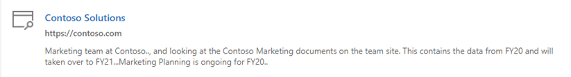
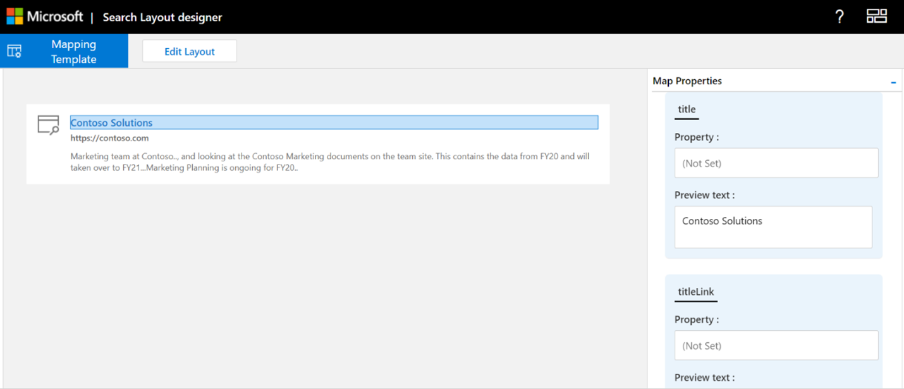

<!-- markdownlint-disable no-hard-tabs -->
# Create a layout to customize search results

You can design the result layout for a custom vertical using the search layout designer. You can start designing the layout by choosing templates offered in the layout designer and using them if they fit your requirements. Or you can choose to edit these templates in various ways to fit your requirements. For example, add/remove images, add/remove text, and modify text. If none of the templates meet your requirements, you can choose to start designing your layout using a blank template.  

After the layout is ready, use the [Adaptive Cards Template language](/adaptive-cards/templating/language) to create a result layout JSON that's used to define a result type. You map the result properties to the layout using the Mapping step in the layout designer.  

## Create a layout on your own

Creating a layout on your own requires knowledge of [adaptive cards](/adaptive-cards/authoring-cards/getting-started) and their [schema](https://adaptivecards.io/explorer/). Search result layout uses a subset of the elements offered by adaptive cards, and you can use the layout designer to learn about the supported set of elements.  

While creating your own layout, create the adaptive card layout using data from your connector, and then finalize the layout.
There are two main steps in creating your own layout:

- Design the layout.
- Separate the data from the template.

### Design the layout

In this example, we show a layout with a header, logo, link, and descriptive text.



And here's the layout's associated JSON file:

```json
{ 
    "type": "AdaptiveCard", 
    "version": "1.3", 
    "body": [ 
        { 
            "type": "ColumnSet", 
            "columns": [ 
                { 
                    "type": "Column", 
                    "width": "auto", 
                    "items": [ 
                        { 
                            "type": "Image", 
                            "url": "https://searchuxcdn.blob.core.windows.net/designerapp/images/OOTBLayouts/search.png", 
                            "altText": "Thumbnail image", 
                            "horizontalAlignment": "center", 
                            "size": "small" 
                        } 
                    ], 
                    "horizontalAlignment": "center" 
                }, 
                { 
                    "type": "Column", 
                    "width": 10, 
                    "items": [ 
                        { 
                            "type": "TextBlock", 
                            "text": "[Contoso Solutions](https://contoso.com)", 
                            "weight": "bolder", 
                            "color": "accent", 
                            "size": "medium", 
                            "maxLines": 3 
                        }, 
                        { 
                            "type": "TextBlock", 
                            "text": "[https://contoso.com](https://contoso.com)", 
                            "weight": "bolder", 
                            "spacing": "small", 
                            "maxLines": 3 
                        }, 
                        { 
                            "type": "TextBlock", 
                            "text": "Marketing team at Contoso.., and looking at the Contoso Marketing documents on the team site. This contains the data from FY20 and will taken over to FY21...Marketing Planning is ongoing for FY20..", 
                            "maxLines": 3, 
                            "wrap": true 
                        } 
                    ], 
                    "spacing": "medium" 
                } 
            ] 
        } 
    ], 
    "$schema": "http://adaptivecards.io/schemas/adaptive-card.json" 
} 
```

### Separate the data from the layout

You can separate the data from the layout and bind the data.

Here's Layout JSON after binding the data:

```json
{ 
    "type": "AdaptiveCard", 
    "version": "1.3", 
    "body": [ 
        { 
            "type": "ColumnSet", 
            "columns": [ 
                { 
                    "type": "Column", 
                    "width": "auto", 
                    "items": [ 
                        { 
                            "type": "Image", 
                            "url": "https://searchuxcdn.blob.core.windows.net/designerapp/images/OOTBLayouts/search.png", 
                            "altText": "Thumbnail image", 
                            "horizontalAlignment": "center", 
                            "size": "small" 
                        } 
                    ], 
                    "horizontalAlignment": "center" 
                }, 
                { 
                    "type": "Column", 
                    "width": 10, 
                    "items": [ 
                        { 
                            "type": "TextBlock", 
                            "text": "[${title}](${titleLink})", 
                            "weight": "bolder", 
                            "color": "accent", 
                            "size": "medium", 
                            "maxLines": 3 
                        }, 
                        { 
                            "type": "TextBlock", 
                            "text": "[${titleLink}](${titleLink})", 
                            "weight": "bolder", 
                            "spacing": "small", 
                            "maxLines": 3 
                        }, 
                        { 
                            "type": "TextBlock", 
                            "text": "${description}", 
                            "maxLines": 3, 
                            "wrap": true 
                        } 
                    ], 
                    "spacing": "medium" 
                } 
            ] 
        } 
    ], 
    "$schema": "http://adaptivecards.io/schemas/adaptive-card.json" 
} 
```

Sample data:
Specify sample data in the **Sample Data Editor** to view the data-bound card when in **Preview Mode**.

```json
{ 
    "title": "Contoso Solutions", 
    "titleLink": "https://contoso.com", 
    "description": "Marketing team at Contoso.., and looking at the Contoso Marketing documents on the team site. This contains the data from FY20 and will taken over to FY21...Marketing Planning is ongoing for FY20.." 
} 
```

## Map the layout to the result properties

You must map each field of the layout to a result property or a connector property to generate the result layout JSON.



Select a field in the layout to highlight the variables that need to be mapped. You can use multiple variables for a single field, and all fields must be mapped to the result properties.

### Show snippet on search result  

Dynamic snippets generated on the **content** property of the connector result can be shown on the search result. **ResultSnippet** is the system property that acts as a placeholder property for the snippets generated for each Connector result. To show the snippets on the result layout, the **ResultSnippet** system property must be mapped to an appropriate field, for example Description, in the search result layout. Snippets generated on each result also highlight the matches in the Snippet with the query term entered by the user.

## Things to consider

Before you get started, there are a few things that you should do and a few things you should avoid to ensure that your layouts will be successful.

### Do

- While designing the layouts think of the layout structure as row and column and create those by adding column set elements 
- Provide a logo/icon for every result layout as this maintains consistency and easy scanning with other results. Edit a template to provide the logo link in the layout if you're using static links for logos and not result properties.
- It is recommended to use a square logo to ensure proper alignment of results. To avoid pixelation, use a logo with a minimum size of 32px by 32px.
- Think of theme requirements when designing a result layout, your result icon should be visible in dark theme as well.
- Validate the result layout for scenarios where no data is returned for a result property used in the result JSON. Use the `$when` condition to hide an element if the property doesn't contain data.  
- Make sure that data types of the `$when` condition and the result property match. For example, don't compare `Number` with `Text` in the `$when` condition.  
- Make sure that the `Textblock` element can handle dynamic content. You can use the `wrap` and `maxLines` element properties for this purpose.
- Properly format the date when using `{DATE()}` in Markdown.  
- Ensure properties of type StringCollection are wrapped in a join method as: ```json ${propertyName} -> ${join(propertyName, ‘,’)} ``` . If you want to show a single value (say, the ith item) from a StringCollection, you can specify it as follows:  ```json ${propertyName} -> ${propertyName[i]}  ``` (Note: indexing in StringCollection types start from 0 )

### Don't

- Don't define invalid data types when binding values. For more information about data types, see [Manage the Search schema](/sharepoint/search/manage-the-search-schema).
- Avoid cropping the result on the result page by following the maximum height of the result layout JSON. If you exceed the maximum height of the result layout, the result will be cropped on the result page.
- Don't use `px` values in element properties.
- Don't use markdown with the **ResultSnippet** property in the result layout to highlight query match in the search result.

## Resources

[Customize search result page](customize-search-page.md)

[Adaptive cards](/adaptive-cards/authoring-cards/getting-started)

[Adaptive Cards Template language](/adaptive-cards/templating/language)

[Adaptive card schema](https://adaptivecards.io/explorer/)

