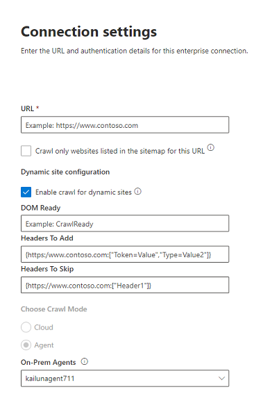
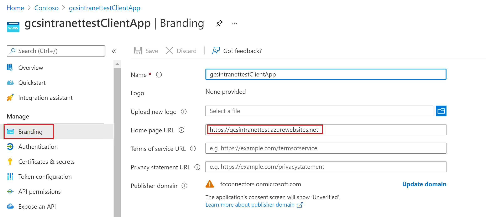
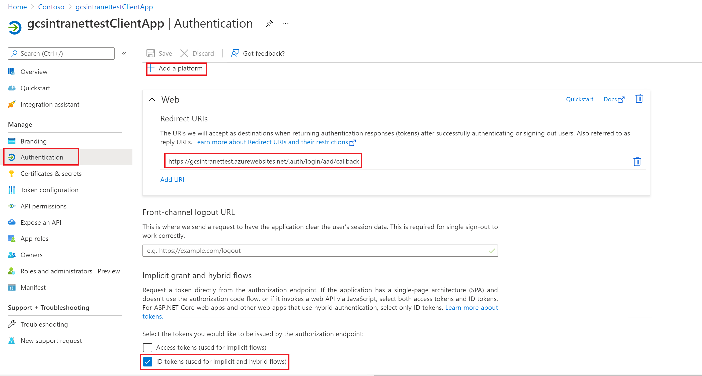
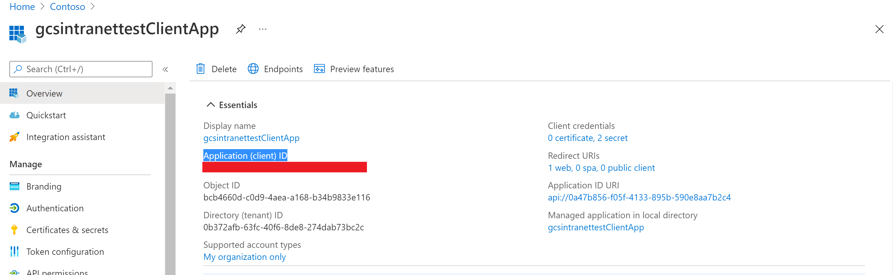
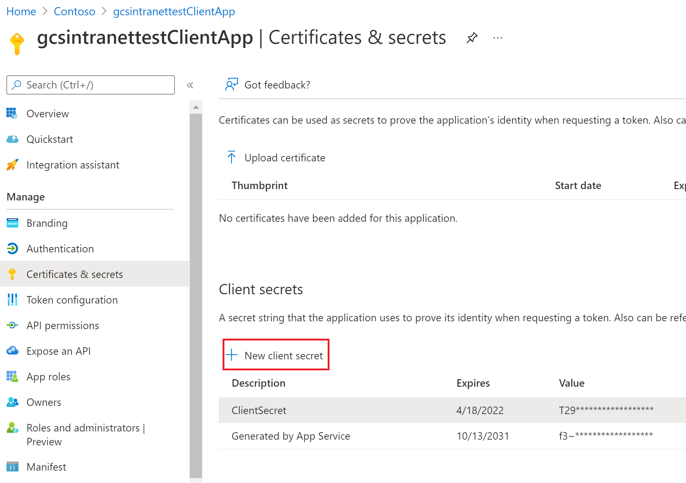
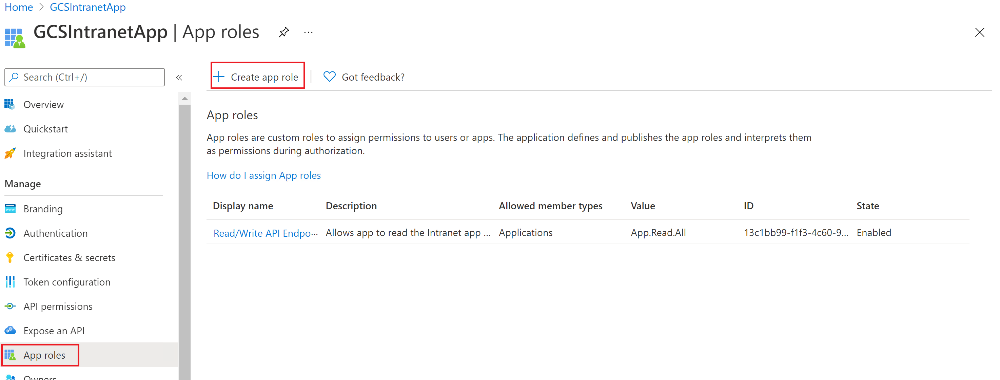
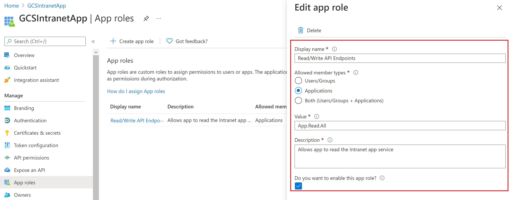
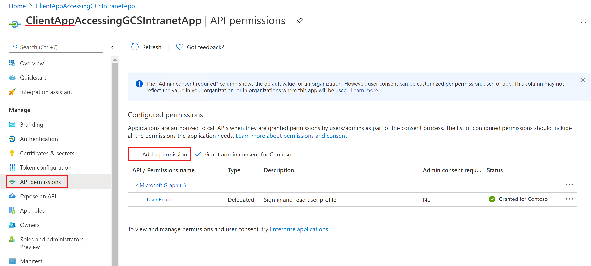
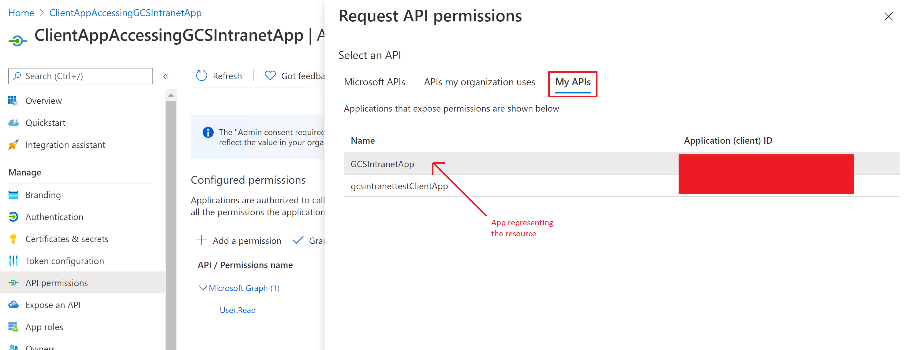
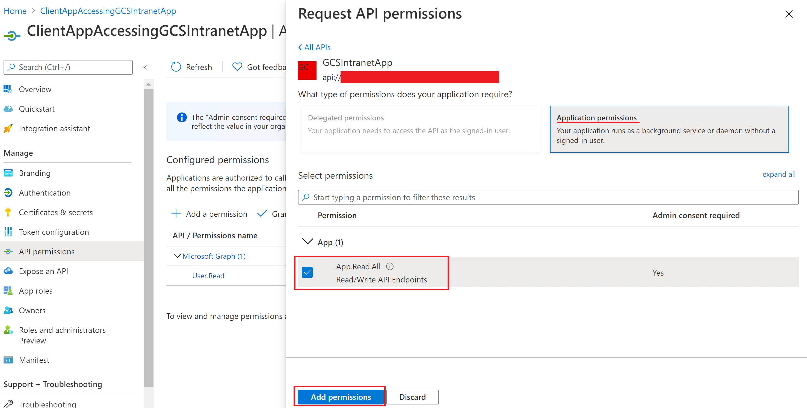

<!-- markdownlint-disable no-inline-html -->

# Enterprise Websites Microsoft Graph connector

The Enterprise Websites Microsoft Graph connector allows your organization to index articles and **content from your company-owned websites**. After you configure the connector and sync content from the website, end users can search for that content from any Microsoft Search and Microsoft 365 Copilot client.

This article is for anyone who configures, runs, and monitors an Enterprise Websites Microsoft Graph connector. It supplements the general setup process and shows instructions that apply only to the Enterprise Websites Microsoft Graph connector. This article also includes information about [Troubleshooting](#troubleshooting).

<!---## Before you get started-->

<!---Insert "Before you get started" recommendations for this data source-->

## Step 1: Add a connector in the Microsoft 365 admin center

[Add Enterprise Websites Microsoft Graph connector](https://admin.microsoft.com/adminportal/home#/MicrosoftSearch/Connectors/add?ms_search_referrer=MicrosoftSearchDocs_Intranet&type=IntranetSites)

(See general [setup instructions](./configure-connector.md) for more details)
<!---If the above phrase does not apply, delete it and insert specific details for your data source that are different from general setup instructions.-->

## Step 2: Name the connection

Specify these attributes:

* Name (required)
* Connection ID (required)
* Description (optional)
* Select check box (required)

The connection ID creates implicit properties for your connector. It must be unique and can only contain a maximum of 32 alphanumeric characters. To change the ID, go to **Advanced settings**.

## Step 3: Configure the connection settings

To connect to your data source, fill in the root URL of the website and select a custom vertical for the results. After you complete this information, select **Test connection** to verify your settings.

### Website URL

Specify the root of the website that you'd like to crawl. The Enterprise Websites Microsoft Graph connector uses this URL as the starting point and follow all the links from this URL for its crawl.

The connector only crawls webpages in the domain of root URLs and does not support crawling of out-of-domain URLs. Redirection is only supported within the same domain. If there are redirections in the webpages to be crawled, you may add the redirected URL directly in list of URLs to be crawled.

> [!NOTE]
> You can index up to 50 different site URLs in a single connection. In the URLs field, enter the site URLs separated by commas (,). For example, `https://www.contoso.com,https://www.contosoelectronics.com`.

### Use sitemap for crawling

When selected the connector only crawls the URLs listed in the sitemap. This also allows you to configure incremental crawling during a later step. If not selected or no site map is found, the connector does a deep crawl of all the links found on the root URL of the site.

### Dynamic site configuration

If your website contains dynamic content, for example, webpages that live in content management systems like Confluence or Unily, you can enable a dynamic crawler. To turn it on, select **Enable crawl for dynamic sites**. The crawler waits for dynamic content to render before it begins crawling.

> [!div class="mx-imgBorder"]
> 

In addition to the check box, there are three optional fields available:

1. **DOM ready**: Enter the DOM element the crawler should use as the signal that the content is fully rendered and the crawl should begin.
2. **Headers to add**: Specify which HTTP headers the crawler should include when sending that specific web URL. You can set multiple headers for different websites. We suggest including auth token values.
3. **Headers to skip**: Specify any unnecessary headers that should be excluded from dynamic crawling requests.

Headers should be added in the following syntax: `{"Root-URL":["TKey=TValue"]}`

Example: `{"https://www.contoso.com":["Token=Value","Type=Value2"]}`

> [!NOTE]
> Dynamic crawling is only supported for Agent crawl mode.

### Crawl mode: Cloud or On-premises

The crawl mode determines the type of websites you want to index, either cloud or on-premises. For your cloud websites, select **Cloud** as the crawl mode.

Also, the connector now supports crawling of on-premises websites. To access your on-premises data, you must first install and configure the connector agent. To learn more, see [Microsoft Graph connector agent](./graph-connector-agent.md).

For your on-premises websites, select **Agent** as the crawl mode, and in the **On-prem agent** field, choose the Microsoft Graph connector agent that you installed and configured earlier.  

### Authentication

**None** requires no authentication

**Basic** requires a username and password.

**OAuth 2.0** with [Microsoft Entra ID](/azure/active-directory/) requires a resource ID, client ID, and a client secret.

The resource ID, client ID, and client secret values depend on how you did the setup for Microsoft Entra ID-based authentication for your website:

1. If you're using an application both as an identity provider and the client app to access the website, the client ID and the resource ID are the application ID of the app, and the client secret  the secret that you generated in the app.

    
    > [!NOTE]
    > For detailed steps to configure a client application as an Identity provider, see [Quickstart: Register an application with the Microsoft identity platform and Configure your App Service or Azure Functions app to use Microsoft Entra login](/azure/app-service/configure-authentication-provider-aad).

    After the client app is configured, make sure you create a new client secret by going to the **Certificates & Secrets** section of the app. Copy the client secret value shown in the page because it won't be displayed again.

    In the following screenshots, you can see the steps to obtain the client ID, and client secret, and set up the app if you're creating the app on your own.
    
    * View of the settings in the branding section:
    
      > [!div class="mx-imgBorder"]
      > [  ](media/enterprise-web-connector//connectors-enterpriseweb-branding.png#lightbox)
    
    * View of the settings in authentication section:
    
      > [!div class="mx-imgBorder"]
      > [  ](media/enterprise-web-connector/connectors-enterpriseweb-authentication.png#lightbox)
    
      > [!NOTE]
      > It is not required to have the above-specified route for Redirect URI on your website. Only if you use the user token sent by Azure in your website for authentication you will need to have the route.
    
    * View of the client ID on the **Essentials** section:
    
      > [!div class="mx-imgBorder"]
      > [  ](media/enterprise-web-connector/connectors-enterpriseweb-clientapp-clientidresource-Id.png#lightbox)
    
    * View of the client secret on the **Certificates & secrets** section:
    
      > [!div class="mx-imgBorder"]
      > [  ](media/enterprise-web-connector/connectors-enterpriseweb-client-secret.png#lightbox)
    
2. If you're using an application as an identity provider for your website as the resource, and a different application to access the website, the client ID is the application ID of your second app and the client secret is the secret configured in the second app. However, the resource ID is the ID of your first app.

    > [!NOTE]
    > For steps to configure a client application as an identity provider see [Quickstart: Register an application with the Microsoft identity platform](/azure/active-directory/develop/quickstart-register-app) and [Configure your App Service or Azure Functions app to use Microsoft Entra login](/azure/app-service/configure-authentication-provider-aad).

    You don't need to configure a client secret in this application, but you'll need to add an app role in the **App roles** section, which will later be assigned to your client application. Refer to the images to see how to add an app role.

    * Creating a new app role:
    
      > [!div class="mx-imgBorder"]
      > [  ](media/enterprise-web-connector/connectors-enterpriseweb-new-app-role.png#lightbox)
    
    * Editing the new app role:
    
      > [!div class="mx-imgBorder"]
      > [  ](media/enterprise-web-connector/connectors-enterpriseweb-new-app-role2.png#lightbox)
    
      After configuring the resource app, create the client app and give it permission to access the resource app by adding the app role configured above in the API permissions of the client app. 
    
      > [!NOTE]
      > To see how to grant permissions to the client app see [Quickstart: Configure a client application to access a web API](/azure/active-directory/develop/quickstart-configure-app-access-web-apis).
    
    The following screenshots show the section to grant permissions to the client app.
    
    * Adding a permission:
    
      > [!div class="mx-imgBorder"]
      > [  ](media/enterprise-web-connector/connectors-enterpriseweb-adding-permissions.png#lightbox)
    
    * Selecting the permissions:
    
      > [!div class="mx-imgBorder"]
      > [  ](media/enterprise-web-connector/connectors-enterpriseweb-adding-permissions2.png#lightbox)
    
    * Adding the permissions:
 
      > [!div class="mx-imgBorder"]
      > [  ](media/enterprise-web-connector/connectors-enterpriseweb-adding-permissions3.png#lightbox)
    
    Once the permissions are assigned, you'll need to create a new client secret for this application by going to the Certificates & secrets section.
    Copy the client secret value shown on the page as it won't be displayed again. Use the application ID from this app as the client ID, the secret from this app as the client secret, and the application ID of the first app as the resource ID.

**SiteMinder** requires a properly formatted URL, ```https://custom_siteminder_hostname/smapi/rest/createsmsession```, a username, and a password.

**Windows** authentication is only available in agent mode. It requires a username, domain, and password. You need to provide the username and domain in the **Username** field, in any of the following formats: domain\username, or username@domain. A password must be entered in the **Password** field. For Windows authentication, the username provided must also be an administrator in the server where the agent is installed.

## Step 4: Meta tag settings

The connector fetches any meta tags your root URLs may have and shows them. You can select which tags to include for crawling.

:::image type="content" source="media/enterprise-web-connector/connectors-enterpriseweb-meta-tags-settings.png" alt-text="Meta tag settings with author, locale, and other tags selected.":::

Selected meta tags can be used to create custom properties. Also, on the schema page, you can manage them further (Queryable, Searchable, Retrievable, Refinable).

## Step 5: Custom property settings

You can enrich your indexed data by creating custom properties for your selected meta tags or the connector's default properties. 

:::image type="content" source="media/enterprise-web-connector/connectors-custom-property-setup.png" alt-text="Custom property set up with a rule for Team metadata.":::

To add a custom property:

  1. Enter a property name. This name will appear in search results from this connector.
  1. For the value, select Static or String/Regex Mapping. A static value will be included in all search results from this connector. A string/regex value will vary based on the rules you add.
  1. Select **Edit value**.
  1. If you selected a static value, enter the string you want to appear.
  1. If you selected a string/regex value:
      * In the **Add expressions** section, in the **Property** list, select a default property or meta tag from the list.
      * For **Sample value**, enter a string to represent the type of values that could appear. This sample is used when you preview your rule.
      * For **Expression**, enter a regex expression to define the portion of the property value that should appear in search results. You can add up to three expressions. To learn more about regex expressions, see [.NET regular expressions](/dotnet/standard/base-types/regular-expressions) or search the web for a regex expression reference guide.
      * In the **Create formula** section, enter a formula to combine the values extracted from the expressions. 

## Step 6: Add URLs to exclude (Optional crawl restrictions)

There are two ways to prevent pages from being crawled: disallow them in your robots.txt file or add them to the Exclusion list.

### Support for robots.txt

The connector checks to see if there's a robots.txt file for your root site. If one exists, it follows and respects the directions found within that file. If you don't want the connector to crawl certain pages or directories on your site, include the pages or directories in the "Disallow" declarations in your robots.txt file.

### Add URLs to exclude

You can optionally create an **Exclusion list** to exclude some URLs from getting crawled if that content is sensitive or not worth crawling. To create an exclusion list, browse through the root URL. You can add the excluded URLs to the list during the configuration process.

## Step 7: Assign property labels

You can assign a source property to each label by choosing from a menu of options. While this step isn't mandatory, having some property labels improves the search relevance and ensure more accurate search results for end users.

## Step 8: Manage schema

On the **Manage schema** screen, you can change the schema attributes (the options are **Query**, **Search**, **Retrieve**, and **Refine**) associated with the default or custom properties, add optional aliases, and choose the **Content** property.

## Step 9: Manage search permissions

The Enterprise websites connector only supports search permissions visible to **Everyone**. Indexed data appears in the search results and is visible to all users in the organization.

## Step 10: Set the refresh schedule

The Enterprise websites connector supports full and incremental crawling. Incremental crawling is only supported for connections set up with sitemap crawling enabled. Sitemap for crawling can be selected in step 3. 

During an incremental refresh interval, only URLs that have been modified since the last incremental refresh are crawled. In a full refresh interval, the connector will recrawl all the website's content. For a full refresh, we recommend you set a large refresh schedule interval, between one and two weeks, to ensure the connector has enough time to complete the crawl. We recommend a scheduled refresh.

## Step 11: Review connection

Follow the general [setup instructions](./configure-connector.md).
<!---If the above phrase does not apply, delete it and insert specific details for your data source that are different from general setup instructions.-->

## Troubleshooting
After publishing your connection, you can review the status under the **Data Sources** tab in the [admin center](https://admin.microsoft.com). To learn how to make updates and deletions, see [Manage your connector](manage-connector.md).
You can find troubleshooting steps for commonly seen issues [here](troubleshoot-enterprise-web-connector.md).

If you have any other issues or want to provide feedback, reach out to us at [Microsoft Graph | Support](https://developer.microsoft.com/en-us/graph/support).
