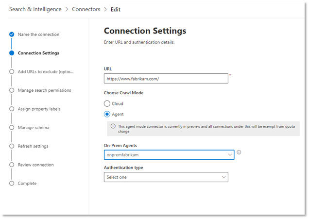

<!-- markdownlint-disable no-inline-html -->
# Enterprise websites connector

With the Enterprise websites connector, your organization can index articles and **content from its internal-facing websites**. After you configure the connector and sync content from the website, end users can search for that content from any Microsoft Search client.

This article is for [Microsoft 365](https://www.microsoft.com/microsoft-365) administrators or anyone who configures, runs, and monitors an Enterprise websites connector. It explains how to configure your connector and connector capabilities, limitations, and troubleshooting techniques.  

## Connection settings

To connect to your data source, you need to fill in the root URL of the website, select a crawl source, and the type of authentication you'd like to use: None, Basic Authentication, or OAuth 2.0 with [Azure Active Directory (Azure AD)](https://docs.microsoft.com/azure/active-directory/). After you complete this information, click Test Connection to verify your settings.

### URL

Use the URL field to specify the root of the website that you'd like to crawl. The enterprise websites connector will use this URL as the starting point and follow all the links from this URL for its crawl.

### Crawl mode: Cloud or On-premises (Preview)

The crawl mode determines the type of websites you want to index, either cloud or on-premises. For your cloud websites, select **Cloud** as the crawl mode.

Also, the connector now supports crawling of on-premises websites. This mode is in preview. To access your on-premises data, you must first install and configure the Graph connector agent. To learn more, see [Graph connector agent](https://docs.microsoft.com/microsoftsearch/on-prem-agent).

For your on-premises websites, select **Agent** as the crawl mode and in the **On-Prem Agent** field, choose the Graph connector agent that you installed and configured earlier.  

### Authentication

Basic Authentication requires a username and password. Create this bot account by using the [Microsoft 365 admin center](https://admin.microsoft.com).

OAuth 2.0 with [Azure AD](https://docs.microsoft.com/azure/active-directory/) requires a resource ID, Client ID, and Client Secret. OAuth 2.0 only works with Cloud mode.

For more information, see [Authorize access to Azure Active Directory web applications using OAuth 2.0 code grant flow](https://docs.microsoft.com/azure/active-directory/develop/v1-protocols-oauth-code). Register with the following values:

**Name:** Microsoft Search  
**Redirect_URI:** `https://gcs.office.com/v1.0/admin/oauth/callback`

To get the values for the resource, client_id, and client_secret, go to **Use the authorization code to request an access token** on the redirect URL webpage.

For even more information, see [Quickstart: Register an application with the Microsoft identity platform](https://docs.microsoft.com/azure/active-directory/develop/quickstart-register-app).

## Support for robots.txt

The connector checks to see if there is a robots.txt file for your root site and, if one exists, it will follow and respect the directions found within that file. If you do not want the connector to crawl certain pages or directories on your site, you can call out those pages or directories in the "Disallow" declarations in your robots.txt file.

## Add URLs to exclude

You can optionally create an **Exclusion list** to exclude some URLs from getting crawled if that content is sensitive or not worth crawling. To create an exclusion list, browse through the root URL. You have the option to add the excluded URLs to the list during the configuration process.

## Manage search permissions

The Enterprise websites connector only supports search permissions visible to **Everyone**. Indexed data appears in the search results and is visible to all users in the organization.

## Assign property labels

You can assign a source property to each label by choosing from a menu of options. While this step is not mandatory, having some property labels will improve the search relevance and ensure more accurate search results for end users.

## Manage schema

On the **Manage Schema** screen, you have the option to change the schema attributes (**queryable**, **searchable**, **retrievable**, and **refinable**) associated with the properties, add optional aliases, and choose the **Content** property.

## Set the refresh schedule

The Enterprise websites connector only supports a full refresh. This means that the connector will recrawl all the website's content during every refresh. To make sure the connector gets enough time to crawl the content, we recommend that you set a large refresh schedule interval. We recommend a scheduled refresh between one and two weeks.

## Troubleshooting

When reading the website's content, the crawl may encounter some source errors, which are represented by the detailed error codes below. To get more information on the types of errors, go to the **error details** page after selecting the connection. Click on the **error code** to see more detailed errors. Also refer to [Manage your connector](https://docs.microsoft.com/microsoftsearch/manage-connector) to learn more.

 Detailed Error code | Error message
 --- | ---
 6001 | The site that is being tried to index is not reachable
 6005 | The source page that is being tried to index has been blocked by as per robots.txt configuration.
 6008 | Unable to resolve the DNS
 6009 | For all client-side errors (Except HTTP 404, 408), refer to HTTP 4xx error codes for details.
 6013 | The source page that is being tried to index could not be found. (HTTP 404 error)
 6018 | The source page is not responding, and the request has timed out. (HTTP 408 error)
 6021 | The source page that is being tried to index has no textual content on the page.
 6023 | The source page that is being tried to index is unsupported (not an HTML page)
 6024 | The source page that is being tried to index has unsupported content.

* Errors 6001-6013 occur when the data source is not reachable due to a network issue or when the data source itself is deleted, moved, or renamed. Check if the data source details provided are still valid.
* Errors 6021-6024 occur when the data source contains non-textual content on the page or when the page is not an HTML. Check the data source and add this page in exclusion list or ignore the error.

## Limitations

The Enterprise websites connector doesn't support searching data on **dynamic webpages**. Examples of those webpages live in content management systems like [Confluence](https://www.atlassian.com/software/confluence) and [Unily](https://www.unily.com/) or databases that store website content.

## Next steps

After publishing the connection, you need to customize the search results page. To learn about customizing search results, see [Customize the search results page](https://docs.microsoft.com/microsoftsearch/configure-connector#next-steps-customize-the-search-results-page).
