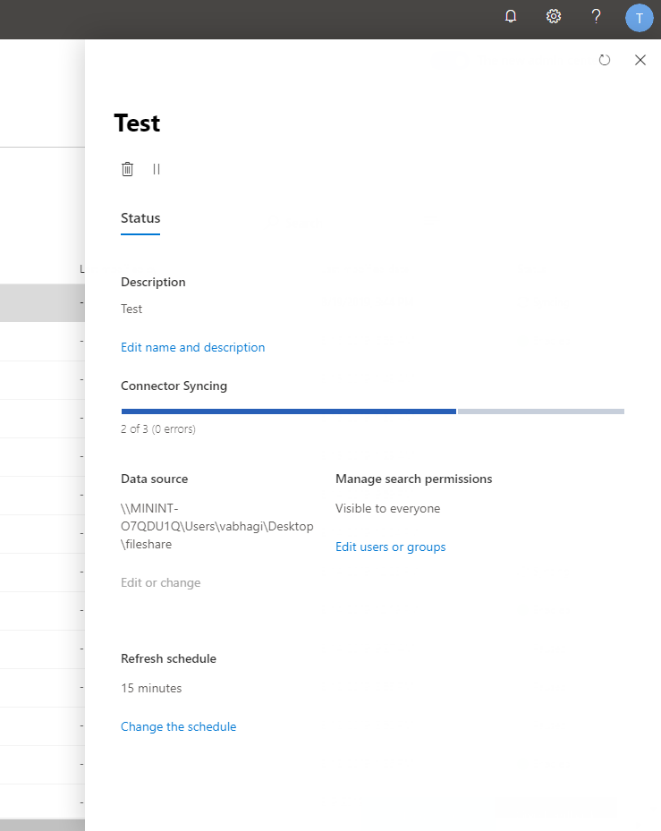
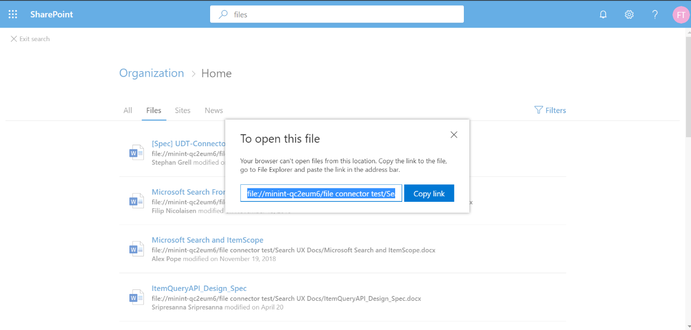

# File share connector configuration in the M365 Admin portal

## Overview
The file share connector for Microsoft Search will allow the users in your organization to search on-premises file shares. The search results from these shares will be merged with the results from Sharepoint and One Drive for Business (ODB).

This article is intended for Microsoft Search file share connector administrators, or anyone who is responsible for configuring, running, and monitoring the connector. Here you can find information on what to know before configuring your connector, additional information regarding connector capabilities, and limitations.

## Connect to data source
In the connect to data source page do the following:
1. Select **Create** > **Folder**.
2. Provide a path to the file share.
3. From the dropdown, select your previously installed gateway. See [configure your gateway](configure-gateway.md) for more information. Provide the credentials of the Windows user account that has **read access** to all the files in the share. Click **Next**.
4. You will be taken to a screen which lists all the files present in the share. Verify this and click **Create**.
5. You will be taken to a success screen. Click **Next**.
6. You can see all the metadata that is fetched in the following screen.

## Manage search permissions
In the "Manage search permissions" screen, let the search be visible to **Everyone**.

## Set refresh schedule
The default refresh interval is 15 minutes. You can choose to update this if you would like.

## Monitoring the connection
( ADD SOMETHING ABOUT MANAGE CONNECTORS )
Admins can also see a progress bar which indicates how many files are identified by the crawl and how many got successfully ingested so far. Right after creating the connection, this progress bar shows the total number of files detected in the share. Once the initial full crawl gets successfully completed, this bar shows the progress for periodic incremental crawls. Only the newly detected changes will be shown in the progress bar for incremental crawl.



Below are the four states that show up in the ‘status’ column against each connection:
* **Syncing**: the connector is crawling the data from the source to index the existing items and make any updates
* **Enabled**: the connection is enabled and there is no active crawl running against it. ‘Last sync time’ indicates when the last successful crawl happened. The connection is as fresh as the time present there.
* **Paused**: the crawls are paused by the admins through the pause option. The next crawl will run only when it is manually resumed. However, the data from this connection will continue to be searchable.
* **Failed**: there was a critical failure in the connection. This requires manual intervention. The admin needs to take appropriate action based on the error message shown. Data which was indexed until the error occurred will be searchable.

## Setting up your search results page (SERP)
You need to set up the SharePoint search engine results page so that different file connections results can be displayed in the ‘Files’ & ‘All’ tabs. Combined results from connections and SharePoint would be found in the ‘All’ tab.. Results from only file connections are displayed in the ‘Files’ vertical. 

Follow these steps to set up your SERP:
1. Create a SharePoint site collection with a modern search page.

2.	Install (if not already installed) [SharePoint Online Management Shell](https://www.microsoft.com/en-us/download/details.aspx?id=35588).

3. Open SharePoint Online (SPO) Management shell as an administrator and import “Microsoft.SharePoint.Client.dll” module present in "C:\Windows\Microsoft.NET\assembly\GAC_MSIL\Microsoft.SharePoint.Client\v4.0_16.0.0.0__71e9bce111e9429c\Microsoft.SharePoint.Client.dll". (This path can be different for users). 
To import the module please run this command in SPO Management shell:
```bash
Import-Module "C:\Windows\Microsoft.NET\assembly\GAC_MSIL\Microsoft.SharePoint.Client\v4.0_16.0.0.0__71e9bce111e9429c\Microsoft.SharePoint.Client.dll" 
```

4. Run the script inside SPO Management shell.
```bash
$orgName = Read-Host -prompt 'Please enter your org name'
$userName = Read-Host -prompt 'Enter user name'
$userCreds = Get-Credential -UserName $userName -Message "Type the password"
Connect-SPOService -Url https://$orgName-admin.sharepoint.com -Credential $userCreds

$url = Read-Host -Prompt 'Please enter the site url'
$site = Get-SPOSite -Identity $url
Set-SPOSite $url -DenyAddAndCustomizePages 0

$pwd = Read-Host -AsSecureString 'type the password'
$context = New-Object Microsoft.SharePoint.Client.ClientContext($url)
$credential = New-Object Microsoft.SharePoint.Client.SharePointOnlineCredentials($userName, $pwd)
$context.Credentials = $credential
$web = $context.Web
$context.Load($web)
$web.AllProperties["AllVerticalContent"] = "Combined"
$web.Update()
$context.ExecuteQuery()
$web.AllProperties["FilesVerticalContent"] = "ConnectorsOnly"
$web.Update()
$context.ExecuteQuery()
Set-SPOSite $url -DenyAddAndCustomizePages 1

Write-Host "Success" -ForegroundColor Cyan
Read-Host -Prompt 'Press enter to exit'
```

5. Enter the details (organization name, username, password, site URL, etc.) as prompted in PowerShell.

**Example**: If your admin credentials are admin@a830edad9050849823J19081300.onmicrosoft.com, then your organization name would be a830edad9050849823J19081300 and your site URL would be https:// a830edad9050849823J19081300.sharepoint.com.


> [!NOTE]
> The **AllProperties** setting can only be done at a site collection level (Teams/Comms site).

6. Now you should be able to search for ingested files and see them under the "Files" tab. 

## Searching for file share content in the SERP
Navigate to the Sharepoint home page of the test tenant to search for any ingested content.

> [!NOTE]
> You must click on the "Files" vertical to see the results.

File results of local file shares cannot be viewed in the browser by clicking on the result, due to browser restrictions. Thus, after clicking on the file result you need to copy the link from the popup and paste it in the address bar of your system’s file browser (Windows explorer in case you are using Windows OS). This will allow you to open the file on your system. See below.



## Troubleshooting
When there is something critically wrong with the connection, the status of the connection is shown as ‘failed’. In that case, there are three kinds of errors you can see in the details page when you click on the failing connection.
1. Gateway not reachable (error code: 11): The gateway machine being used by the connection is down. Please verify if the PowerBI process is running on the gateway machine.
2. Authentication error (error code: 12): The credentials which were used for creating the connection expired or is no longer valid. Enter the right credentials to resolve this.
3. Internal error (error code: anything other than 11 and 12): There is some error in the connector infrastructure. Please reach out to [searchconnectorsfeedback@service.microsoft.com](searchconnectorsfeedback@service.microsoft.com) with the following details.
    * Dataset ID
    * Screenshot of the error you see in the admin portal
    * Gateway logs. You can follow the instruction [here](https://docs.microsoft.com/en-us/data-integration/gateway/service-gateway-tshoot#collect-logs-from-the-on-premises-data-gateway-app) to export the logs. Please send the ODGLogs.zip folder.

^^^^^^ WHAT IS THIS EMAIL???

## Limitations
* You can only ingest 'files' with a fixed schema (no custom properties)
* NTFS ACLs are support on search (share ACLs are not respected as of now. Support for the same will be added soon)
* No support for external identities (needs mapping to Azure Active Directory identities)
^^^ ADD LINKS. WHAT IS NTFS??


