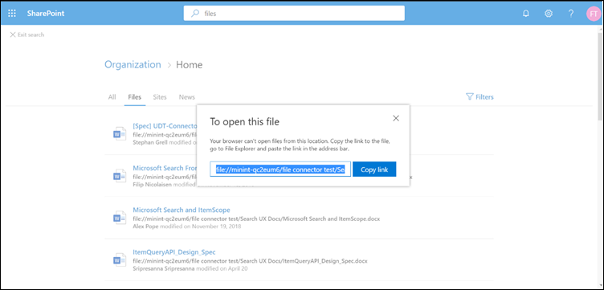

# Configure a File share connector in Microsoft 365

With the File share connector for Microsoft Search, users in your organization can search on-premises file shares. The search results from these shares merge with the results from SharePoint and Microsoft OneDrive for Business.

This article is for Microsoft 365 administrators or anyone who configures, runs, and monitors a File share connector for Microsoft Search. It explains how to configure your connector and connector capabilities, limitations, and troubleshooting techniques. 

## Install a data gateway
In order to access your third-party data, you must install and configure a Microsoft Power BI gateway. See [Install and on-premises gateway](https://docs.microsoft.com/data-integration/gateway/service-gateway-install) to learn more.  

## Connect to a data source
On the **Connect to data source** page, create a folder and provide a path to the file share. Then select your previously installed gateway. Enter the credentials for a Windows user account with **read access** to all the files in the share. You can then verify the files present in the share and see all the fetched metadata.

## Manage search permissions
The File share connector only supports search permissions visible to **Everyone**. Indexed data appears in the search results and is visible to all users in the organization.

## Set the refresh schedule
The recommended default refresh schedule interval is 15 minutes, but you can change it to another interval that you prefer.

## Set up your search results page
To display different file connection results in the **All** and **Files** tabs, you need to set up a SharePoint search engine results page:
- The **All** table shows combined results from your file connections, SharePoint files, OneDrive files, and SharePoint sites. 
- The **Files** vertical shows all file results from your connections, SharePoint, and OneDrive.
Results from file connections are added to already existing results in both the **All** and **Files** verticals.

To set up your search results page, take these steps:
1. Create a SharePoint site collection with a modern search page.

2. Install a [SharePoint Online Management Shell](https://www.microsoft.com/download/details.aspx?id=35588).

3. Open SharePoint Online Management Shell as an administrator and import the **Microsoft.SharePoint.Client.dll** module present at `C:\Windows\Microsoft.NET\assembly\GAC_MSIL\Microsoft.SharePoint.Client\v4.0_16.0.0.0__71e9bce111e9429c\Microsoft.SharePoint.Client.dll`.

> [!NOTE]
> This path might not be the same for all users.

To import the module, run this command in SharePoint Online Management Shell:
```bash
Import-Module "C:\Windows\Microsoft.NET\assembly\GAC_MSIL\Microsoft.SharePoint.Client\v4.0_16.0.0.0__71e9bce111e9429c\Microsoft.SharePoint.Client.dll" 
```

4. Now run this script:
```bash
$orgName = Read-Host -prompt 'Please enter your org name'
$userName = Read-Host -prompt 'Enter user name'
$userCreds = Get-Credential -UserName $userName -Message "Type the password"
Connect-SPOService -Url https://$orgName-admin.sharepoint.com -Credential $userCreds

$url = Read-Host -Prompt 'Please enter the site url'
$site = Get-SPOSite -Identity $url
Set-SPOSite $url -DenyAddAndCustomizePages 0

$pwd = Read-Host -AsSecureString 'type the password'
$context = New-Object Microsoft.SharePoint.Client.ClientContext($url)
$credential = New-Object Microsoft.SharePoint.Client.SharePointOnlineCredentials($userName, $pwd)
$context.Credentials = $credential
$web = $context.Web
$context.Load($web)
$web.AllProperties["AllVerticalContent"] = "Combined"
$web.Update()
$context.ExecuteQuery()
$web.AllProperties["FilesVerticalContent"] = "ConnectorsOnly"
$web.Update()
$context.ExecuteQuery()
Set-SPOSite $url -DenyAddAndCustomizePages 1

Write-Host "Success" -ForegroundColor Cyan
Read-Host -Prompt 'Press enter to exit'
```

5. Enter the required values in PowerShell, such as organization name, username, password, and site URL. As an **example**, if your admin credentials are `admin@a830edad9050849823J19081300.onmicrosoft.com`, then your organization name is **a830edad9050849823J19081300**, and your site URL is `https:// a830edad9050849823J19081300.sharepoint.com`.

> [!NOTE]
> The **AllProperties** setting can only be done at a site collection level (Teams/Comms site).

6. Now you can search for indexed files and see results in both the **All** and **Files** tabs.

## Search for file share content in the search results page
To search for indexed content, go to the SharePoint home page of your test tenant. Results will be displayed in the **All** and **Files** tabs.

Because of browser restrictions, you can't select a file result to view or open files from local file share searches. To open these files, copy the file result's link and paste it into the address bar of your system's browser. For Windows OS, use Windows Explorer. Then you can open the file on your system.



## Troubleshooting
If something is critically wrong with a connection, its status shows as **failed**. To get more information on the three types of errors, go to the **error details** page and select the failing connection. See [Manage your connector](manage-connector.md) to learn more.
1. **Gateway not reachable (error code: 11)**. The gateway machine for the connection is down. Verify if the Microsoft Power BI process runs on the gateway machine.
2. **Authentication error (error code: 12)**. The credentials that were used for creating the connection expired or are no longer valid. To resolve this error, enter valid credentials.
3. **Internal error (error code: anything other than 11 or 12)**. There's an error in the connector infrastructure. See the [Feedback](connectors-feedback.md) article to find out how to report these errors.

## Limitations
The File share connector has these limitations in the preview release:
* You can only index files with fixed properties, not files with custom properties.
* File share Access Control Lists (ACLs) aren't currently supported.
* External identities aren't supported. They must be mapped to Azure Active Directory identities.