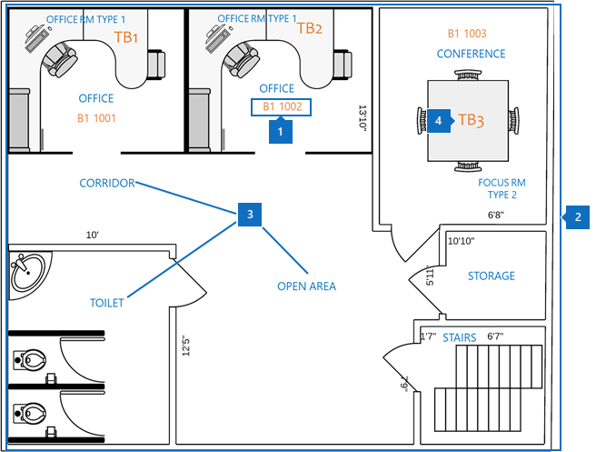
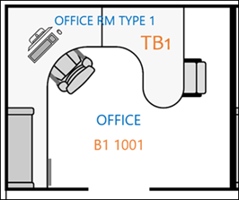
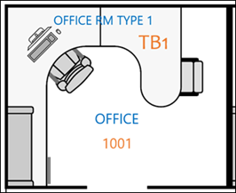
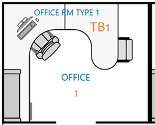

# Best practices for Microsoft Search floor plans

To implement Microsoft Search floor plans, you need to coordinate the three data elements explained in this article:
- **Building location data**. Required format and how data is added.
- **Floor plan map in DWG format**. How to view floor plans and data that's needed for maximum success.
- **Employee office location in [Azure Active Directory (Azure AD)](https://azure.microsoft.com/en-us/services/active-directory/)**. Required format and how data is added.

The best practices for deploying Microsoft Search floor plans are also described in the following sections.

## Building location data
Before you add floor plans, you need to add your buildings to Microsoft Search locations. Provide the following required building data:

|Required building data  |Example  |
|---------|---------|
|Name     |    Building 1, New York City     |
|Street address     |     123 Any Avenue, New York, NY 10118  |
|Latitude-longitude  (optional)   |    40.760539, -73.975341      |
|Keywords     |    New York Office, Building 1, main office, headquarters     |

You can add many buildings at a time by using the **Import** feature in the **Locations** tab instead of adding locations one at a time. With the **Import** feature, you can specify the latitude-longitude. However, you can only add the street address in the **Add floor plans** wizard. For more information, see [Manage locations](manage-locations.md).

## Floor plan map in DWG format
To build maps in Microsoft Search, you need to upload floor plans in DWG format with specific information. To learn how to create and view DWG-formatted files, see [DWG Viewers](https://www.autodesk.in/products/dwg). 

Floor plan maps display four elements:
1. **Room numbers**. In the following example, room numbers are defined as **B1 1001** and **B1 1002**. **B1** is the building code, and **1001** contains the floor number **1** and the office number **001**.
1. **Room layouts.** To help clarify details when multiple users share an office, you can define layouts like chairs and desks.
1. **Room types**. Some examples include office, corridor, open area, and toilet.
1. **Asset info**. If users are in an open space, you can denote which desk they sit at. In this example, the desks are denoted by **TB1** and **TB2**.

In this diagram, room numbers are the most important item. They're mapped to a person’s office location on their user account as shown in the following image.

####insert outlook people card####

This information is stored in Azure AD in the **Office location** property. In the Microsoft 365 [admin center](https://admin.microsoft.com), it’s called the **Office** property, and it can be added in **Active users**.

### DWG files
Microsoft Search requires floor plan files in DWG, which is an AutoCAD format. The files must contain **layout** and **label** data. **Room numbers** are the most important labels for floor plans. 

We recommend that you create your office numbering system with the exact match method shown in the following table. But you aren't limited to that labeling. For example, if the user's office location in Azure AD is **B1 1001**, you can label the room number in the DWG file with any of the options that follow.

|Match  |Layout  |
|---------|---------|
|Exact match to office location (Recommended)   **B1 1001**   Building code: B1 Floor: 1  Room number: 001    |         |
|Match floor and room number   **1001** Floor: 1  Room number: 001    |      |
|Match room number only   **1** Room number: 1        |         |

## User account office location
To map an employee’s location, the room numbers in DWG files are mapped to office locations in the user’s account in Azure AD. The **Office location** property needs to match the office location information in the DWG file.

The following table explains best practices for mapping location data:

|Best practice  |Explanation |
|---------|---------|
|Include building code, floor, and room number.     |   This data gives you the best chance to make exact matches.     |
|Include a separator after building codes and floors.     |  Separate building codes from floor and room numbers with a separator or a space, as in these examples:  B1 1001  B1/1001   B1-1001   |
|Room number always follows building code, wing, and floor information.     |  If room number is **1001**, then set the office location to **B1 1001**, **B1/1001**, or **B1-1001**.   If the room number is **F1-001**, then set the office location to **B1 F1-001** or **B1/F1-001**.   If the room number is **1**, then set the Azure AD location to **B1 1001**, **B1/1001**, or **B1-F1-001**.       |
|

## Next steps
[Manage locations](manage-locations.md) 
[Manage floor plans](manage-floorplans.md)