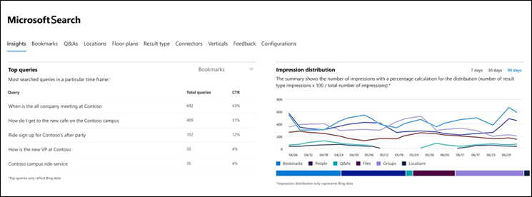
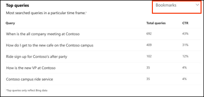
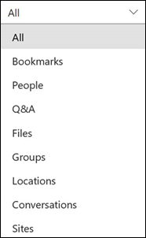
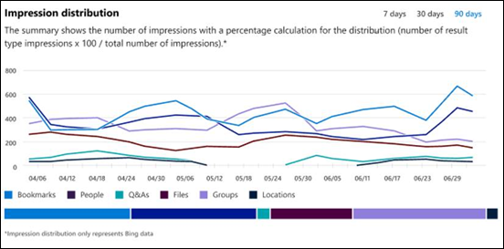

# Microsoft Search Insights dashboard reports

You can use the Microsoft Search insights dashboard to manage the Bing data for your published answers. This is just one of the steps needed to [make content easy to find](make-content-easy-to-find.md) for your users.

When you first go to Microsoft Search in the Microsoft 365 admin center, you'll enter on the Insights dashboard.

Here are the reports that are available on the insights dashboard.

> [!NOTE]
> The data in the reports only represents Bing data.

## Top queries

This report gives details about the top 2000 Bing search queries that users run. For a query to appear in **Top queries**, the query must get at least three clicks.

A low click-through rate (CTR) means that users aren’t finding what they’re looking for.

You can choose different views of the report by filtering on the type of answer. For example if you just want to view the top queries for Bookmarks, select the drop-down in the upper-right corner of the report, and then select **Bookmarks**. By default, **All** answer types are shown.

## Impression distribution

This report shows impression distribution in Bing over time for various answers. Examples are bookmarks, people, Q&A, files, locations, file sites, groups, and conversations. 

Impression Distribution can help admins understand what users look for during a specified period.
