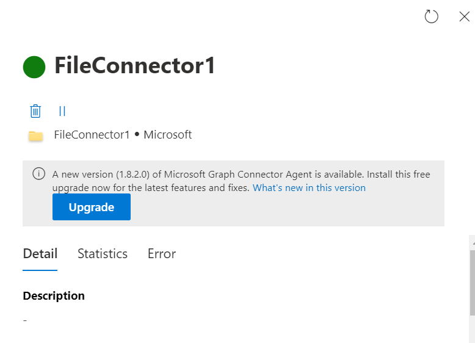

--- 
title: "Release history for Microsoft Graph connector agent" 
ms.author: harshkum 
author: harshkum
manager: Siva
audience: Admin
ms.audience: Admin 
ms.topic: article 
ms.service: mssearch 
ms.localizationpriority: medium 
search.appverid: 
description: "Release history of Microsoft Graph connector agent, which is used to index the on-premises data sources using Microsoft built connectors" 
--- 

# Release history for Microsoft Graph connector agent

Indexing on-premises data sources require you to install *Microsoft Graph connector agent* software. It allows for secure data transfer between on-premises data and the connector APIs.

For help on installation, refer to this [page](graph-connector-agent.md#installation)

[Download latest Graph Connector Agent](https://aka.ms/gca)

## Version 3.0.1.0 (*September 12, 2024)

* Bug fixes and reliability improvements.

## Version 3.0.0.0 (*August 08, 2024)

* This is a critical security patch that enhances the secure communication between endpoints. We recommend you to upgrade to this version immediately as Microsoft will deprecate the previous versions by September 30, 2024. For more details, follow the communication from Microsoft in the Message Center. Please ignore if you have already upgraded to this version.

## Version 2.4.0.0 (*July 05, 2024*)

* Support for .NET 8. The .NET 8 upgrade flow for the host machine will kick-in after you hit "Upgrade" button in the connection pane. Make sure to upgrade the machine's version to .NET 8 to avoid unexpected behavior. If there is a failure in the upgrade in the process, do a manual upgrade to the .NET version before upgrading the agent.
* Feature to show elaborate index statistics for a connection. This gives more information about the current state of items in the index. [Learn more.](connector-details-errors.md#view-connection-statistics)
* Bug fixes and reliability improvements.

## Version 2.3.7.0 (*June 12, 2024*)

* Bug fixes and reliability improvements.

## Version 2.3.6.0 (*May 15, 2024*)

* Bug fixes and reliability improvements.

## Version 2.3.5.0 (*May 09, 2024*)

* Bug fixes and reliability improvements.

## Version 2.3.4.0 (*April 17, 2024*)

* Fixed issue where item url was getting ingested with changed case.
* Other bug fixes and reliability improvements.

## Version 2.3.3.0 (*April 1, 2024*)

* Fixed upgrade failure issue
* Other bug fixes and reliability improvements.

## Version 2.3.2.0 (*March 20, 2024*)

* Enterprises Websites Graph Connector: Added error reporting for redirection related errors.
* Fixed identity sync crawls errors.
* Other bug fixes and reliability improvements.

## Version 2.3.1.0 (*January 29, 2024*)

* Enabled OAuth2 support for Confluence connector.
* Added schema edit support for Graph connector SDK.
* Added support for SID or UPN identity type in Graph Connector Agent.
* Bug fixes and reliability improvements.

## Version 2.3.0.0 (*December 12, 2023*)

* Configurable payload size for File share connector to reduce ingestion failures
* ID Sync framework improvements to resolve crawl errors
* Bug fixes and reliability improvements

## Version 2.2.8.0 (*November 18, 2023*)

* Bug fixes and reliability improvements

## Version 2.2.7.0 (*October 17, 2023*)

* Bug fixes and reliability improvements: Fixed an issue discovered in the last version due to which the crawls were failing for some connections.

## Version 2.2.6.0 (*October 10, 2023*)

* Bug fixes and reliability improvements

## Version 2.2.5.0 (*August 30, 2023*)

* Added functionality to keep trying the multiple instances if they are unreachable in the first crawl. Before this if the connectivity with one of the instances was interrupted, Graph connector agent did not retry the path in the subsequent crawl and threw a warning for the instance path.
* Bug fixes and reliability improvements

## Version 2.2.4.0 (*August 28, 2023*)

* Bug fixes and reliability improvements

## Version 2.2.3.0 (*July 21, 2023*)

* Bug fixes and reliability improvements

## Version 2.2.2.0 (*June 21, 2023*)

* Bug fixes and reliability improvements

## Version 2.2.1.0 (*June 07, 2023*)

* Bug fixes and reliability improvements

## Version 2.2.0.0 (*May 31, 2023*)

* Added surfacing of errors when the endpoint "graph.microsoft.com" is not allowed in the customer network. Refer to this [page](graph-connector-agent.md) to learn more about the domains that need to be unblocked in the customer network.
* Bug fixes and reliability improvements

## Version 2.1.0.0 (*April 10, 2023*)

* Fix for slow crawl by optimizing local file logging
* Semantic search for Intranet connector - Parsing of HTML content to store annotations for each item to power future intelligent search capabilities
* Bug fixes and reliability improvements

## Version 2.0.1.0 (*March 27, 2023*)

* Bug fixes and reliability improvements

## Version 2.0.0.0 (*March 15, 2023*)

* Microsoft Graph connectors SDK GA: Updated SDK test utility with more test cases. [Learn more about Graph Connectors SDK](/graph/custom-connector-sdk-overview).
* Support for .NET 7. This version upgrade requires a manual installation of the GCA and the “Upgrade” feature will not be available until this new version is installed. If you're upgrading from GCA 1.x to 2.x, refer to this [page](graph-connector-agent.md).
* Improved troubleshooting of common GCA issues through "Health Check" feature in Registration details page. Now, you can click on the "Health check" button, as in the image, to check GCA health.
:::image type="content" source="media/onprem-agent/health-check-registration.jpg" alt-text="Sample snapshot of Health check success on GCA registration page.":::

* Bug fixes and performance improvements

## Version 1.8.9.0 (*February 9, 2023*)

* Bug fixes and reliability improvements

## Version 1.8.8.0 (*January 19, 2023*)

* Bug fixes and reliability improvements

## Version 1.8.7.0 (*January 11, 2023*)

* Bug fixes and reliability improvements

## Version 1.8.6.0 (*December 16, 2022*)

* Bug fixes and reliability improvements

## Version 1.8.5.0 (*December 06, 2022*)

* Security Enhancements
* Bug fixes and reliability improvements

## Version 1.8.2.0 (*October 06, 2022*)

* Upgrade Graph Connector Agent with just one click in the UI. For later builds, if there are any upgrades available for Graph Connector Agent, the one-click upgrade feature is available in the connection details pane. For builds older than this version, there is an option to download and install the GCA build.

* Bug fixes and reliability improvements

## Version 1.8.1.0 (*not supported*) (*August 29, 2022*)

* Security Enhancements
* Bug fixes and reliability improvements

## Version 1.8.0.0 (*not supported*) (*July 25, 2022*)

* Support for incremental crawls and OAuth for Microsoft Graph connectors SDK
* Bug fixes and reliability improvements

## Version 1.7.0.0 (*not supported*) (*June 16, 2022*)

* Security enhancements
* Bug fixes and reliability improvements

## Version 1.6.0.0 (*not supported*) (*May 09, 2022*)

* Dashboard changes to enable monitoring of multiple instances of a connector
* Bug fixes and reliability improvements

## Version 1.5.1.0 (*not supported*) (*March 21, 2022*)

* Bug fixes and reliability improvements
* Change in default property labels assignment for 'Enterprise websites' connector

## Version 1.5.0.0 (*not supported*) (*February 16, 2022*)

* Ability to update client-secret & certificate used for authentication 
* OAuth 2.0 support for Intranet On-premises connector 
* Support for parsing of OneNote (.one) file 
* Fixed issues in parsing word files (.doc*) & last modified date for PowerPoint files (.ppt*) 

## Version 1.4.0.0 (*not supported*) (*January 13, 2022*)

* Support for multiple instances of a connector
* Bug fixes and reliability improvements

## Version 1.3.1.0 (*not supported*) (*October 28, 2021*)

* File-share connectors documents per second improvements
* Other performance improvements
* Bug fixes

## Version 1.3.0.0 (*not supported*) (*October 8, 2021*)

* General reliability improvements
* Bug fixes

## Version 1.2.1.0 (*not supported*) (*September 3, 2021*)

* Bug fixes

## Version 1.2.0.0 (*not supported*) (*August 16, 2021*)

* Support for localized strings in 33 languages: English - US, Arabic, Bulgarian, Catalan, Czech, Danish, German, Greek, Spanish, Estonian, Finnish, Hebrew, Croatian, Hungarian, Italian, Japanese, Korean, Lithuanian, Latvian, Dutch, Norwegian, Polish, Portuguese, Russian, Slovak, Slovenian, Serbian (Latin), Swedish, Thai, Turkish, Ukrainian, Chinese - China, Chinese - Taiwan
* Resumption of full crawl if there was an agent crash
* Bug fixes

## Version 1.1.0.0 (*not supported*) (*July 9, 2021*)

* Support for Exclusions rules for file-share connector
* Performance improvements
* Bug fixes
