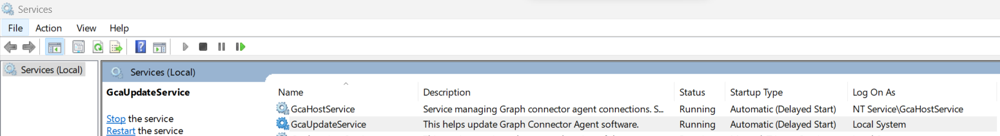
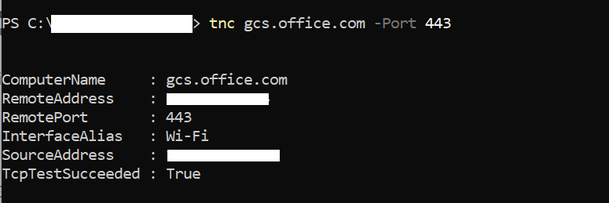
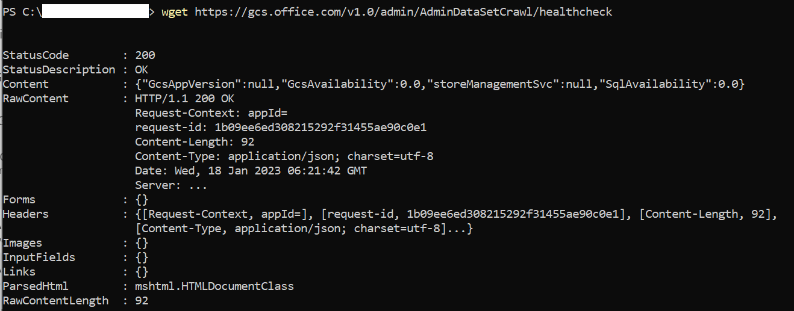
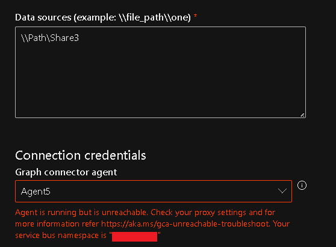
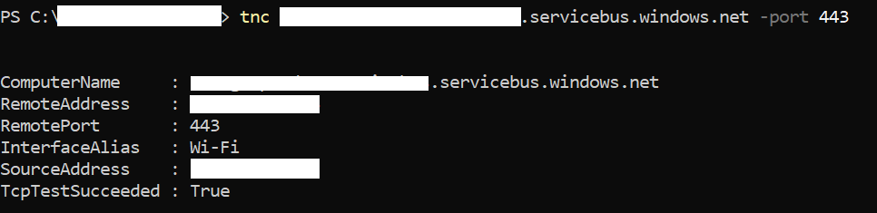
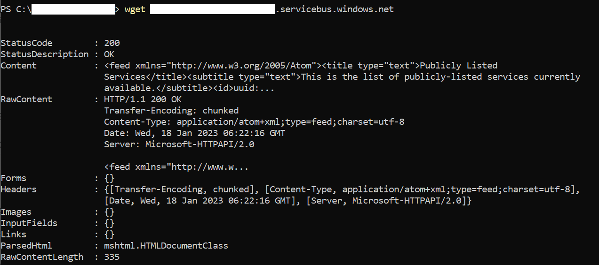

--- 
title: "Microsoft Graph connector agent" 
ms.author: kam1 
author: kam1 
manager: jameslau 
audience: Admin
ms.audience: Admin 
ms.topic: article 
ms.service: mssearch 
ms.localizationpriority: medium 
search.appverid: 
- BFB160 
- MET150 
- MOE150 
description: "Overview of the Microsoft graph connector agent to index on-premises content using Microsoft built connectors for File-shares, SQL, Confluence etc." 
ms.date: 08/02/2021
---

# Microsoft Graph connector agent

Using on-premises connectors requires installing *Microsoft Graph connector agent* software. It allows for secure data transfer between on-premises data and the connector APIs. This article guides you through installing and configuring the agent.

## Installation

[Download](https://aka.ms/gca) the latest version of the Microsoft Graph connector agent and install the software by using the installation configuration assistant. Release notes of the connector agent software are available [here](./graph-connector-agent-releases.md)

### Check Execution Policy

The execution policy has to be set to allow the execution of remote signed scripts. If any machine or group level policy is restricting the same, the installation of GCA fails. Run the following command to get the execution policy:

```powershell
Get-ExecutionPolicy -List
```

To know more and set the right execution policy, refer to [Execution Policy](/powershell/module/microsoft.powershell.core/about/about_execution_policies?).

### Recommended Configuration

Using the recommended configuration of the machine, the connector agent instance can handle up to three connections. Any connections beyond that might degrade the performance of all connections on the agent. Here is the recommended configuration:

* Windows 10, Windows Server 2016 R2 and higher versions
* [.NET Framework 4.7.2](https://dotnet.microsoft.com/en-us/download/dotnet-framework/net472)
* [.NET Core Desktop Runtime 8.0 (x64)](https://dotnet.microsoft.com/download/dotnet/8.0)
* 8 cores, 3 GHz
* 16 GB RAM, 2 GB Disk Space
* Network access to data source and internet through 443

If your organization's proxy servers or firewalls block communication to unknown domains, add the following rules to the 'allow' list:

| **M365 Enterprise** | **M365 GCC** | **M365 GCCH** |
| ------------- | -------------| -------------|
| 1. `*.servicebus.windows.net` | 1. `*.servicebus.usgovcloudapi.net` | 1. `*.servicebus.usgovcloudapi.net`
| 2. `*.events.data.microsoft.com` | 2. `*.events.data.microsoft.com` | 2. `*.events.data.microsoft.com`
| 3. `*.office.com` | 3. `*.office.com` | 3. `*.office.com`, `*.office365.us`
| 4. `https://login.microsoftonline.com` | 4. `https://login.microsoftonline.com` | 4. `https://login.microsoftonline.com`, `https://login.microsoftonline.us`
| 5. `https://gcs.office.com/` | 5. `https://gcsgcc.office.com` | 5. `https://gcs.office365.us/`
| 6. `https://graph.microsoft.com/` | 6. `https://graph.microsoft.com` | 6. `https://graph.microsoft.com/`, `https://graph.microsoft.us/`

>[!NOTE]
>Proxy authentication isn't supported. If your environment has a proxy that requires authentication, we recommend allowing the connector agent to bypass the proxy.

## Upgrade

Graph Connector Agent can be upgraded in two ways:

1. Downloading and installing Graph Connector Agent manually from the link provided in the installation section.

2. Clicking on the "Upgrade" button available in the connection pane as shown in the image:
   :::image type="content" source="media/gca-releases/one-click-upgrade.png" alt-text="Sample snapshot of how to upgrade GCA with one-click from the connection pane.":::

The upgrade button isn't available for agents upgrading from 1.x version to 2.x version. Follow these steps if the agent is upgrading from 1.x to 2.x version:

1. Download the installer from the link provided in the installation section.

2. The installer asks you to install .NET 8 Desktop runtime, if not already installed.

3. Allow communication to the endpoint *.office.com.

4. Post installation, GCA configuration app restarts. If GCA isn't registered, sign in and proceed with the registration.

5. If GCA is already registered, the GCA configuration app shows the following success message:
   :::image type="content" source="media/onprem-agent/health-check-sign-in.jpg" alt-text="Sample snapshot of Health check success on GCA sign-in page.":::

6. If you observe any errors, follow the suggested mitigation steps in the error message and close & reopen the GCA configuration app.

7. If the error message says, "Can't determine the health of the agent. If the error persists, contact support.", restart GcaHostService(steps mentioned in the troubleshooting section), and open the GCA configuration app again.

8. You can run the checks anytime by closing and opening the GCA Config app or by using the "Health Check" button next to the "Edit" button in the registration details screen.
   :::image type="content" source="media/onprem-agent/health-check-registration.jpg" alt-text="Sample snapshot of Health check success on GCA registration page.":::

## Create and configure an app for the agent  

First, sign-in and note that the minimum required privilege on the account is search administrator. The agent then asks you to provide authentication details.
Use the steps to create an app and generate the required authentication details.

### Create an app

1. Go to the [Azure portal](https://portal.azure.com) and sign in with admin credentials for the tenant.

2. Navigate to **Microsoft Entra ID** -> **App registrations** from the navigation pane and select **New registration**.

3. Provide a name for the app and select **Register**.

4. Make a note of the application (client) ID.

5. Open **API permissions** from the navigation pane and select **Add a permission**.

6. Select **Microsoft Graph** and then **Application permissions**.

7. Search for the following permissions and select **Add permissions**.

   | **Permission** | **When is the permission required** |
   | ------------- | -------------|
   | [ExternalItem.ReadWrite.OwnedBy](/graph/permissions-reference#application-permissions-52) or [ExternalItem.ReadWrite.All](/graph/permissions-reference#application-permissions-52) | Always |
   | [ExternalConnection.ReadWrite.OwnedBy](/graph/permissions-reference#application-permissions-58) | Always |
   | [Directory.Read.All](/graph/permissions-reference#application-permissions-23) | Required for File share, MS SQL and Oracle SQL connectors |

8. Select **Grant admin consent for [TenantName]** and confirm by selecting **Yes**.

9. Check that the permissions are in the "granted" state.

    :::image type="content" alt-text="Permissions shown as granted in green on right hand column." source="media/onprem-agent/granted-state.png" lightbox="media/onprem-agent/granted-state.png":::

### Configure authentication

You can provide authentication details using a client secret or a certificate. Follow the steps of your choice.

#### Configuring the client secret for authentication

1. Go to the [Azure portal](https://portal.azure.com) and sign in with admin credentials for the tenant.

2. Open **App Registration** from the navigation pane and go to the appropriate App. Under **Manage**, select **Certificates and secrets**.

3. Select **New Client secret** and select an expiry period for the secret. Copy the generated secret and save it because it is not shown again.

4. Use this Client secret and the application ID to configure the agent. Alphanumeric characters are accepted. You can't use blank spaces in the **Name** field of the agent.

#### Using a certificate for authentication

There are three simple steps for using certificate-based authentication:

1. Create or obtain a certificate
2. Upload the certificate to the Azure portal
3. Assign the certificate to the agent

##### Step 1: Get a certificate

You can use the script to generate a self-signed certificate. Your organization may not allow self-signed certificates. In that case, use this information to understand the requirements and acquire a certificate according to your organization's policies.

```powershell
$dnsName = "<TenantDomain like agent.onmicrosoft.com>" # Your DNS name
$password = "<password>" # Certificate password
$folderPath = "D:\New folder\" # Where do you want the files to get saved to? The folder needs to exist.
$fileName = "agentcert" # What do you want to call the cert files? without the file extension
$yearsValid = 10 # Number of years until you need to renew the certificate
$certStoreLocation = "cert:\LocalMachine\My"
$expirationDate = (Get-Date).AddYears($yearsValid)
$certificate = New-SelfSignedCertificate -DnsName $dnsName -CertStoreLocation $certStoreLocation -NotAfter $expirationDate -KeyExportPolicy Exportable -KeySpec Signature -KeyLength 2048 -KeyAlgorithm RSA -HashAlgorithm SHA256
$certificatePath = $certStoreLocation + '\' + $certificate.Thumbprint
$filePath = $folderPath + '\' + $fileName
$securePassword = ConvertTo-SecureString -String $password -Force -AsPlainText
Export-Certificate -Cert $certificatePath -FilePath ($filePath + '.cer')
Export-PfxCertificate -Cert $certificatePath -FilePath ($filePath + '.pfx') -Password $securePassword
```

##### Step 2: Upload the certificate to the Azure portal

1. Open the application and navigate to certificates and secrets section from left pane.

2. Select **Upload certificate** and upload the .cer file.

3. Open **App registration** and select **Certificates and secrets** from the navigation pane. Copy the certificate thumbprint.

:::image type="content" alt-text="List of thumbprint certificates when Certificates and secrets are selected in the left pane." source="media/onprem-agent/certificates.png" lightbox="media/onprem-agent/certificates.png":::

##### Step 3: Assign the certificate to the agent

Using the sample script to generate a certificate would save the PFX file in the location identified in the script.

1. Download the certificate pfx file onto the Agent machine.

2. Double-click the pfx file to launch the certificate installation dialog.

3. Select **Local Machine** for store location while installing the certificate.

4. After installing the certificate, open **Manage computer certificates** through the **Start** menu.

5. Select the newly installed certificate under **Personal** > **Certificates**.

6. Select and hold (or right-click) on the certificate and select **All Tasks** > **Manage Private Keys** Option.

7. In the permissions dialog, select add option. It pops up a new window. Select the 'Locations' option in it. Select the machine on which agent is installed among the listed locations shown and select **Ok**.

8. In the user selection dialog, write: **NT Service\GcaHostService** and select **Ok**. Don't select the **Check Names** button.

9. Select ok on the permissions dialog. The agent machine is now configured for the agent to generate tokens using the certificate.

## Troubleshooting

### Installation failure

If there's an installation failure, check the installation logs by running: msiexec /i "< path to msi >\GcaInstaller.msi" /L*V "< destination path >\install.log". Make sure you are not getting any security exception. Generally, these exceptions arise due to wrong policy settings. The execution policy needs to be remote signed. To know more, check the "Installation" section of this document.

If the errors aren't resolvable, send an email to support via MicrosoftGraphConnectorsFeedback@service.microsoft.com with the logs.

### Registration failure

If signing in to configure the application fails and shows the error, "Sign-in failed, please select the sign-in button to try again," even after browser authentication succeeds, then open services.msc and check if GcaHostService is running. If it doesn't start, start it manually. In Task Manager, go to Services tab, check if GcaHostService is in the running state. If not, right click and start the service.



When the service fails to start with the error "The service didn't start due to a logon failure," check if the virtual account: "NT Service\GcaHostService" has permission to sign in as a service on the machine. Check [this link](/windows/security/threat-protection/security-policy-settings/log-on-as-a-service) for instructions. If the option to add a user or group is greyed out in the Local Policies\User Rights Assignment, it means that the user trying to add this account doesn't have admin privileges on this machine, or there's a group policy overriding it. The group policy needs to be updated to allow the host service to log on as a service.

### Post Registration Failure

Post registration, some local settings may affect the connectivity of the agent.

#### Agent is offline

The agent is considered offline if it isn't able to contact graph connector services. In such cases, follow these steps:

1. Check if the agent is running - Sign-in to the machine where the agent is installed and check if it's running. In Task Manager, go to Services tab, check if GcaHostService is in the running state. If not, right click and start the service. 

    

1. Check if domain gcs.office.com is reachable. (For a GCC tenant, substitute gcsgcc.office.com, and for a GCCHigh tenant, substitute gcs.office365.us, as shown in the initial table.)
   Follow these steps:
    * From PowerShell, run the following command:

    ```powershell
    tnc gcs.office.com -Port 443
    ```

    The response should contain the output “TcpTestSucceeded: True” as shown:

    

    If it's false, verify that the domain is allowed in your proxy/firewall and requests are going through the proxy.

    * For a more specific test, or if you can't run tnc because ICMP ping is blocked in your network, run the following command:

    ```powershell
    wget https://gcs.office.com/v1.0/admin/AdminDataSetCrawl/healthcheck
    ```

    The output should contain  “StatusCode: 200”.

    

    If it isn't 200, verify that the domain is allowed in your proxy/firewall and requests are going through the proxy.

1. If the steps have passed successfully and the agent is still offline, check the GCA logs for any network proxy issues.
    * GcaHostService logs can be found in the given location (you might need to manually navigate to this path - copy paste in file explorer may not work):
        1. For Windows Server 2016 OS: C:\Users\GcaHostService\AppData\Local\Microsoft\GraphConnectorAgent\HostService\logs
        2. For all other supported Windows OS Version: C:\Windows\ServiceProfiles\GcaHostService\AppData\Local\Microsoft\GraphConnectorAgent\HostService\logs
    * Sort the log files in the folder in reverse order of “Modified Time” and open the latest two files.
    * Check for any error messages with following text: “No connection could be made because the target machine actively refused it.”
        1. This indicates that there's an issue with the network settings that is preventing the GcaHostService virtual account from contacting the https://gcs.office.com endpoint.
        2. Check with your network/proxy team to allow the virtual account (NT Service\GcaHostService), to send traffic to this domain.
        3. You can verify that the issue is resolved if the log file no longer contains these errors.

1. If none of the steps fix your issue, contact support by sending an email to MicrosoftGraphConnectorsFeedback@service.microsoft.com, and provide the two latest log files from the aforementioned location.

#### Agent is unreachable

While setting up the connection if the agent is unreachable, you see this screen:



Using the service bus namespace provided in the error details, follow these steps to troubleshoot:

1. From PowerShell, run the following command:

    ```powershell
    tnc <yournamespacename>.servicebus.windows.net -port 443
    ```

   The response should contain the output “TcpTestSucceeded: True”:

   

   If it's false, verify that the domain is allowed in your proxy/firewall and requests are going through the proxy.
1. If you can't run tnc because ICMP Ping is blocked in your network, run the following command in PowerShell:

    ```powershell
    wget https://<yournamespacename>.servicebus.windows.net/
    ```

   The output should contain “StatusCode: 200”:

   

   If it's false, verify that the domain is allowed in your proxy/firewall and requests are going through the proxy.

1. If none of the steps fix your issue, contact support by sending an email to MicrosoftGraphConnectorsFeedback@service.microsoft.com, and provide the two latest log files from the aforementioned location.

#### Update in progress

This error appears when there's an update already in progress and the error should go away after a maximum of 30 minutes.


If the error persists after 30 minutes, follow these steps:

1. Check if the agent is running - Sign-in to the machine where the agent is installed and check if it's running. In Task Manager, go to Services tab, check if GcaHostService is in the running state. If not, right click and start the service.


1. If the issue is still seen, contact support by sending an email to MicrosoftGraphConnectorsFeedback@service.microsoft.com, and provide the two latest log files. Manually traverse to the location to access the logs and share the same with the team - C:\Windows\System32\config\systemprofile\AppData\Local\Microsoft\GraphConnectorAgent\AgentUpdateApp\logs

### Connection failure

If the 'Test connection' action fails while creating a connection and shows the error, 'Please check username/password and the data source path', even when the provided username and password are correct, then ensure that the user account has interactive sign-in rights to the machine where the connector agent is installed. You can review the documentation about [logon policy management](/windows/security/threat-protection/security-policy-settings/allow-log-on-locally#policy-management) to check sign in rights. Also, ensure that the data source and the agent machine are on the same network.
