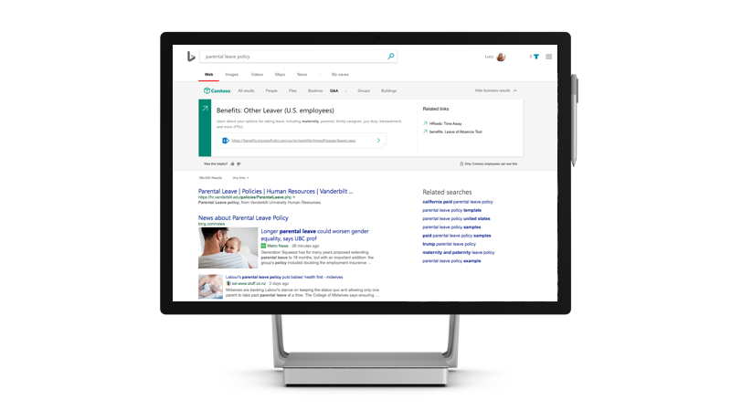

# Microsoft Search

<ul class="panelContent cardsW cols cols2">
    <li>
        

            

                

                    

                        

                            
                        

                    

                    

                    

                

            

        

    </li>
    <li>
        

            

                

                    

                        <h2>Why Microsoft Search</h2>
                        
Get an enterprise search experience that increases productivity and saves time by delivering more relevant search results for your organization

                        
<a href="why-microsoft-search.md">Find out how</a>

                    

                

            

        

    </li>
</ul>

<h2>Featured topics</h2>

<ul class="panelContent cardsW">
    <li>
        

            

                

                    

                        

                            
                        

                    

                    

                        <h3>Key features</h3>
                        
See which features are available for admins and users, including what you'll find when you search

                        
<a href="features.md">Find out more</a>

                    

                

            

        

    </li>
    <li>
        

            

                

                    

                        

                            
                        

                    

                    

                        <h3>Admin quick set up</h3>
                        
Find out how to turn on Microsoft Search and configure it for your organization in four easy steps

                        
<a href="quick-set-up.md">Start now</a>

                    

                

            

        

    </li>
    <li>
        

            

                

                    

                        

                            
                        

                    

                    

                        <h3>FAQs</h3>
                        
Get answers to some of the commonly asked questions about Microsoft Search

                        
<a href="faqs.md">Browse the FAQ</a>

                    

                

            

        

    </li>
</ul>

<ul class="panelContent cardsW cols cols2">
    <li>
        

            

                

                    

                        <h2>Use Microsoft Search</h2>
                        
Microsoft Search is a simple, fast, and safer way to find information, be more productive, and work smarter

                        
<a href="use/about-microsoft-search.md">Find out how</a>

                    

                

            

        

    </li>
    <li>
        

            

                

                    

                        

                            
                        

                    

                    

                    

                

            

        

    </li>
</ul>

<h2>More info</h2>
<ul class="panelContent cardsW">
    <li>
        

            

                

                    

                        
<a href="security.md">Security</a>

                        
<a href="requirements.md">Requirements</a>
  
                        
<a href="about-the-admin-portal.md">About the Admin portal</a>

                    

                

            

        

    </li>
    <li>
        

            

                

                    

                        
<a href="quick-set-up.md">Quick set up</a>

                        
<a href="connected-services.md">Connected services</a>

                        
<a href="set-up-microsoft-search.md">Set up Microsoft Search</a>

                    

                

            

        

    </li>
    <li>
        

            

                

                    

                        
<a href="create-bookmarks.md">Create bookmarks</a>

                        
<a href="create-qas.md">Create Q&As</a>

                        
<a href="add-users.md">Add users</a>

                    

                

            

        

    </li>
</ul>  