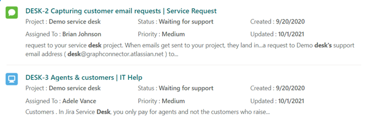

--- 

title: "Result Layout for Jira Graph connector" 
ms.author: vivg 
author: vivg 
manager: harshkum 
audience: Admin
ms.audience: Admin 
ms.topic: article 
ms.service: mssearch 
ms.localizationpriority: medium 
search.appverid: 
- BFB160 
- MET150 
- MOE150 
description: "Result layout JSON for Jira connector for Microsoft Search" 
ms.date: 05/28/2022
---

# Result layout for Jira Graph connector

The [Atlassian Jira Graph connector](jira-connector.md) allows your organization to index Jira issues. After you configure the connector and index content from the Jira site, you need to set up a search result page.

To set up the search result page, you need to:
1. Set up [search vertical](manage-verticals.md).
2. Set up [search result type](manage-result-types.md).

In this document, we have provided a sample result layout JSON required for setting up your result layout for Jira connector.

## Before you get started

You must have configured the Jira graph connector. To consume the sample result layout JSON as is, you must select the below properties for indexing with mentioned [search schema](configure-connector.md).

> [!NOTE]
> * Some of the below listed properties will be selected by default
> * **Retrieve** search attribute is required for displaying a property in search result template. A property can have other search attributes also.  

| Property | Search schema attribute required |
| -------- | -------- |
| Title | Retrieve |
| Updated | Retrieve |
| IssueLink | Retrieve |
| Issue Description | Content property |
| IssueStatus | Retrieve |
| IssueIconUrl | Retrieve |
| IssueType | Retrieve |
| ProjectName | Retrieve | 
| Created | Retrieve |
| AssigneeName | Retrieve |
| IssuePriority | Retrieve |

## Result layout

With this sample, your search results will look like:



And here's the layout's associated JSON file:


```json
{
    "type": "AdaptiveCard",
    "version": "1.3",
    "body": [
        {
            "type": "ColumnSet",
            "columns": [
                {
                    "type": "Column",
                    "width": "auto",
                    "items": [
                        {
                            "type": "Image",
                            "horizontalAlignment": "Center",
                            "size": "Small",
                            "url": "${IssueIconUrl}",
                            "altText": "${join(IssueType, ',')}"
                        }
                    ],
                    "horizontalAlignment": "Center"
                },
                {
                    "type": "Column",
                    "width": "stretch",
                    "items": [
                        {
                            "type": "ColumnSet",
                            "spacing": "Small",
                            "columns": [
                                {
                                    "type": "Column",
                                    "width": "stretch",
                                    "items": [
                                        {
                                            "type": "TextBlock",
                                            "text": "[${Title} | ${join(IssueType, ',')}](${IssueLink})",
                                            "wrap": true,
                                            "maxLines": 1,
                                            "size": "Medium",
                                            "weight": "Bolder",
                                            "color": "Accent"
                                        }
                                    ]
                                }
                            ]
                        },
                        {
                            "type": "Container",
                            "items": [
                                {
                                    "type": "ColumnSet",
                                    "columns": [
                                        {
                                            "type": "Column",
                                            "width": "stretch",
                                            "items": [
                                                {
                                                    "type": "TextBlock",
                                                    "wrap": true,
                                                    "maxLines": 1,
                                                    "text": "Project : __${join(ProjectName, ',')}__",
                                                    "$when": "${ProjectName!=''}"
                                                }
                                            ]
                                        },
                                        {
                                            "type": "Column",
                                            "width": "stretch",
                                            "items": [
                                                {
                                                    "type": "TextBlock",
                                                    "text": "Status : __${join(IssueStatus, ',')}__",
                                                    "$when": "${IssueStatus!=''}",
                                                    "wrap": true,
                                                    "maxLines": 1
                                                }
                                            ]
                                        },
                                        {
                                            "type": "Column",
                                            "width": "stretch",
                                            "items": [
                                                {
                                                    "type": "TextBlock",
                                                    "text": "Created : __{{DATE(${Created}, COMPACT)}}__",
                                                    "wrap": true,
                                                    "maxLines": 1
                                                }
                                            ]
                                        }
                                    ]
                                },
                                {
                                    "type": "ColumnSet",
                                    "columns": [
                                        {
                                            "type": "Column",
                                            "width": "stretch",
                                            "items": [
                                                {
                                                    "type": "TextBlock",
                                                    "text": "Assigned To : __${AssigneeName}__",
                                                    "$when": "${AssigneeName!=''}",
                                                    "wrap": true,
                                                    "maxLines": 1
                                                }
                                            ]
                                        },
                                        {
                                            "type": "Column",
                                            "width": "stretch",
                                            "items": [
                                                {
                                                    "type": "TextBlock",
                                                    "text": "Priority : __${IssuePriority}__",
                                                    "wrap": true,
                                                    "maxLines": 1
                                                }
                                            ]
                                        },
                                        {
                                            "type": "Column",
                                            "width": "stretch",
                                            "items": [
                                                {
                                                    "type": "TextBlock",
                                                    "text": "Updated : __{{DATE(${Updated}, COMPACT)}}__",
                                                    "wrap": true,
                                                    "maxLines": 1
                                                }
                                            ]
                                        }
                                    ]
                                }
                            ],
                            "spacing": "Small"
                        },
                        {
                            "type": "TextBlock",
                            "text": "${ResultSnippet}",
                            "maxLines": 2,
                            "wrap": true,
                            "spacing": "Small"
                        }
                    ],
                    "spacing": "Medium"
                }
            ]
        }
    ],
    "$schema": "http://adaptivecards.io/schemas/adaptive-card.json",
    "$data": {
        "IssuePriority": "Medium",
        "AssigneeName": "Brian Johnson",
        "ProjectName": "Demo service desk",
        "IssueStatus": "Waiting for support",
        "ResultSnippet": "Requests are like emails from your customers asking for help. Like email, you can respond to the reporter and add attachments.",
        "IssueType": "Bug",
        "Created": "2020-09-20T13:57:06Z",
        "Updated": "2021-06-05T04:36:03Z",
        "Title": "DESK-1 What is a request?",
        "IssueLink": "https://example.atlassian.net/browse/DESK-1"
    }
}
```
## Resources

[Customize search result page](customize-search-page.md)

[Manage search result layouts](customize-results-layout.md)
