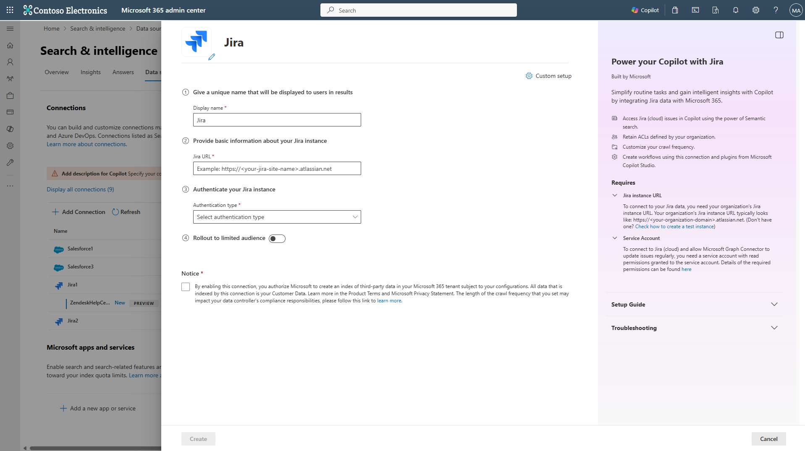
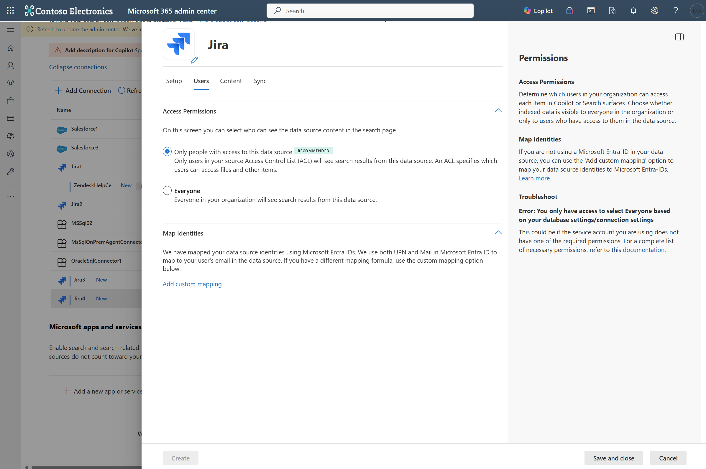
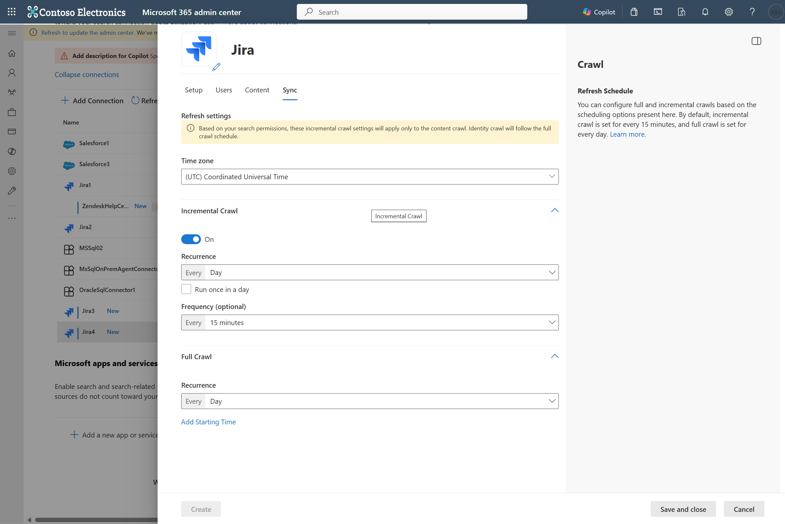

--- 
title: "Atlassian Jira cloud Graph connector for Microsoft Search and Copilot" 
ms.author: vivg 
author: vivg 
manager: harshkum 
audience: Admin
ms.audience: Admin 
ms.topic: article 
ms.service: mssearch 
ms.localizationpriority: medium 
search.appverid: 
- BFB160 
- MET150 
- MOE150 
description: "Set up the Jira cloud Microsoft Graph connector for Microsoft Search and Copilot" 
ms.date: 07/22/2021
---

# Atlassian Jira cloud Microsoft Graph connector

The Atlassian Jira cloud Microsoft Graph connector allows your organization to index issues from Jira cloud instance. After you configure the connector, end users can search for these issues from Jira in Microsoft Copilot and from any Microsoft Search client.

This article is for Microsoft 365 administrators or anyone who configures, runs, and monitors a Jira cloud Graph connector.

## Capabilities
- Index issues (or tickets) from Jira cloud
- Enable your end users to ask questions related to project tracking, support queries, or task execution in Copilot.
   - Find the issue with mobile app not loading.
   - Look for Jira tasks reported by John to update documentation about API migration.
   - Summarize CP-1234.
- Use [Semantic search in Copilot](semantic-index-for-copilot.md) to enable users to find relevant content based on keywords, personal preferences, and social connections.

## Limitations
- The connector doesn't support the "Any user logged in" application role to grant access of issues to users.
- The connector doesn't index attachments.

## Prerequisites
- You must be the **search admin** for your organization's Microsoft 365 tenant.
- **Jira cloud instance URL**: To connect to your Jira data, you need your organization's Jira instance URL. Your organization's Jira instance URL typically looks like `https://<your-organization-domain>.atlassian.net`. If you don't have an instance already, refer the [page](https://www.atlassian.com/software/jira) to create a test instance.
- **Service Account**: To connect to Jira and allow the Microsoft Graph Connector to update issues regularly, you need a service account with the following permissions granted to it.

| Permission name | Permission type | Required for |
| ------------ | ------------ | ------------ |
| Browse projects | [Project permission](https://support.atlassian.com/jira-cloud-administration/docs/manage-project-permissions/) | Crawling Jira issues. This permission is **mandatory** for the projects that need to be indexed. |
| Issue level security permissions | [Issue-level security](https://support.atlassian.com/jira-cloud-administration/docs/configure-issue-security-schemes/) | Crawling different issue types. This permission is **optional**. |
| Browse users and groups   | [Global permission](https://support.atlassian.com/jira-cloud-administration/docs/manage-global-permissions/) | Security trimming based on access permissions of search results. This permission is **optional** and is required to select `Only people with access to this data source` option in step 4 below. |
| Administer Jira | [Global permission](https://support.atlassian.com/jira-cloud-administration/docs/manage-global-permissions/) | Security trimming based on access permissions of search results. This permission is **optional** and is required to select `Only people with access to this data source` option in step 4 below. |

## Get Started

### 1. Display name 
A display name is used to identify each citation in Copilot, helping users easily recognize the associated file or item. Display name also signifies trusted content. Display name is also used as a [content source filter](/MicrosoftSearch/custom-filters#content-source-filters). A default value is present for this field, but you can customize it to a name that users in your organization recognize.

### 2. Jira cloud URL
To connect to your Jira cloud data, you need your organization's Jira instance URL. Your organization's Jira instance URL typically looks like `https://<your-organization-domain>.atlassian.net`.

### 3. Authentication Type
To authenticate and sync issues from Jira, choose **one of the two** supported methods: 

   a. **Basic authentication**  
     Enter your account's username (usually email ID) and API token to authenticate using basic auth. Refer Atlassian's documentation on how to [manage API tokens for your Atlassian account](https://support.atlassian.com/atlassian-account/docs/manage-api-tokens-for-your-atlassian-account/) to learn more about generating an API token.
      

   b. **Atlassian Jira OAuth 2.0 (Recommended)**  

To use the Jira OAuth for authentication, follow these steps.
   
Register an app in Atlassian Jira so that the Microsoft Search app can access the instance. To learn more, see Atlassian Support documentation on how to [Enable OAuth 2.0](https://developer.atlassian.com/cloud/jira/platform/oauth-2-3lo-apps/#enabling-oauth-2-0--3lo-).

The following steps provide guidance on how to register the app:

1. Sign in to [Atlassian Developer console](https://developer.atlassian.com/console/myapps/) with your Atlassian Jira admin account.
2. Select on `Create` and select `OAuth 2.0 integration`.
3. Provide an appropriate name for the application and create the new app.
4. Navigate to `Permissions` from the navigation pane on left. Select `Add` for `Jira API` and click on `Configure`. Under the 'Granular Permissions' header, add the following scopes.

   |  #  |  Scope name  |  Code  |
   | ------------ | ------------ | ------------ |
   | 1 | View fields | `read:field:jira` |
   | 2 | View avatars | `read:avatar:jira` |
   | 3 | View project categories | `read:project-category:jira` |
   | 4 | View projects | `read:project:jira` |
   | 5 | Read field configurations | `read:field-configuration:jira` |
   | 6 | View issue types | `read:issue-type:jira` |
   | 7 | View project properties | `read:project.property:jira` |
   | 8 | View users | `read:user:jira` |
   | 9 | View application roles | `read:application-role:jira` |
   | 10 | View groups | `read:group:jira` |
   | 11 | Read issue type hierarchies | `read:issue-type-hierarchy:jira` |
   | 12 | View project versions | `read:project-version:jira` |
   | 13 | View project components | `read:project.component:jira` |
   | 14 | View issue details | `read:issue-details:jira` |
   | 15 | View audit logs | `read:audit-log:jira` |
   | 16 | View issue meta | `read:issue-meta:jira` |
   | 17 | View project roles | `read:project-role:jira` |
   | 18 | View issue security levels | `read:issue-security-level:jira` |
   | 19 | View issue security schemes | `read:issue-security-scheme:jira` |
   | 20 | View permission schemes | `read:permission-scheme:jira` |
   | 21 | View permissions | `read:permission:jira` |

5. Navigate to `Authorization` from the navigation pane on the left. Add the callback URL for **M365 Enterprise**: `https://gcs.office.com/v1.0/admin/oauth/callback`, for **M365 Government**: `https://gcsgcc.office.com/v1.0/admin/oauth/callback` and save the changes.

6. Navigate to `Settings` from the navigation pane on the left to get the `Client ID` and `Secret` from this page.

Complete the connection settings step using the **Client ID** and **Secret**.

> [!NOTE]
>
> * Refer the [list of scopes](https://developer.atlassian.com/cloud/jira/platform/scopes-for-oauth-2-3LO-and-forge-apps/#list-of-scopes) for OAuth 2.0 apps to learn more about Jira permissions.
> * The original (Classic) OAuth permissions are being deprecated for Jira cloud. Refer the [changelog announcement](https://developer.atlassian.com/cloud/jira/platform/changelog/#CHANGE-517) to learn more.

### 4. Roll out to limited audience
Deploy this connection to a limited user base if you want to validate it in Copilot and other Search surfaces before expanding the rollout to a broader audience. To know more about limited rollout, see [staged rollout](staged-rollout-for-graph-connectors.md).

At this point, you're ready to create the connection for Jira cloud. You can click on the "Create" button to publish your connection and index issues from your Jira account.

For other settings, like Access Permissions, Data inclusion rules, Schema, Crawl frequency etc., we have defaults based on what works best with Jira data. You can see the default values below:

| Users | Description |
|----|---|
| Access permissions | _Only people with access to content in Data source._ |
| Map Identities | _Data source identities mapped using Microsoft Entra IDs._ |

| Content | Description |
|---|---|
| Site projects | _All projects are indexed._ |
| Filter data | _All issues are indexed. No time filter or JQL criteria is applied._ |
| Manage Properties | _To check default properties and their schema, see [content](#content)_ |

| Sync | Description |
|---|---|
| Incremental Crawl | _Frequency: Every 15 mins_ |
| Full Crawl | _Frequency: Every Day_ |

If you want to edit any of these values, you need to choose the "Custom Setup" option.

## Custom Setup

Custom setup is for those admins who want to edit the default values for settings listed in the above table. Once you click on the "Custom Setup" option, you see three more tabs - Users, Content, and Sync.

### Users

**Access Permissions**

The Atlassian Jira connector supports search permissions visible to **Everyone** or **Only people with access to this data source**. If you choose **Everyone**, indexed data appears in the search results for all users. If you choose **Only people with access to this data source**, indexed data appears in the search results only for users who have access to them. In Atlassian Jira, security permissions are defined using project permission schemes containing site-level groups and project roles. Issue level security can also be defined using issue-level permission schemes.

> [!IMPORTANT]
> The Jira cloud Graph connector must be able to read a user's email ID in Jira to appropriately assign security permissions in Microsoft Search. This requires you to ensure either of the following:
>
> - All users, who are part of managed accounts, must have the managed account setting selected in profile visibility settings.
>
>   All users should have selected the ‘Anyone’ option for their profile visibility settings. To learn more about profile visibility settings, refer the [documentation by Atlassian](https://support.atlassian.com/atlassian-account/docs/update-your-profile-and-visibility-settings/).
>
> - Users who are not part of the managed account (same as crawling account), need to have ‘Anyone’ selected in their profile visibility settings.
>
>   For organizations using ‘Managed accounts’ (All the Atlassian accounts with email addresses from your verified domain become managed accounts. Refer to [this documentation](https://support.atlassian.com/user-management/docs/what-are-managed-accounts/) for more information).
>
> Also, the crawling account used during connection configuration must have the managed account domain.

**Mapping Identities**

The default method for mapping your data source identities with Microsoft Entra ID is by checking whether the Email ID of Jira users is same as the UserPrincipalName (UPN), or Mail of the users in Microsoft Entra. If you believe the default mapping wouldn't work for your organization, you can provide a custom mapping formula. To know more about, mapping Non-Microsoft Entra ID identities, [click here](map-non-aad.md).

To identify which option is suitable for your organization:

1. Choose the **Microsoft Entra ID** option if the Email ID of Jira users is the **same** as the UserPrincipalName (UPN) of users in Microsoft Entra ID.
2. Choose the **Non-Microsoft Entra ID** option if the Email ID of Jira users is **different** from the UserPrincipalName (UPN) and Email of users in Microsoft Entra ID.

>[!NOTE]
>
> Updates to groups governing access permissions are synced in full crawls only. Incremental crawls don't support processing of updates to permissions.

### Content

**Choose projects and filter data**

1. _Site projects_

   You can choose for the connection to index either the entire Jira site or specific projects only.

   * If you choose to index the entire Jira site, Jira issues in all projects in the site are indexed. New projects and issues are indexed during the next crawl after they're created.

   * If you choose individual projects, only Jira issues in the selected projects are indexed.

   > [!NOTE]
   > When you grant the _Browse projects_ permission to a Jira projects, it is listed in the project selection and can be crawled. If a project is missing, check the permissions for your account.

1. _Filter data_

   You may further choose to filter the Jira issues that are indexed in two ways.

   * Specify the **issue modified time period**. This option will only index the Jira issues that are created or modified in the time period selected on a **rolling basis** based on current crawl.

   * Specify the **JQL**. This option will only index the Jira issues that are returned after filtering based on provided Jira Query Language (JQL). To learn more about using JQL, see Atlassian Support documentation on [using advanced search with Jira Query Language](https://support.atlassian.com/jira-service-management-cloud/docs/use-advanced-search-with-jira-query-language-jql/)

   > [!TIP]
   > You may use the JQL filter to index only specific Jira issue types using "*issueType in (Bug,Improvement)*"

**Manage Properties**

Here, you can add or remove available properties from your Jira data source, assign a schema to the property (define whether a property is searchable, queryable, retrievable, or refinable), change the semantic label and add an alias to the property. Properties that are selected by default are listed below.

|Source Property|Label|Description|Schema|
|---|---|---|---|
| Authors | Authors | Name all the people who participated/collaborated on the item in the data source | Retrieve |
| Created | Created date time | Data and time that the item was created in the data source | Query, Retrieve |
| IssueDescription | Content | The description of the issue | Search |
| IssueIconURL | IconUrl | Icon url that represents the issue type.| Retrieve |
| IssueId | | | |
| IssueKey | | | |
| IssueLink | url | The target URL of the item in the data source | Query, Retrieve |
| IssueStatus | | | Query |
| IssueSummary | | | |
| ProjectName | | | Query |
| ReporterEmailId | Created by | | Retrieve | 
| ReporterName | | | Query, Retrieve |
| Title | Title | The title of the item that you want shown in Copilot and other search experiences | Search, Query, Retrieve |
| Updated | Last modified date time | Date and time the item was last modified in the data source.| Query, Retrieve |

> [!NOTE]
> - The Atlassian Jira connector can index both default issue fields and custom created issue fields.
> - If a selected custom created field is not present in some Jira issue type(s), the field will be ingested as *NULL* (blank).

*The list of properties that you select here, can impact how you can filter, search and view your results in Copilot for Microsoft 365.*

**Preview Data**

Use the preview results button to verify the sample values of the selected properties and query filter.

### Sync

The refresh interval determines how often your data is synced between the data source and the Graph connector index. There are two types of refresh intervals - full crawl and incremental crawl. For more details, see [refresh settings](configure-connector.md#step-8-refresh-settings).

You can change the default values of refresh interval from here if you want to.

### Set up search result page

After creating the connection, you need to customize the search results page with verticals and result types. To learn about customizing search results, review how to [manage verticals](manage-verticals.md) and [result types](manage-result-types.md).
You may also use the [sample result layout](jira-connector-result-layout.md) for the Jira connector. Copy-paste the result layout JSON to get started after reviewing the schema of the connection with required schema for the sample layout.

## Troubleshooting
After publishing your connection, you can review the status under the **Data Sources** tab in the [admin center](https://admin.microsoft.com). To learn how to make updates and deletions, see [Manage your connector](manage-connector.md). You can find troubleshooting steps for commonly seen issues in [Troubleshooting guide for Atlassian Jira Cloud Microsoft Graph connector](troubleshoot-jira-cloud-connector.md).

If you have any other issues or want to provide feedback, reach out to us at [Microsoft Graph support](https://developer.microsoft.com/en-us/graph/support)
