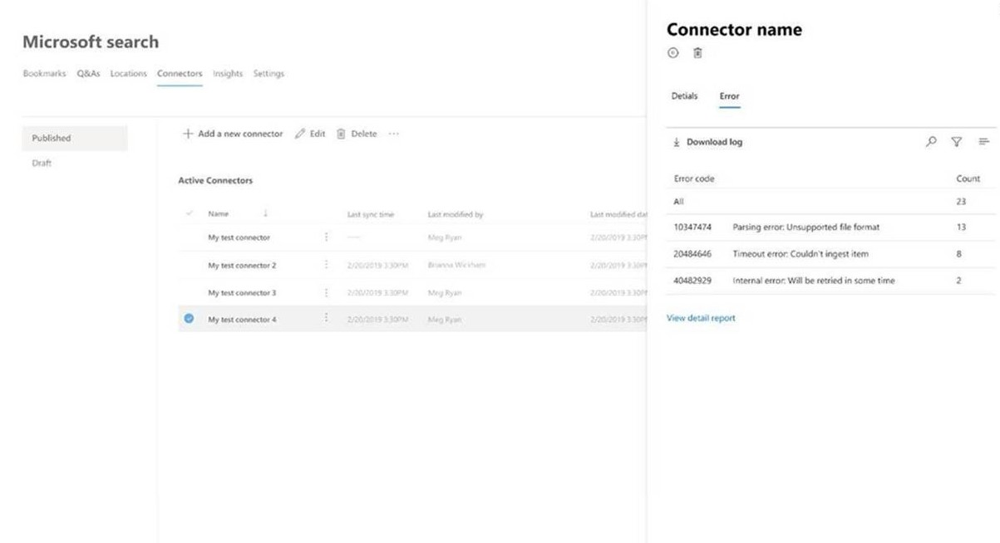
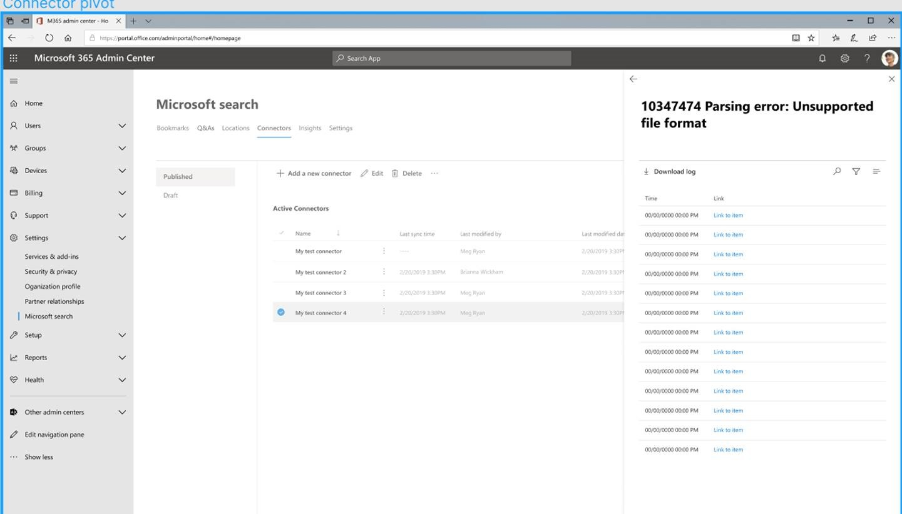

# Manage your connector in Microsoft 365 
To access and manage your connectors, you must be designated as a search administrator for your tenant. Contact your tenant administrator to provision you for the search administrator role.

## Get started
Navigate to the connectors management portal:
1.	Sign in to the [admin center](https://admin.microsoft.com).
2.	Go to **Settings** > **Microsoft Search** > **Connectors**.

For each connector type, the Microsoft 365 [admin center](https://admin.microsoft.com) supports the operations shown in the following table:

**Operation** | **Microsoft-built connector** | **Partner or custom-built connector**
--- | --- | ---
Add a connection | :heavy_check_mark: (See [configure your Microsoft-built connector](configure-connector.md)) | :x: (Refer to your partner or custom-built connector admin UX)
Delete a connection | :heavy_check_mark: | :heavy_check_mark:
Edit a published connection | :heavy_check_mark: Name   :heavy_check_mark: Description   :heavy_check_mark: Authentication credentials for your external data source   :heavy_check_mark: Gateway credentials for your on-premises data source   :heavy_check_mark: Refresh schedule   | :heavy_check_mark: Name   :heavy_check_mark: Description
Edit a draft connection | :heavy_check_mark: | :x:

## Monitor your connection status
After you create a connection, the number of processed items shows on the **Connectors** tab on the **Microsoft Search** page. After the initial full crawl completes successfully, the progress for periodic incremental crawls displays. This page provides information about the connector's day-to-day operations and an overview of the logs and error history.

Four states show up in the **Status** column against each connection:
* **Syncing**. The connector is crawling the data from the source to index the existing items and make any updates.
* **Enabled**: The connection is enabled, and there’s no active crawl running against it. **Last sync time** indicates when the last successful crawl happened. The connection is as fresh as the last sync time.
* **Paused**. The crawls are paused by the admins through the pause option. The next crawl runs only when it’s manually resumed. However, the data from this connection continues to be searchable.
* **Failed**. The connection had a critical failure. This error requires manual intervention. The admin needs to take appropriate action based on the error message shown. Data that was indexed until the error occurred is searchable.

### Monitor errors
For each Active Connector** on the **Connectors** tab shows, any existing errors show under the **Error** tab. The tab lists error codes, the count of each, and error log download options. See the example in the following table.

To view an error’s specific details, select its error code. A screen appears with error details and a link. The most recent errors appear at the top. See the example in the following table.

## Preview limitations
* When you **publish** a Microsoft-built connector, it might take a few minutes for the connection to be created. During that time, the connection shows its status as pending. Also, there’s no auto-refresh, so you need to refresh manually.
* The Microsoft 365 [admin center](https://admin.microsoft.com) doesn’t support viewing and editing **search schema** after a connection is published. To edit a schema, delete your connection and then create a new one.
* When you manage your connection’s **refresh schedule**, the number of items that sync during each session are displayed. However, the sync history isn’t available.
