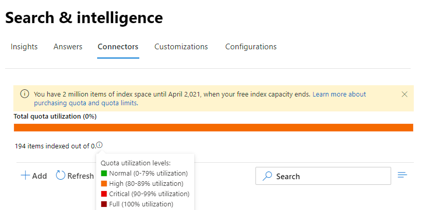

<!-- markdownlint-disable no-inline-html -->

# Manage your connections for Microsoft Search

To access and manage your connectors, you must be designated as a search administrator for your tenant. Contact your tenant administrator to provision you for the search administrator role.

## Get started

Navigate to the [Connectors tab](https://admin.microsoft.com/Adminportal/Home#/MicrosoftSearch/Connectors) in the [Microsoft 365 admin center](https://admin.microsoft.com).

For each connector type, the [Microsoft 365 admin center](https://admin.microsoft.com) supports the operations shown in the following table:

Operation | Microsoft-built connector | Partner or custom-built connector
--- | --- | ---
Add a connection | :heavy_check_mark: (See [Configure your Microsoft-built connector](configure-connector.md)) | :x: (Refer to your partner or custom-built connector admin UX)
Delete a connection | :heavy_check_mark: | :heavy_check_mark:
Edit a published connection | :heavy_check_mark: Name   :heavy_check_mark: Description   :heavy_check_mark: Authentication credentials for your external data source   :heavy_check_mark: Gateway credentials for your on-premises data source   :heavy_check_mark: Refresh schedule   | :heavy_check_mark: Name   :heavy_check_mark: Description
Edit a draft connection | :heavy_check_mark: | :x:

## Monitor your connection status

After you create a connection, the number of processed items shows on the **Connectors** tab on the **Microsoft Search** page. After the initial full crawl completes successfully, the progress for periodic incremental crawls displays. This page provides information about the connector's day-to-day operations and an overview of the logs and error history.

Four states show up in the **Status** column against each connection:

* **Syncing**. The connector is crawling the data from the source to index the existing items and make any updates.

* **Enabled**: The connection is enabled, and there's no active crawl running against it. **Last sync time** indicates when the last successful crawl happened. The connection is as fresh as the last sync time.

* **Paused**. The crawls are paused by the admins through the pause option. The next crawl runs only when it's manually resumed. However, the data from this connection continues to be searchable.

* **Failed**. The connection had a critical failure. This error requires manual intervention. The admin needs to take appropriate action based on the error message shown. Data that was indexed until the error occurred is searchable.

### View your last crawl info

After the first initial incremental or full crawl completes successfully, the last crawl data values are displayed under the last crawl header in the detail pane. If there was no last crawl that ran, you will not see any information under the last crawl header. This information about last crawl will help you gain insights into how the crawl performed and take necessary steps wherever required.

The following last crawl values will be available for each connection:

Value | Description
--- | ---
Completed at | Date and time the last crawl got completed
Type | Incremental or full crawl
Duration | how much time did the last crawl take to complete
Successes | Number of items that have been successfully ingested in the last crawl
Errors | Number of items that errored in the last crawl

### Monitor errors

For each **Active Connector** on the **Connectors** tab, any existing crawl errors show under the **Error** tab. The tab lists error codes, the count of each, and error log download options. See the example in the following image. Select an **error code** to view the error's details.

To view an error's specific details, select its error code. A screen appears with error details and a link. The most recent errors appear at the top. See the example in the following table.

Below is the list of different errors that can appear against any connection. If these solutions don’t work, contact support or send us [feedback]((https://github.com/MicrosoftDocs/OfficeDocs-MicrosoftSearch/issues)).

Error code | Error message | Solution
--- | --- | ---
1000 | The data source isn't available. Check your internet connection or make sure the data source is still accessible by the connector. | This error occurs when the data source is not reachable due to a network issue or when the data source itself is deleted, moved, or renamed. Check if the data source details provided are still valid.
1001 | Can't update the data, because the data source is throttling the connector. | To unthrottle the data source, check if its scale limits can be increased or wait until a less traffic-heavy time of the day.
1002 | Can't authenticate with the data source. Verify that the credentials associated with this data source are correct. | Click **Edit** to update the authentication credentials.
1003 | The account associated with the connector doesn't have permission to access the item. |  Ensure the proper account has access to the item you want indexed.
1004 | Unable to reach the on-premises data gateway. Make sure the gateway service is running and the gateway details are updated in the connection configuration. | Check the computer with the gateway, open the Power BI Gateway application and make sure the gateway is running. Verify that the gateway is using the same admin account as Microsoft Search, then make sure all the gateway details are all updated in the connection configuration.
1005 | Credentials associated with this data source have expired. Renew the credentials and update the connection. | Click **Edit** to update the authentication credentials.
1006 | Your gateway version is out of date and doesn’t support this connector anymore. You will need to update the gateway. | Please visit [Install an on-premises data gateway](https://docs.microsoft.com/data-integration/gateway/service-gateway-install) to download  and install the latest version of the Power BI gateway on the machine containing the gateway.
1007 | No valid Power BI license detected. You need a valid Power BI license to perform this crawl. | You need a valid Power BI license to perform this crawl. Check that your organization has a valid license. If it does, try again. If it doesn’t, obtain a license and then try again.
1008 | The total quota utilization of your tenant has reached its limit. Try deleting a connection to free up some of your quota or adjusting your ingestion filters to bring in less data. | Try deleting a connection to free up some of your quota or adjusting your ingestion filters to bring in less data. If these don't solve the issue, contact Microsoft support.
2001 | Indexing is throttled because of a large number of updates in the queue. Depending on the queue, it can take some time for the updates to complete. | Please wait until the queue gets cleared.
2002 | Indexing failed due to unsupported item formatting. | See connector-specific documentation for more information.
2003 | Indexing failed due to unsupported item content. | See connector-specific documentation for more information.
2010 | This connection is no longer valid because of an update made by Microsoft. Please delete the connection and create a new one. | Please delete the connection and create a new one.
5000 | Something went wrong. If this continues, contact support. |

## Monitor your index quota utilization

The available index quota and consumption is displayed on the connectors landing page.

>[!NOTE]
>During the preview period, every organization trying out Graph connectors was provided a free fixed quota of up to 2 million items across all connections. With Graph connectors being generally available, the free quota will expire on Feb 1st, 2021 for those organizations who have been using Graph connectors in preview.
>Microsoft-built Graph connectors labeled as ["Preview"](connectors-preview.md) will not be included in the total charged index quota for your organization. However, it will count towards the max number of 10 connections you can configure for your organization and the max number of 7 million items your organization can index across connections; each connection is limited 700,000 items. 

The quota utilization bar will indicate various states based on consumption of quota by your organization:

State | Quota consumption
--- | ---
Normal | 1-69%
High | 70-89%
Critical | 90%-99%
Full | 100%

The number of items indexed will also be displayed with each connection. The number of items indexed by each connection contributes to the total quota available for your organization.

When index quota is exceeded for your organization, all active connections will be impacted, and those connections will operate in **limit exceeded** state. In this state, your active connections  

* Will not be able to add new items.

* Will be able to update or delete existing items.

To fix this, you can do any of the following:

* Learn how to purchase index quota for your organization at [Licensing requirements and pricing](licensing.md).

* Identify connections which have too much content being ingested and update them to index fewer items to make room for quota. To update the connection, you must delete and create a new connection with a new ingestion filter which brings in fewer items.

* Permanently delete one or more connections

## Limitations

* When you **publish** a Microsoft-built connector, it might take a few minutes for the connection to be created. During that time, the connection will show its status as pending.

* The [Microsoft 365 admin center](https://admin.microsoft.com) doesn't support editing the **search schema** after a connection is published. To edit the search schema, delete your connection and then create a new one.

* Ingestion throughput is throttled at about four items per second.

* There is no support for schema updates. After you create a connection setup, there's no way to update the schema. You can only delete and re-create the connection.

* There is a connections limit. Each tenant can create up to 10 connections.

* Edit support for connection is not available. Once the connection has been created, you cannot edit or change it. If you need to change any details, you must delete and recreate the connection.
