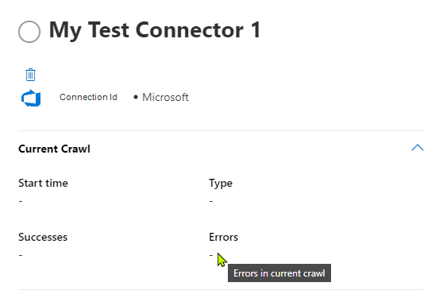
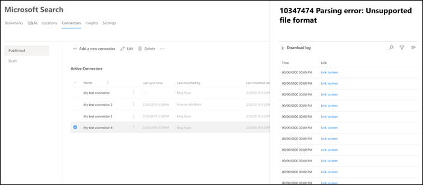

# Manage your connector for Microsoft Search

To access and manage your connectors, you must be designated as a search administrator for your tenant. Contact your tenant administrator to provision you for the search administrator role.

## Get started

1. Sign in to the [Microsoft 365 admin center](https://admin.microsoft.com).
2. Go to **Settings** > **Microsoft Search** > **Connectors**.

For each connector type, the [Microsoft 365 admin center](https://admin.microsoft.com) supports the operations shown in the following table:

**Operation** | **Microsoft-built connector** | **Partner or custom-built connector**
--- | --- | ---
Add a connection | :heavy_check_mark: (See [Configure your Microsoft-built connector](configure-connector.md)) | :x: (Refer to your partner or custom-built connector admin UX)
Delete a connection | :heavy_check_mark: | :heavy_check_mark:
Edit a published connection | :heavy_check_mark: Name   :heavy_check_mark: Description   :heavy_check_mark: Authentication credentials for your external data source   :heavy_check_mark: Gateway credentials for your on-premises data source   :heavy_check_mark: Refresh schedule   | :heavy_check_mark: Name   :heavy_check_mark: Description
Edit a draft connection | :heavy_check_mark: | :x:

## Monitor your connection status
After you create a connection, the number of processed items shows on the **Connectors** tab on the **Microsoft Search** page. After the initial full crawl completes successfully, the progress for periodic incremental crawls displays. This page provides information about the connector's day-to-day operations and an overview of the logs and error history.

Four states show up in the **Status** column against each connection:
* **Syncing**. The connector is crawling the data from the source to index the existing items and make any updates.
* **Enabled**: The connection is enabled, and there's no active crawl running against it. **Last sync time** indicates when the last successful crawl happened. The connection is as fresh as the last sync time.
* **Paused**. The crawls are paused by the admins through the pause option. The next crawl runs only when it's manually resumed. However, the data from this connection continues to be searchable.
* **Failed**. The connection had a critical failure. This error requires manual intervention. The admin needs to take appropriate action based on the error message shown. Data that was indexed until the error occurred is searchable.

### Monitor errors
For each **Active Connector** on the **Connectors** tab, any existing crawl errors show under the **Error** tab. The tab lists error codes, the count of each, and error log download options. See the example in the following image. Select an **error code** to view the error's details.

To view an error's specific details, select its error code. A screen appears with error details and a link. The most recent errors appear at the top. See the example in the following table.

Below is the list of different errors that can appear against any connection. If these solutions don’t work, contact support or send us (feedback)[connectors-feedback.md]. 

**Error code** | **Error message** | **Solution**
--- | --- | ---
1000 | The data source isn't available. Check your internet connection or make sure the data source is still accessible by the connector. | This error occurs when the data source is not reachable due to a network issue or when the data source itself is deleted, moved, or renamed. Check if the data source details provided are still valid.
1001 | Can't update the data, because the data source is throttling the connector. | To unthrottle the data source, check if its scale limits can be increased or wait until a less traffic-heavy time of the day.
1002 | Can't authenticate with the data source. Verify that the credentials associated with this data source are correct. | Click **Edit** to update the authentication credentials.
1003 | The account associated with the connector doesn't have permission to access the item. |  Ensure the proper account has access to the item you want indexed.
1004 | Can't reach the on-premises data gateway. Make sure the gateway service is running. | Go to the machine which has the gateway and check if the Power BI gateway is running by opening the Power BI gateway application. Verify if the gateway is signed in with the admin account used for Microsoft Search. 
1005 | Credentials associated with this data source have expired. Renew the credentials and update the connection. | Click **Edit** to update the authentication credentials. 
1006 | Your gateway version is out of date and doesn’t support this connector anymore. You will need to update the gateway. | Please visit (Install an on-premises data gateway)[https://docs.microsoft.com/en-us/data-integration/gateway/service-gateway-install] to download  and install the latest version of the Power BI gateway on the machine containing the gateway.
2001 | Indexing is throttled because of a large number of updates in the queue. Depending on the queue, it can take some time for the updates to complete. | Please wait until the queue gets cleared.
2002 | Indexing failed due to unsupported item formatting. | See connector-specific documentation for more information.
2003 | Indexing failed due to unsupported item content. | See connector-specific documentation for more information. 
2004 | The [file size](https://docs.microsoft.com/en-us/microsoftsearch/file-share-connector#content-requirements) is too large to be indexed. It must be 100 MB or less before processing and no larger than 4 MB after processing. The file gets indexed partially in this case. Few phrases present in the file might not return a search result. |  
5000 | Something went wrong. If this continues, contact support. | 

## Preview limitations
* When you **publish** a Microsoft-built connector, it might take a few minutes for the connection to be created. During that time, the connection shows its status as pending. Also, there's no auto-refresh, so you need to refresh manually.
* The [Microsoft 365 admin center](https://admin.microsoft.com) doesn't support viewing and editing the **search schema** after a connection is published. To edit the search schema, delete your connection and then create a new one.
* When you manage your connection's **refresh schedule**, the number of items that sync during each session are displayed. However, the sync history isn't available.
