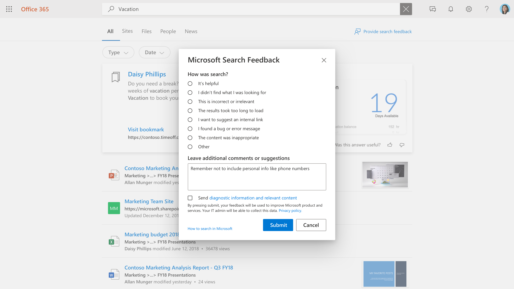

# Managing user feedback

Creating a great search experience for your users is a partnership between Microsoft and the search administrator. Feedback from your users allows us to continuously evaluate the product and tune it for the best experience. Some feedback, however, is best addressed by you.

We're now offering tools that will allow you to review and manage the feedback your users are providing on the search experience.

## How users submit feedback

As people in your organization use Microsoft Search, they may have feedback on the experience. When they click a feedback link on the results page, they can categorize their feedback and include additional comments.

Users also have the option to send their query and other diagnostic info, along with the category and comments, to Microsoft. [Learn more](https://privacy.microsoft.com/en-US/privacystatement) about privacy and how we protect this data. The diagnostic data contains the most critical information that Microsoft needs to use the feedback item for product improvement.

Most feedback submissions appear in the [Feedback](https://admin.microsoft.com/Adminportal/Home#/MicrosoftSearch/feedback) section of the Microsoft Search admin center. Feedback sent with the **I want to suggest an internal link** category appears as a suggested bookmark in the [Bookmarks](https://admin-ignite.microsoft.com/Adminportal/Home#/MicrosoftSearch/bookmarks) section and can be seen by filtering on **Suggested** status.

## Review feedback

On the [Feedback](https://admin.microsoft.com/Adminportal/Home#/MicrosoftSearch/feedback) page, you can review and export feedback that people in your organization have sent during the past 30 days. Once a user submits feedback it will appear in this list within 20 minutes. You can use the refresh button to ensure you're looking at the most current data

By using a filter, you can see feedback for specific answer types. You can also filter by source and date range.

You can use the search box above the feedback list to search for feedback on a specific query.

In the feedback list, the Verbatim column indicates what user's feedback also includes a comment or suggestion. To read it, click the query to open the **Detail** panel.

## Update feedback state

As feedback comes in, it will be in a *New* state and will remain there until you change it to *Resolved* or *Duplicate*.

To change this state:

1. Next to the query, select **More Options** (three vertical dots).
1. On the menu, select **Mark as resolved** or **Mark as duplicate.**
1. The list will refresh and show the updated state.

You can also update the state for multiple items, just select them, then select More Options next any of those items.

## Export feedback

If you want to share search feedback with others or retain them for longer than 30 days, click **Export.** A .csv file named Feedbacks with the date, like "Feedbacks_10_31_2020.csv", will be automatically downloaded.

## Send user feedback to Microsoft

By default, all user feedback is sent to Microsoft in addition to you. To stop sending feedback to Microsoft, click **Manage settings**, and clear the **Automatically send user feedback to Microsoft** check box. It can take up to 24 hours for this change to take effect.

If you've decided to not send feedback to Microsoft automatically, you can still send individual pieces of feedback to Microsoft.

1. Select the feedback that you want to share.
1. In the action bar, select More (three dots), and click **Send feedback to Microsoft**.

1. The status in the Sent to Microsoft column will change to Pending. When the feedback is sent, it will change to Yes.

If you share feedback automatically or manually, it never includes queries and other diagnostic info for users that opted to not include this information.

## Suggestions on how to use feedback

As a search administrator you should understand the major personas in your organization and what types of content those people typically interact with and search for. With this understanding, you can use feedback to make targeted improvements to your users' search experience.

1. “I didn't find what I was looking for” and similar feedback can be used to identify content users want, but isn't currently included in the search index. Determining this often takes investigation and inference based on understanding your users. Once found, decide which methods of including that content would be most appropriate:
    1. Bookmarks are useful for content sources having a high-quality landing page and a limited variety of search terms, so that the user community gets a high-quality result from the bookmark and can then efficiently find what they're looking for.
    1. Q&A are useful for individual answers that are fairly frequent, yet don't change.
    1. Connectors are useful for content sources with a wide variety of content and wide variety of search terms.
1. “The results took too long to load” & “I found a problem” may be indicators of a broader problem. Looking for this feedback daily may help and if multiple cases appear, you can verify the search experience for yourself and open a support case with Microsoft if needed. This type of feedback is also important to Microsoft and is an excellent reason to flow all feedback to us.
1. “I want to suggest an internal link” can be evaluated for being added as bookmarks or connected content. Your first thought should be a bookmark; if the bookmark gets high usage, you can consider bringing in content through a connector to enable an even richer search experience.
