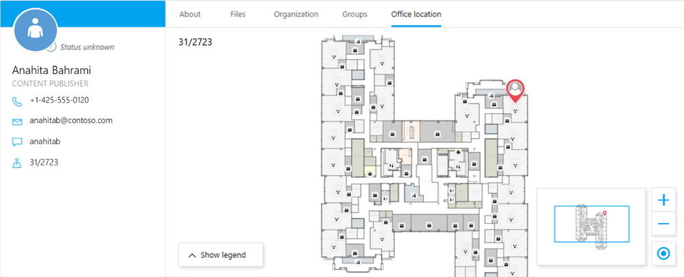
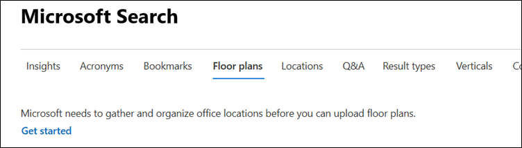
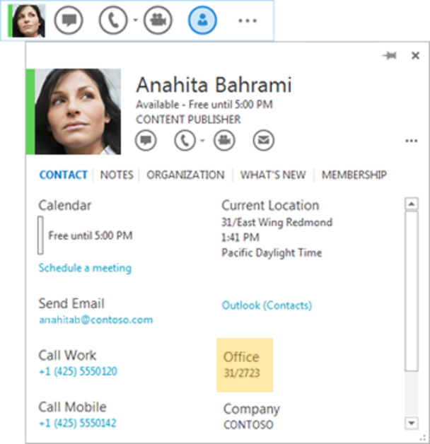
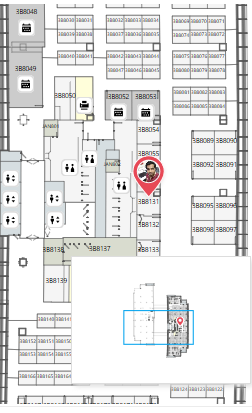
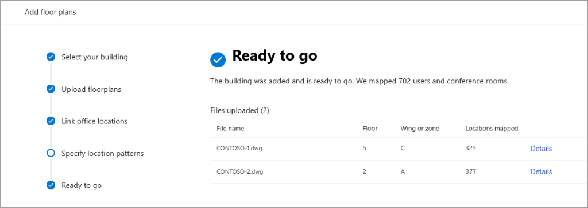

# Manage floor plans

Microsoft Search floor plans help users find people and meeting rooms within a building. Floor plans answers these questions:
- Where is Allan Deyoung's office?
- Where is meeting room C1?
**COMMENT 1: THIS NEEDS TO FOLLOW THE EXAMPLE IN THE SCREEN CAPTURE. WHEN WE GET THE UPDATED SCREEN GRAB FROM HEIDI**

*Figure 1 – Office location isn’t just a number with Microsoft Search.*

To make it easy to find answers to questions like these, information about an organization's buildings, offices, and facilities needs to be available and made searchable. Larger organizations usually have facilities or space management teams and may already have this info available. In a smaller organization, the Search admin might have to create and add it.

## 48 hours before you begin
Before you start to upload floor plans, you'll need to index the users' office locations. Depending on the size of your organization, it can take up to 48 hours to complete. If you ignore this step, you'll get errors while performing the procedure. 

In the Microsoft 365 admin center, go to **Settings** > **Microsoft Search** > **Floor plans**, and then select **Get started**.

If you don't see this notice, then you or someone in your organization has already initiated this step.

## Things to consider...
To help users to find information about offices and building facilities, you need to add:

|Consideration     |Why is this important?  |
|---------|---------|
|Building location    |    You'll need to add each building into Microsoft Search locations. You should come up with a standard naming format for each building. You can add the building using a street address or map coordinates.     |
|**Office** property on all user accounts     |    Each user account needs to have the **office** property with their office location. And office locations should follow a standard format and include building, floor and room info.     In Azure AD, this property is called **office location**.    |
|Floor plan file in DWG format     |   You'll need a separate floor plan for each floor or wing of your building and include the office information in the same format that you used in the user's Office property. The file needs to be in AutoCad drawing DWG format. If you need to create floor plan, you can use Microsoft Visio. |

   **COMMENT 2: IS THE PROPERTY CALLED "SEAT NUMBERS" IN AAD? ALSO THIS CARD NEEDS TO GET UPDATED WITH THE CURRENT OUTLOOK PEOPLE CARD. HEIDI SENDING.**

*Figure 2 – The user's office can be added in the Active users "Office" property. In Azure AD, this is called "Office location.*

## Building location

Identify the buildings that need to be added as locations. The location address and map coordinates of a building are the first point of identification.  If the building is not yet added as a location, the admin needs to add it. See [Manage Locations](manage-locations.md) for more details.

If the building's address is already in Azure AD, you don't need to add it. When you are creating your floor plan, you can just search for the building name instead and select it. **COMMENT 3: WHAT PROPERTY OR PAGE IS THIS IN AAD? WE SHOULD TELL THEM WHERE IT IS AND HOW TO FIND IT**

## Floor plans

Once a building is identified, you can add its floor plans. All floor plans must be in DWG format. If your organization doesn't already have them, you'll need to create the floor plans in AutoCAD or another DWG-compatible app. Floor plans must correctly map all rooms, including conference or meeting rooms, restrooms, kitchens, mailrooms, and other facilities on each floor of the building to enable search.

### Unique identification codes

Each floor plan should have a unique identification code. Buildings, floors, wings, and room numbers are used to uniquely identify office locations. You must use only one standardized pattern to define the office locations in a building.

For example, your organization might standardize on a pattern where the first character identifies the building (A), followed by a number identifying the floor (1), and then a three-digit number identifying a room (119). 

In this example, A1/119 would uniquely identify room 119 on the first floor of Building A and B2/309 would uniquely identify room 309 on the second floor of Building B.
Whichever numbering system you decide upon needs to be followed consistently for all rooms, floors, and buildings of your organization.
You'll add those in the Microsoft 365 admin center [Active users](https://go.microsoft.com/fwlink/p/?linkid=834822) or in Azure AD.

 **COMMENT 4: THIS GRAPHIC ISN'T NECESSARY. LET'S REMOVE IT?**

*Figure 3 – Office floor plan search*

### Office locations

All office locations and employee office data must be stored in AAD in order to be mapped to floor plans. All office locations must have unique values; that is, two or more people may sit in an open area that has an office location ID of B1/0001, but B1/0001 is a unique location and there is no other location with the same code in AAD. **COMMENT 5: THIS IS REALLY CONFUSING. DOES MY REWRITE WORK?:** 
All office locations and employee office data must be in the user's account in order to be mapped to floor plans. In the floor plan, the office locations must be unique and cannot repeat. For example, if two or more people are sharing office 31/2004, "31/2004" can only have one unique instance in your floor plans, but the user accounts in Azure AD will both have the same office location.

 **Note:** When a user searches for a room or office location of a colleague, the room numbers in floor plans are matched with office locations in Azure AD. If a match is found, then the map is shown.

## Add floor plan

   **COMMENT 6: WE only DO GRABS OF THE UX IN A PROCEDURE IF THERE'S A DISCOVERY ISSUE. THE ASSUMPTION IS THAT THE USER IS LOOKING AT THEIR SCREEN. LET'S REMOVE THIS AND NOT PAY FOR LOC COSTS**

*Figure 4 – Specify the Floor and Wing or Zone that each file represents.*

The first time go to floor plans, you may see a note at the top of the page saying that "Microsoft needs to gather and organize office locations before you can upload floor plans." Select **Get started** to do something spectacular that takes up to 48 hours. 
**COMMENT 11: IS THIS LIKE A HYDRATION STEP? HOW DO YOU KNOW WHEN IT'S DONE? IT DISAPPEARD. WE NEED TO EXPLAIN THIS. AND THIS IS WHAT I'D LIKE TO GET A SCREEN GRAB OF. THIS SHOULD BE NOTED IN THE TOP OF THE ARTICLE BECAUSE IT WOULD FRUSTRATE ME TO BE TOTES READY TO GO AND NOW I HAVE TO WAIT...**

1. In the Microsoft 365 admin center, go to **Settings** > **Microsoft Search** >**Floor plans**, and then select **Add floor plans**.
4. Select the building in the drop-down and select Next. If the building is not listed in the drop-down, you can add it as a new location. See [Manage Locations](manage-locations.md) for more info.
6. Select Upload files and select the floor plan you want to upload. All floor plans must be in DWG format. You can upload multiple floor plans at the same time. After the file is uploaded, identify the floor and/or wing in the building that the floor plan is for.  

If a floor plan cannot be uploaded, an error messages should identify the issue and solution. For troubleshooting DWG file upload issues, see the Troubleshoot Errors section. The Next button will be disabled until all floor plans are successfully uploaded.

   **COMMENT 12: LET'S REMOVE**

*Figure 5 – Specify the office location that’s related to the seat numbers you assigned.*

7. Link office locations requires the building code. The building code can be found in the AAD office location of an employee. For example, if the office location is 31/2773 then building code is 31. If the office location is, say, CITY CENTER 21009 then building code is CITY CENTER. Building codes can be found in the AAD profile of a person who sits in that building.
8. Next, specify the location nomenclature. Here you define what each of the different characters or numbers in the code identifies. For example, the building code PS35/13/0124 identifies a building name and number (PS35), followed by a floor number (13th floor), and finally, the room number (0124). Microsoft Search tries to extract the pattern and displays it for confirmation. The Search Admin can determine the pattern by looking at the location information for an employee in the address card.
9. After associating a building with an AAD location and specifying location patterns for all uploaded floor plans, select Publish to add to the floor plans. Or you can save the plans as a draft for publishing later.

 **COMMENT 7: REMOVE GRAB**

*Figure 6 – When mapping is complete, you’re ready to go*

 **Note:** When a floor plan is in a draft state, it is incomplete. A draft lets stakeholders coordinate in uploading and creating floor plans. It also allows you to upload floor plans in stages.

## Edit floor plan

1. In the Microsoft 365 admin center, go to **Settings** > **Microsoft Search** > **Floor plans**. 
1. Select **Published** or **Draft**, select the floor plan you want to change, and then **Edit**.
5. Make your changes, and then select **Save**.

 **Note:** The draft facility is not available once the building is published. A Search Editor can still edit a published building, but they cannot make partial changes and save it to draft. They need to make the changes in one session. Any changes saved are shown in the Office tab in the People card in Microsoft Search. You can also unpublish a building, in which case the building is moved to the Drafts section and the details are not shown in the Office locations tab.
 **COMMENT 9: WHAT DOES THIS MEAN: 'DRAFT FACILITY?' THIS NOTE IS CONFUSING AND I DON'T UNDERSTAND THE POINT THAT IS BEING MADE. NOTES SHOULD ONLY BE ABOUT ONE THING?**

## Troubleshoot errors

You can't go to the next step of defining floor, wing, and room information until all errors are fixed. Here's a list of DWG file upload error messages and actions for fixing the issues.

| Error message   | Type    | Action       |
|:----------------| :--------- | :-------------- |
| Unable to read CC_1.dwg. Please re-upload or delete the floor plan. | Error |  Try uploading the file again. If that doesn't work, delete the file, and then try again. |
| There are two files named CC_1.dwg. Please delete one of them or re-upload with another name.| Error | If the file name is incorrect, make the file name unique by adding floor or wing infornation, and then upload the file again.   If you accidentally added the same file twice, just delete it. |
| No data found. | Error | Check your file to make sure it's the correct one, and then upload it again, or delete it. |
| External references are missing in this file. Either upload "CC_1_furniture.dwg" or delete this file. | Warning | Upload external reference files or delete. **COMMENT 10: WHAT IS AN EXTERNAL REFERENCE FILE? WHERE DO I FIND IT?|
| Could not read room numbers or tags in the DWG file. Please delete  this file. | Warning | Check your DWG file to make sure the data is included, and then delete the file and try again. |
