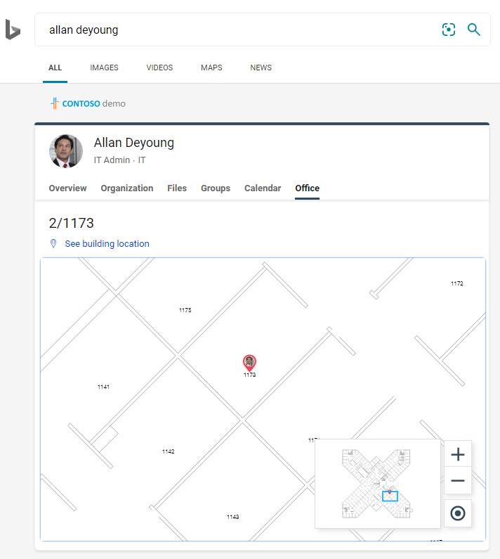
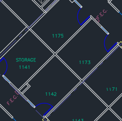
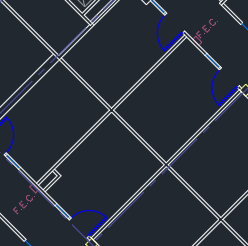
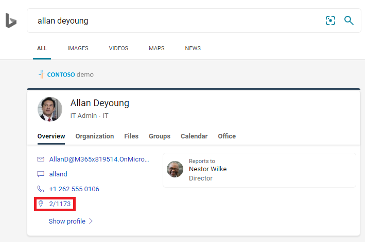
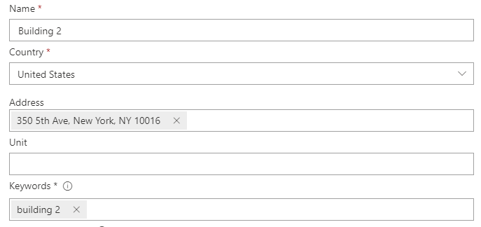
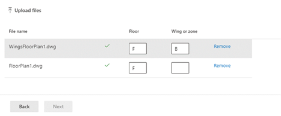

# Manage floor plans

> [!IMPORTANT]
> The Microsoft Search floor plans feature has been retired. Customers can soon use [Microsoft Places](https://www.microsoft.com/en-us/microsoft-places#modal-Hero-1) for their floor plan solutions. Existing customers have until September 30, 2024 to download their existing floor plans for use in Microsoft Places. 
>
> If your tenant is interested in onboarding to Microsoft Places, please [begin the request process here](/deployoffice/places/opt-in-places-preview).

Floor plans in Microsoft Search help users find people, rooms, and spaces within a building. Watch the video for an overview of floor plan answers and a walkthrough of the steps to add them.

## What users experience

Users can see floor plan answers on [Bing](https://bing.com), [SharePoint](https://sharepoint.com/), and [Office 365](https://office.com). Other entry points that return Bing results, including Windows Search and the Microsoft Edge address bar, are also supported. Query patterns that include a person's full name, first name, room name, or room location, like these examples, will return a floor plan answer:

- Where is Allan Deyoung's office?
- Where is Daisy's office?
- Building 2 floor 3
- Workspace-1
- B1/1.20

When users search for someone's office, they'll see a marker with the person's profile image on the location. When they search for a room or workspace, they'll see a similar answer.

> [!div class="mx-imgBorder"]
> > 

## Add floor plans

Follow these steps to set up floor plans answers for your organization.

### Step 1: Determine your building codes

Building codes are used as part of a user's office location. You'll use these codes when updating user profiles. Let's say your organization has a building at this address: *Building 2, 350 5th Avenue, New York City, NY 10016*

Here are some good examples for the building's code: 2, B2, Building2, Building 2, or NYCB2. Each building must have a unique code.

### Step 2: Review your floor plans

Floor plans files must be in DWG format, which supports text labels. When a text label marks a room, it's called a room label. Here are some examples DWG files with different types of labels:

| Text labels including room labels | Text labels but no room labels | No text labels |
|:-----:|:-----:|:-----:|
||||

As a best practice, DWG text labels should contain floor numbers, wing numbers (if relevant), and room numbers, in that order. For the best results, they shouldn't be grouped with other elements like lines, boxes, or arrows. See the [FAQs](#frequently-asked-questions) for more examples of text label formats, and information about viewing and updating DWG files.

### Step 3: Update office locations on user profiles

A user's office location is a combination of a building code and a room label. For example, if the building code is *2* and the room label is *1173*, the office location would be *2/1173*.

Add or update office locations for users with an assigned work location. You can do this from their user profile in the [Microsoft 365](https://admin.microsoft.com) or [Microsoft Entra ID](https://portal.azure.com/) admin centers, or your on-premises Active Directory (will sync to Microsoft Entra ID). *PhysicalDeliveryOfficeName* is the field used for office location. If your room labels don't include floor numbers, see the [FAQs](#frequently-asked-questions) for tips.

In this example, Allan's office is in room 1173 on floor 1 of building 2.

> [!div class="mx-imgBorder"]
> 

To set up floor plans for meeting rooms, add office locations for them in the [Rooms & equipment](https://admin.microsoft.com/Adminportal/Home#/ResourceMailbox) section of the Microsoft 365 admin center. For more information, see [Set up room and equipment mailboxes](/microsoft-365/admin/manage/room-and-equipment-mailboxes#set-up-room-and-equipment-mailboxes). If people in your organization can schedule the room or resource for a meeting or event, see [Change how a room mailbox handles meeting requests](/Exchange/recipients/room-mailboxes#change-how-a-room-mailbox-handles-meeting-requests). For information about configuring workspaces, including setting up room mailboxes, see the post about [Book a workspace in Outlook](https://techcommunity.microsoft.com/t5/exchange-team-blog/book-a-workspace-in-outlook/ba-p/1524560).

### Step 4: Verify office location

Use Microsoft Search to find a user and verify that their office location is appearing correctly. You may need to wait up to **72 hours** for the updates to appear in the search results.

> [!div class="mx-imgBorder"]
> 

### Step 5: Add building locations

Floor plans use [Locations](manage-locations.md) to define your buildings. In the [Microsoft 365 admin center](https://admin.microsoft.com), go to [**Locations**](https://admin.microsoft.com/Adminportal/Home#/MicrosoftSearch/locations), and then select **Add**. Enter the name, address, and keywords for the building. Add as many buildings as you need.

> [!div class="mx-imgBorder"]
> 

For more information about locations, see [Manage Locations](manage-locations.md)

### Step 6: Gather and organize office locations

Before you can upload floor plans, office locations must be indexed. This one-time operation that can take up to 48 hours to complete. The total time will depend on the size of your organization.

In [admin center](https://admin.microsoft.com), go to [**Floor plans**](https://admin.microsoft.com/Adminportal/Home#/MicrosoftSearch/floorplans), and then select **Begin indexing**. If you don't see the button, the step has already been completed for your organization

### Step 7: Upload floor plans

1. In the [admin center](https://admin.microsoft.com), go to [**Floor plans**](https://admin.microsoft.com/Adminportal/Home#/MicrosoftSearch/floorplans).

2. Select a building in the drop-down list and select **Next**. If the building isn't listed, go back and [add building locations](#step-5-add-building-locations).

3. Select **Upload files**, and then choose the floor plan you want to upload.

4. When the upload is complete, you must enter floor number that is represented in the floor plan file. Then select **Next**.

5. (Optional) If your floor has wings or zones, enter that detail.

6. You'll see a review screen listing how many office locations were mapped to the floor plans. Select **Details** to ensure the mapping is correct.
    - If no users are mapped or you're not satisfied with the mapping, select **Continue mapping**.
    - To publish, select **Skip and publish**.

1. Enter the building code for this floor plan. The building code can be found on users' office location property. For example, if a user's office location is **2/1173**, then the building code is **2**.

1. On the review screen, repeat step 6 to ensure the mapping is correct. If you're satisfied with the mapping, select **Continue mapping** and **Skip and publish**. If not, select **Continue mapping** and go to the Specify location patterns screen.

1. (Optional) Review and identify the naming logic for all unique location patterns for this building within your Azure directory, then select **Next**.

1. On the review screen, repeat step 6 to ensure the mapping is correct.

1. When you're ready, select **Publish** to make the floor plan available in Microsoft Search.

> [!NOTE]
> **It takes 48 hours for the floor plans to be published.** After that your users will see a floor plan results similar to the one below when they search for a co-worker's office.

> [!div class="mx-imgBorder"]
> 

### Step 8: (Optional) Specify location patterns

When a floor plan is uploaded, the DWG text labels are compared to the office locations in your users' profiles. If the office locations or text labels don't consistently follow the recommended naming patterns in [Step 2](#step-2-review-your-floor-plans) and [Step 3](#step-3-update-office-locations-on-user-profiles), use the **Specify location patterns** screen to add more information to complete the mapping. Location patterns are used to extract floor, wing, and room information from Microsoft Entra office locations.

> [!div class="mx-imgBorder"]
> 

Floor and wing are optional, only room is required, and you can skip locations as needed.

## Update floor plans

Before you update an existing floor plan, make sure your Microsoft Entra office locations are current and you've waited for 48 hours for any Microsoft Entra ID updates to process. To update a floor plan, go to Floor plans, select the building for the floor plan, and select **Edit**. If the floor plan has changed structurally, because of remodeling for example, remove the old file, then upload and publish the new DWG file.

> [!NOTE]
> You don't need to update floor plans when users move to a floor that's already been mapped. Just update their user profile to reflect the new office location:
>
> - In the Microsoft 365 admin center (Active users > Account > Manage contact information)
> - In the Azure Active Director admin center (Users > Profile > Edit contact info)
> - In your on-prem Active Directory (will sync to Microsoft Entra ID)

## Delete floor plans

To delete a single floor plan, go to [Floor plans](https://admin.microsoft.com/Adminportal/Home#/MicrosoftSearch/floorplans) and select the building. Next, select the floor plan and select **Remove**. To delete all of the floor plans for a building, go to [Locations](https://admin.microsoft.com/Adminportal/Home#/MicrosoftSearch/locations), select the building, and select **Delete**.  

## Troubleshooting

| Step | Error message | Type | Action |
|:-----|:-----|:-----|:-----|
|Upload floor plans|Unable to read CC_1.dwg. Please re-upload or delete the floor plan.|Error|Try uploading the file again. If that doesn't work, delete the file and try again.|
|Upload floor plans|There are two files named CC_1.dwg. Please delete one of them or re-upload with another name.|Error|If the file name is incorrect, add the floor or wing number to create a unique file name and upload it again. If you accidentally added the same file twice, just delete one of them.|
|Upload floor plans|No data found.|Error|Check your file to make sure it's the correct one and then upload it again or delete it.|
|Upload floor plans|External references are missing in this file. Either upload CC_1_furniture.dwg or delete this file.|Warning|Upload external reference files or delete.|
|Upload floor plans|Could not read room numbers or tags in the DWG file. Please delete this file.|Warning|Check your DWG file to make sure the data is included and then delete the file and try again.|
|Link office locations|No office locations found in Microsoft Entra ID. Add location data to Microsoft Entra ID before setting up floor plans.|Error|[Update office locations on user profiles](#step-3-update-office-locations-on-user-profiles) |

## Frequently asked questions

**Q:** How do I view and edit DWG files?

**A:** Use any of these options to view DWG files:

- Upload the file to SharePoint and open it.
- Open the file in [Microsoft Visio](https://support.office.com/article/Open-insert-convert-and-save-DWG-and-DXF-AutoCAD-drawings-60cab691-0f4c-4fc9-b775-583273c8dac5) or [Autodesk DWG TrueView](https://www.autodesk.com/products/dwg).
- Upload the file to [Autodesk's Online Viewer](https://viewer.autodesk.com/).

You can create or edit a DWG file in any DWG editor, including Visio or Autodesk AutoCAD. To use Visio, see [Create a floor plan](https://support.microsoft.com/office/create-a-floor-plan-ec17da08-64aa-4ead-9b9b-35e821645791). The maximum file size for a single DWG file is 16 MB.

**Q:** How do I add text labels to unmarked rooms?

**A:** Open the DWG file in an editor  and [add room labels](https://knowledge.autodesk.com/support/autocad-map-3d/learn-explore/caas/CloudHelp/cloudhelp/2019/ENU/MAP3D-Learn/files/GUID-4854F184-6279-4E0C-9487-34A4759017F6-htm.html).

**Q:** What's the best format for text labels in DWG files?

**A:** For the best results, DWG text labels should be a single line that contains floor numbers, wing numbers (if relevant), and room numbers, in that order. For the best results, they shouldn't be grouped with other elements like lines, boxes, or arrows. The examples below use 2 or CITY CENTER for the building code.
<!-- markdownlint-disable no-inline-html -->
|Room label types|Floor|Wing/Zone|Room|Sample text label|Office location (building code/text label)|
|:-----|:-----|:-----|:-----|:-----|:-----|
|Has floor and room number|1| |173|1173|2/1173|
||21| |45|21045|2/21045|
||23| |100K|23-100K|2/23-100K|
||1| |G06-07|1G06-07|CITY CENTER/1G06-07|
||2| |1024A|02.1024A|CITY CENTER/02.1024A|
|Has floor, wing, and room number|1|A|173|1A173|2/1A173
||2|Z1|128b|2Z1128b|2/2Z1128b

Also, in the DWG file don't include any extra text labels, like room dimensions or architect name.

**Q:** Are there any characters limits for text labels?

**A:** Text labels must be a single line. Special characters can be used for building codes or room labels, but not floor or wing values.

**Q:** Can I use a DWG file that doesn't include floor numbers?

**A:** We recommend the DWG text labels include floor numbers, but they aren't required, see naming patterns in [Step 2](#step-2-review-your-floor-plans). Also, you should still include the floor number as part of the office location in the user's contact information. After you upload the DWG file, you'll need to use the optional **Specify location patterns** screen to complete the mapping process for these non-standard labels.

For example, a DWG file that includes room numbers, but no floor numbers, may look similar to this image:

> [!div class="mx-imgBorder"]
> 

The office location in the user's profile would be 2/1175 where '2' is the building code, '1' is the floor number, and '175' is the room number.

**Q:** I've added a building location, why don't see the option to add a floor plan?

**A:** Recently added or updated building locations may not be in the search index yet. It can take several hours for new or changed locations to appear in search results. Also, if the building has a draft or published floor plan, select the building name and then add more plans.

**Q:** Why doesn't the Select a building list show my full list of locations?

**A:** Only buildings with no floor plans appear in the Select a building list. For buildings with at least one draft or published floor plans, add more floor plans by selecting the building in the list and then uploading.

**Q:** Are there limits to the number of floor plans I can upload?

**A:** No. There's no maximum, either per building or per organization.

**Q:** Can I use a DWG file that contains plans for multiple wings/zones within a single floor?

**A:** As long as all of the plans are for the same floor, you can upload a DWG file that contains floor plans for multiple wings/zones. Make sure the text labels and office locations follow the naming best practices in [Step 2](#step-2-review-your-floor-plans) and [Step 3](#step-3-update-office-locations-on-user-profiles).

If the DWG file contains data for multiple wings, leave the wing field blank when you upload.

**Q:** Can I upload two DWG files for the same floor, one with just the floor defined and the other with floor and wing defined?

**A:** You can upload more than one DWG file for the same floor, but you'll need to indicate a wing or zone for each file. In the example below, you would need to enter a Wing or zone value for the FloorPlan1.dwg file before you can go to the next screen. If the floor plan file doesn't have a wing or has multiple wings, enter a value like 0 or X in the Wing or zone field to continue.

> [!div class="mx-imgBorder"]
> 

**Q:** Can I upload and update multiple floor plans at the same time?

**A:** You can upload multiple floor plans for a single building at the same time. Bulk operations, like importing floor plans for multiple buildings, aren't available.

**Q:** My organization has hundreds of users. Do I need to specify locations patterns for each one?

**A:** No. If you followed the formatting recommendations for labels and office locations in [Step 2](#step-2-review-your-floor-plans) and [Step 3](#step-3-update-office-locations-on-user-profiles), and completed items 1-8 in [Step 7](#step-7-upload-floor-plans), you shouldn't need to specify locations patterns.

But, if your users still aren't mapped or you're not satisfied with the mapping, complete the optional [Step 8](#step-8-optional-specify-location-patterns). In Step 8, you need to define each *unique* location pattern found in your Microsoft Entra ID for that building code. For example, you're uploading a floor plan for building A, which has 1,000 offices. Five different location patterns are used for the offices in Building A. When specifying location patterns, you'll need to define the five patterns that appear in your Microsoft Entra ID for the building.

**Q:** Can I create floor plan answers for conference rooms, meeting rooms, or spaces that don't have a person assigned to them?

**A:** Yes, you can. Just add the meeting room to your list of rooms and equipment. For more information, see [Set up room and equipment mailboxes](/microsoft-365/admin/manage/room-and-equipment-mailboxes#set-up-room-and-equipment-mailboxes). If people in your organization can schedule the room or resource for a meeting or event, see [Change how a room mailbox handles meeting requests](/Exchange/recipients/room-mailboxes#change-how-a-room-mailbox-handles-meeting-requests). To configure workspaces, including setting up room mailboxes, see the post about [Book a workspace in Outlook](https://techcommunity.microsoft.com/t5/exchange-team-blog/book-a-workspace-in-outlook/ba-p/1524560). For floor plans, follow the recommendations for the DWG room labels in [Step 2](#step-2-review-your-floor-plans) and profile location in [Step 3](#step-3-update-office-locations-on-user-profiles). After adding a room or workspace, you'll need to wait 72 hours for the index to be updated before uploading the floor plan.

**Q:** I've completed all of the steps to add a floor plan. Why don't they appear in Microsoft Search results?

**A:** A link to the floor plan answer may be appearing in the middle of the search results page. This type of ranking can happen when there's lower confidence that the answer matches the search intent. If no information is appearing on the results page, verify the searches follow a supported query pattern: an office name, a user name, or an office location as it appears in Microsoft Entra ID. Partial or fuzzy word matches aren't supported for floor plan searches.

**Q:** I've added floor plans for my organization's workspaces. Why don't they appear when booking a workspace in Outlook?

**A:** Currently, only Outlook Mobile supports workspace floor plans. They aren't available in the desktop or web app. For more information, see the post about [Book a workspace in Outlook](https://techcommunity.microsoft.com/t5/exchange-team-blog/book-a-workspace-in-outlook/ba-p/1524560).

**Q:** Can my users book a meeting room from a floor plan answer?

**A:** Floor plan answers don't include the ability to reserve or book a room. Use the [schedule assistant or room finder in Outlook](https://support.microsoft.com/office/use-the-scheduling-assistant-and-room-finder-for-meetings-in-outlook-2e00ac07-cef1-47c8-9b99-77372434d3fa) to book a meeting room.

**Q:** Can you describe a scenario where I would need to specify location patterns?

**A:** Let's say you have a building with the code 'Design B' and you're trying to add a plan for the first floor, 'F1.' The office locations on the users' profiles have these values indicating their cubicle numbers on the floor:

- User 1: DesignB/F121
- User 2: DesignB/F122
- User 3: DesignB/F123
- User 4: DesignB/F124
- User 5: DesignB/F1-25
- User 6: DesignB/F1-26

The DWG file for the floor has these text labels for the same cubicles:

- 21
- 22
- 23
- 24
- 25
- 26

Because of the differences between the office locations that appear on the users' profiles and the corresponding text labels (DesignB/F121 and 21, DesignB/F1-25 and 25), Microsoft Search can't match them. When the file is uploaded, the initial review shows zero locations have been mapped. Continue mapping and in the Link office locations stage, enter the building code, DesignB.

In the second review stage, Microsoft Search ignores the building code value in the users' office locations and tries again to match the office locations and text labels (F121 and 21, F1-25 and 25). The second review shows zero locations have been mapped. You'll need to continue mapping again. At this point, you'll be prompted to specify location patterns.

When you specify location patterns, you don't need to add info for every office, only for the *unique patterns* that appear in your Microsoft Entra ID. In this stage, Microsoft Search determines all unique location patterns for the building, it isn't limited to the floor plan you've uploaded. For the users in this scenario, there are two unique location patterns. You'll see a randomly picked location for each pattern. Enter the corresponding floor and room values:

|Location|&nbsp;|Floor|Wing or zone|Room|
|:-----|:-----|:-----|:-----|:-----|
|DesignB/F123| |F1 | |23|
|DesignB/F1-26| |F1| |-26|

Next, Microsoft Search applies the matching logic to all locations in the building that use those patterns and does two checks:

1. For Rooms, do the values match any of the text labels in the DWG file?
1. When concatenated, do the Floor, Wing, and Room values match any of the text labels in the DWG file?

If either check returns a match, the location mapping for that pattern is successful and you move to the final stage. In the Ready to go stage, you'll see the number of users mapped to the floor plan locations. To verify, go to the Details pane. In this scenario, only users 1-4 would be mapped. The preferred method to map users 5 and 6 is to update their user profile to follow the specified pattern, DesignB/F125. You can also edit the text labels in the DWG file to match the unique pattern, -25 instead of 25.
