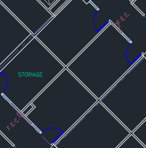
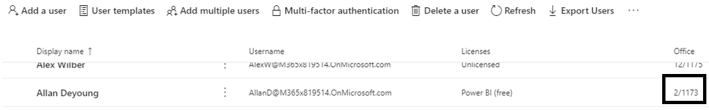
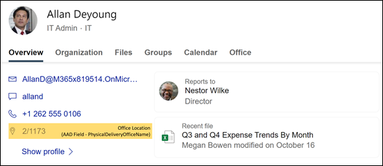
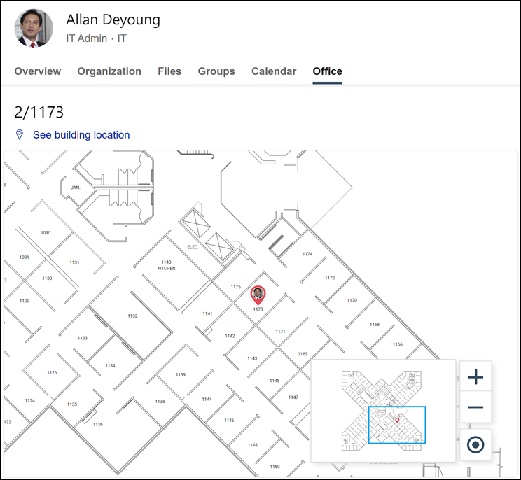
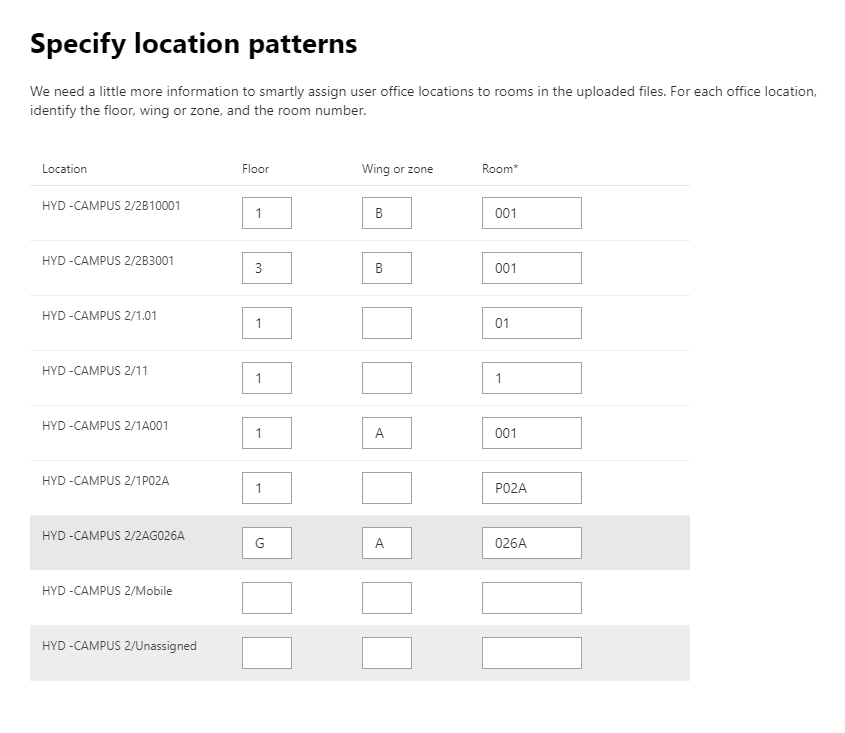
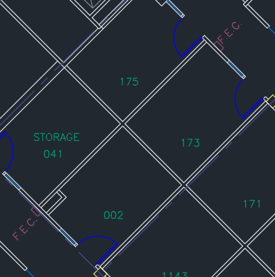

# Manage floor plans

Floor plans in **Microsoft Search** help users find people and meeting rooms within a building. Floor plans answer the following questions:

- Where is Allan Deyoung's office?
- Building 2 floor 3
- Find 2/11173

## Add floor plans

Follow these steps to setup floor plans answers in **Microsoft Search**.

### Step 1: Determine your building codes

Building codes are used as part of a user's office location. You'll use these codes when updating user profiles. Let's say your organization has a building at this location: *Building 2, 350 5th Avenue, New York City, NY 10016*

Here are some good examples for this building's code: 2, B2, Building2, Building 2, or NYCB2. Each building must have a unique code.

### Step 2: Review your floor plans

Floor plans files must be in DWG format; DWG files can contain text labels. When a text label marks a room, it is called a room label. The DWG file must have **at least 10 rooms** marked with labels. Here are some examples of DWG files with different label types:

|**Text labels including room labels**|**Text labels but no room labels**|**No text labels**|
|:-----:|:-----:|:-----:|
||||

See the [FAQ](#frequently-asked-questions) section for information on viewing and updating DWG files.

### Step 3: Update office locations on user profiles

A user's office location is a combination of a building code and a room label. For example, if the building code is *2* and the room label is *1173*, the office location would be *2/1173*.

Add or update office locations for each user in your organization. You can change office location on the user profile in the Microsoft 365 [admin center](https://admin.microsoft.com) or you can change in your on-premises Active Directory to sync into Azure Active Directory. *PhysicalDeliveryOfficeName* is the field that is used for office location. If your room labels do not include floor numbers, see the FAQ for tips.

In this example, Allan's office is in room 1173 on floor 1 of building 2.

> [!NOTE]
> To see updated office locations when searching for floor plans, you must update office locations for **at least 10 people** on each floor.

### Step 4: Verify office location

Use **Microsoft Search** to find a user and verify that their office location is appearing correctly. If you have just updated locations, you may need to wait up to **72 hours** for the updates to appear in the search results.

### Step 5: Add building locations

Floor plans uses [Locations](manage-locations.md) to define your buildings. In the Microsoft 365 [admin center](https://admin.microsoft.com), go to **Settings** > **Microsoft Search** > **Locations**, and then select **Add**. Enter the name, address, and keywords for the building. Add as many buildings as you need.

For more details about locations, see [Manage Locations](manage-locations.md)

### Step 6: Gather and organize office locations

Before you can use floor plans, office locations must be indexed. This is a one-time operation that can take up to 48 hours to complete. The total time will depend on the size of your organization.

In [admin center](https://admin.microsoft.com), go to **Settings** > **Microsoft Search** > **Floor plans**, and then select **Get started**. If you don't see this notice, this step has already been completed for your organization

### Step 7: Upload floor plans

1. In the [admin center](https://admin.microsoft.com), go to **Settings** > **Microsoft Search** > **Floor plans**, and then select **Add**.
2. Select a building in the drop-down list and select **Next**. If the building isn't listed, go back and [add building locations](#step-5-add-building-locations).
3. Select **Upload files**, and then choose the floor plan you are uploading.
4. When the upload is complete, you must enter floor number that is represented in the floor plan file. Then select **Next**.
5. (Optional) If your floor has wings or zones, enter that detail.
6. You will see a review screen listing how many office locations were mapped to the floor plans. Select **Details** to ensure the mapping is correct.
    - If no users are mapped or you're not satisfied with the mapping, select **Continue mapping**. To publish, select **Skip and publish**.
7. Enter the building code for this floor plan. The building code can be found on users' office location property. For example, if a user's office location is **2/1173**, then the building code is **2**.
8. On the review screen, repeat step 6 to ensure the mapping is correct.
9. (Optional) Review and identify the location patterns for all uploaded floor plans and then select **Next**.
10. On the review screen, repeat step 6 to ensure the mapping is correct.
11. When you're ready, select **Publish** to make the floor plan available in **Microsoft Search**.

> [!NOTE]
> **It takes 48 hours for the floor plans to be published.** After that your users will see a floor plan results similar to the one below when they search for a co-worker's office.

### Step 8: (Optional) Specify location patterns

After uploading a floor plan, the text labels will be compared to the office locations in your users' profiles. If there are fewer than 10 matches, the **Specify location patterns** screen appears. Location patterns are used to extract floor, wing, and room information from office locations.

Only room is required, floor and wing are optional, and you can skip locations as needed.

## Edit floor plans

To update an existing floor plan, select the floor plan you want to change, and then select **Edit**. Make your changes and save them.

## Troubleshooting

|**Step**|**Error message**|**Type**|**Action**|
|:-----|:-----|:-----|:-----|
|Upload floor plans|Unable to read CC_1.dwg. Please re-upload or delete the floor plan.|Error|Try uploading the file again. If that doesn't work delete the file and try again.|
|Upload floor plans|There are two files named CC_1.dwg. Please delete one of them or re-upload with another name.|Error|If the file name is incorrect make the file name unique by adding floor or wing information and then upload the file again. If you accidentally added the same file twice just delete it.|
|Upload floor plans|No data found.|Error|Check your file to make sure it's the correct one and then upload it again or delete it.|
|Upload floor plans|External references are missing in this file. Either upload CC_1_furniture.dwg or delete this file.|Warning|Upload external reference files or delete.|
|Upload floor plans|Could not read room numbers or tags in the DWG file. Please delete this file.|Warning|Check your DWG file to make sure the data is included and then delete the file and try again.|
|Link office locations|No office locations found in Azure Active Directory. Add location data to Azure Active Directory before setting up floor plans.|Error|[Update office locations on user profiles](#step-3-update-office-locations-on-user-profiles) |

## Frequently asked questions

**Q:** How do I view and edit DWG files?

**A:** Use any of these options to view DWG files:

- Upload the file to SharePoint and open it.
- Open the file in [Microsoft Visio](https://support.office.com/article/Open-insert-convert-and-save-DWG-and-DXF-AutoCAD-drawings-60cab691-0f4c-4fc9-b775-583273c8dac5) or [Autodesk DWG TrueView](https://www.autodesk.com/products/dwg).
- Upload the file to [Autodesk Online Viewer](https://viewer.autodesk.com/).

**Q:** How do I add text labels to unmarked rooms?

**A:** Open the DWG file in an editor  and [add room labels](https://knowledge.autodesk.com/support/autocad-map-3d/learn-explore/caas/CloudHelp/cloudhelp/2019/ENU/MAP3D-Learn/files/GUID-4854F184-6279-4E0C-9487-34A4759017F6-htm.html).

**Q:** How do I create or edit DWG files for testing purposes?

**A:** Create a DWG file in Microsoft Visio, Autodesk AutoCAD, or any other DWG editor. Make sure 10 or more rooms are labeled in the file.

**Q:** **What's the best format for text labels in DWG files?

**A:** For the best results, text labels should contain floor numbers and room numbers. The examples below use 2 or SC for the building code.
<!-- markdownlint-disable no-inline-html -->
|Room label types|Floor|Room|Sample text label|Office location (building code/text label)|
|:-----|:-----|:-----|:-----|:-----|
|Has floor and room number|1|173|1173|2/1173|
||21|45|21045|2/21045|
||23|100K|23-100K|2/23-100K|
||1|G06-07|1G06-07|2/1G06-07|
||2|1024A|02.1024A|2/02.1024A|
||2|1024A|02.1024A|2/02.1024A|
||2|105.01|2105.01|2/2105.01|
|Has building code, floor, and room number|0|X-11-M-12|2-0-X-11-M-12|2/2-0-X-11-M-12 2-0-X-11-M-12|
||2|128A|22128A|2/22128A 22128A|
||1|B2-11|21-B2-11|2/21-B2-11 21-B2-11|
||2|45|SC2045|SC/SC2045 SC2045|

**Q:** Can I use a DWG file that doesn't include floor numbers?

**A:** Yes, you can. When you update office locations in the user's Azure Active Directory profile, include the floor number as part of the room number, even if it's missing from the DWG file. After you upload the file, the Specify location patterns screen will appear and you can indicate both values.

For example, a DWG file that includes room numbers, but no floor numbers, may look similar to this:

The office location in the user's profile should be 2/1175 where '2' is the building code, '1' is the floor number, and '175' is the room number.
