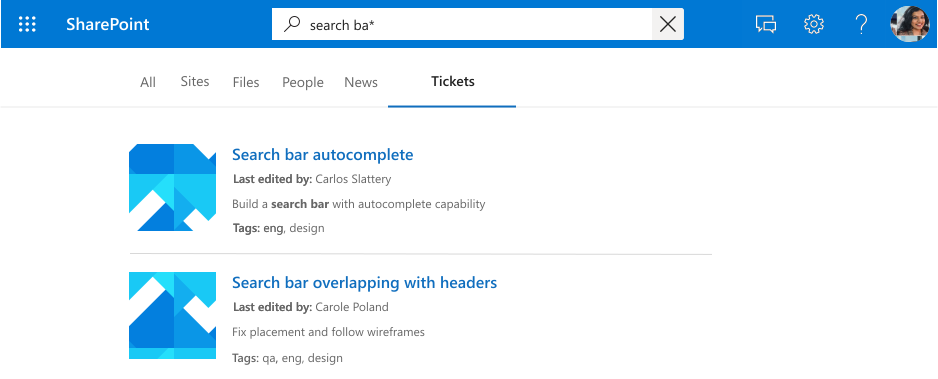
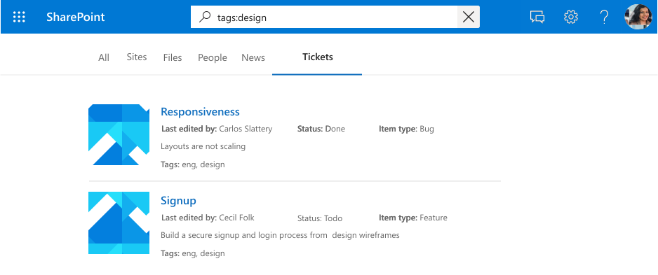
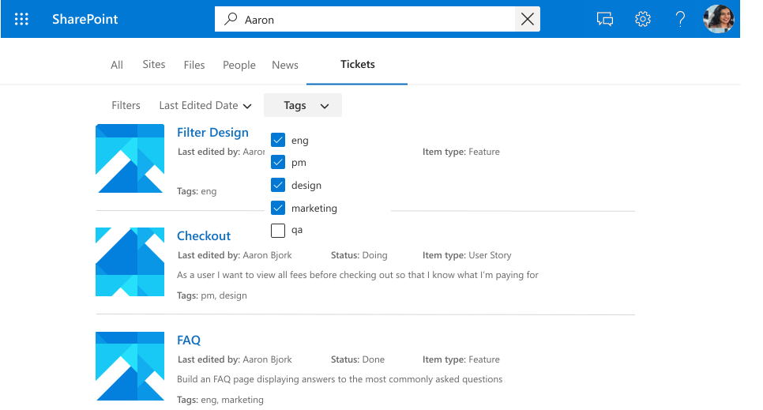
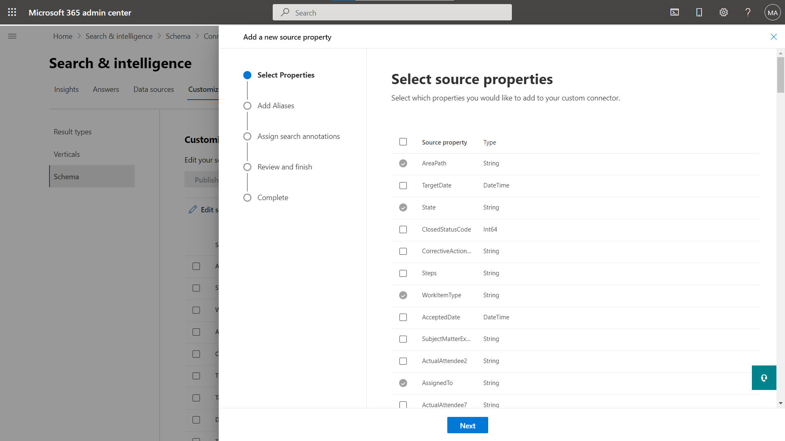
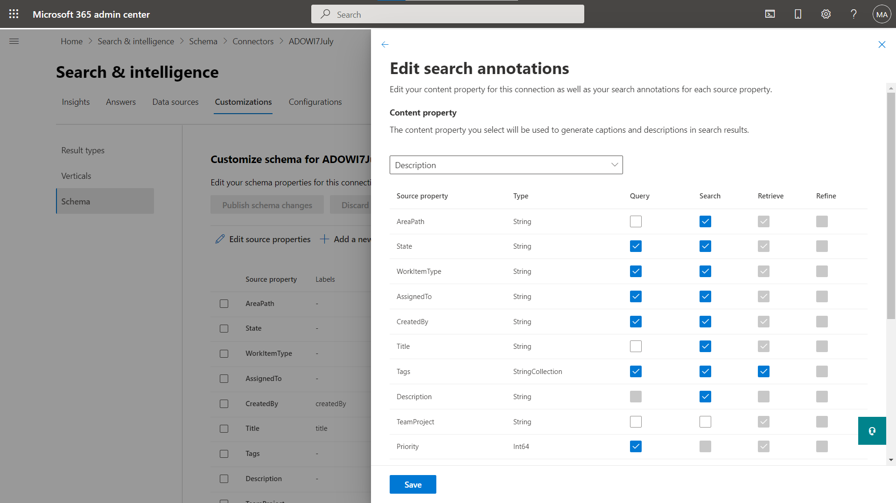
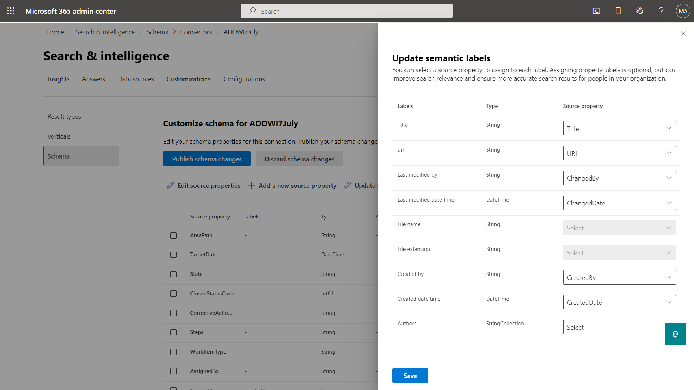
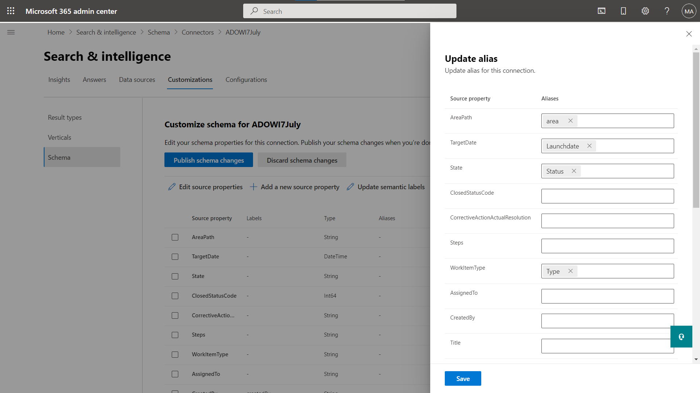

--- 

title: "Manage search schema" 
ms.author: vivg 
author: vivg 
manager: harshkum 
audience: Admin
ms.audience: Admin 
ms.topic: article 
ms.service: mssearch 
localization_priority: Normal 
search.appverid: 
- BFB160 
- MET150 
- MOE150 
description: "Manage the search schema for Microsoft built Graph connectors" 
ms.date: 03/13/2024
---

# Manage search schema (preview)

The search schema determines how your content ingested via a Graph connector is used in various Microsoft Graph experiences. The schema defines the structure of how content is collected from data source, indexed, queried and retrieved from search index. By changing the search schema, you can control what users can search for, how users can search it, and how you can present the results on Microsoft Search endpoints.

The search schema contains crawled properties, search attributes, semantic labels and aliases. The next sections will define the various constituents of schema and management capabilities provided.

> [!NOTE]
> Read the [**Setup your Graph connector**](configure-connector.md) article to understand the general Graph connectors setup instructions. Steps 6 and 7 define the schema while setting up a new connection.

> [!NOTE]
> If you are looking to modify the SharePoint Online search schema, read [**Manage the search schema in SharePoint**](/sharepoint/manage-search-schema).

## Crawled properties

To build up the search index, you must first crawl content. You can crawl various content sources as listed in the [connectors gallery](connectors-gallery.md). The contents and metadata of the items that you crawl are represented as crawled properties (or source properties).

For example, the following table presents sample crawled properties for a work tickets system connector.

| Property       | Type             |
|----------------|------------------|
| ticketId       | String           |
| title          | String           |
| createdBy      | String           |
| assignedTo     | String           |
| lastEditedDate | DateTime         |
| lastEditedBy   | String           |
| workItemType   | String           |
| priority       | Int64            |
| tags           | StringCollection |
| status         | String           |
| url            | String           |
| resolved       | Boolean          |

> [!NOTE]
> * For Microsoft built connectors, the crawled properties are selected in step 4 of [**Setup your Graph connector**](configure-connector.md) article.

## Search attributes

### Content property

This property is used for full-text indexing of content, search results page snippet generation, [result cluster](result-cluster.md) participation, language detection, HTML/text support, ranking and relevance, and query formulation.

If you select a content property, you have the option of using the system-generated property **ResultSnippet** when you [create your result type](customize-results-layout.md). This property serves as a placeholder for the dynamic snippets that are generated from the content property at query time. If you use this property in your result type, snippets are generated in your search results.

### Searchable

If a property is searchable, its value is added to the full text index. When a user performs a search, we return results if there is a search hit in one of the searchable fields or its content.

*A search for "design" displaying results for hits against the property (`title`) and content.*

### Queryable

If a property is queryable, you can query against it using knowledge query language (KQL). KQL consists of one or more free text keywords (words or phrases) or property restrictions. The property name must be included in the query, either specified in the query itself or included in the query programmatically. You can use prefix matching with the wildcard operator(*).

> [!NOTE]
> Suffix matching is not supported.

*A search for "search ba\*" displaying results that match this prefix.*

*A search for "tags:design" scoping down results to items with "design" in the `tags` property.*

### Retrievable

If a property is retrievable, its value can be returned in search results. Any property that you want to add in the display template or be returned from the query and be relevant in search results must be retrievable. Marking large or too many properties as retrievable increases search latency. Be selective and choose relevant properties.

*A set of retrievable properties (`title` and `lastEditedBy`) rendered as a result.*

### Refinable

If a property is refinable, an admin can configure it as a custom filter in the Microsoft Search results page. A `refinable` property cannot be `searchable`.

*Refine results by `tags`, a refinable property.*

> [!NOTE]
> * For Microsoft built connectors, the search attributes are selected in step 7 of [**Setup your Graph connector**](configure-connector.md) article.

## Semantic labels

A semantic label is a well-known tag published by Microsoft that you can add against a property in your schema. Adding a semantic label helps various Microsoft products understand the property and provide a better experience.

Semantic labels provide a domain-independent approach to assigning properties from different content domains to a set of well-known classes. They find applications in many different content experiences, and provide automated support for tasks such as:

* Data integration in heterogenous experiences
* Building common knowledge graphs (for example, Topics)
* Default templates for user experiences

Labels provide semantic meaning, and let you integrate your connector data into Microsoft 365 experiences.  

| Label                 | Description                                                                               |
|---------------------- |------------------------------------------------------------------------------------------ |
| title                 | The title of the item that you want shown in search and other experiences.                |
| url                   | The target URL of the item in the data source.                                            |
| createdBy             | The name of the person who created the item in the data source.                           |
| lastModifiedBy        | The name of the person who most recently edited the item in the data source.              |
| authors               | The names of all the people who participated/collaborated on the item in the data source. |
| createdDateTime       | The date and time that the item was created in the data source.                           |
| lastModifiedDateTime  | The date and time that the item was last modified in the data source.                     |
| fileName              | In case of a file, the name of the file in the data source.                               |
| fileExtension         | In case of a file, the extension of the file in the data source.                          |
| iconUrl               | The URL of an icon.                                                                       |

For example, the crawled property **lastEditedBy** has the same meaning as the Microsoft label *lastModifiedBy*.

> [!IMPORTANT]
> All properties that you map to labels must be retrievable.

The label **title** is the most important label. Make sure that you assign a property to this label to allow your connection to participate in the result cluster experience. Incorrectly mapping labels degrades the search experience. It's okay for some labels to not have a property assigned to them.

> [!NOTE]
> * For Microsoft built connectors, the semantic labels are selected in step 6 of [**Setup your Graph connector**](configure-connector.md) article.

## Aliases

Aliases are friendly names for properties that you assign. These are used in queries and selections in refinable property filters.

> [!NOTE]
> * For Microsoft built connectors, aliases are defined in step 7 of [**Setup your Graph connector**](configure-connector.md) article.

## Schema update capabilities

This section includes information about the update capabilities for the search schema of Microsoft built Graph connectors.

> [!NOTE]
> We recommend that you run a full crawl after an update to bring them to the latest schema. Without a full crawl, the behavior of the items will be inconsistent.

### Manage schema

1. In the [Microsoft 365 admin center](https://admin.microsoft.com), go to the [**Schema**](https://admin.microsoft.com/Adminportal/Home#/MicrosoftSearch/schema) page in the **Customization** section.
2. Click **View Details** under **Graph Connectors schema**.
3. Select the connection for which you want to update the schema and click **Customize schema**.
4. After making the required schema changes, click **Publish schema changes** to publish the new schema.

### Add a crawled property

You can add a property to your schema. When you add a property, you can include all the search attributes that you need.

*Add a new source property from list of supported properties by connector*

> [!IMPORTANT]
> 
> You cannot delete an existing property for a published connection. To remove a property, you must delete and recreate a connection.

### Add/remove a search capability

You can add or remove specific search attributes to a property. Adding a search capability requires a full crawl.

*Update the search annotations for crawled properties*

> [!IMPORTANT]
> * You cannot remove a retrievable search attribute from a property.
> * You cannot add or remove refinable search attribute to a property.

### Add/remove a semantic label

You can add or update semantic label mapping of your crawled properties.

*Update semantic labels for crawled properties*

### Add/remove an alias

You can add or remove aliases, and use them for your search queries.

*Add or remove an alias for crawled properties*

<!---## Troubleshooting-->
<!---Insert troubleshooting recommendations-->

<!---## Limitations-->
<!---Insert limitations for this feature-->
