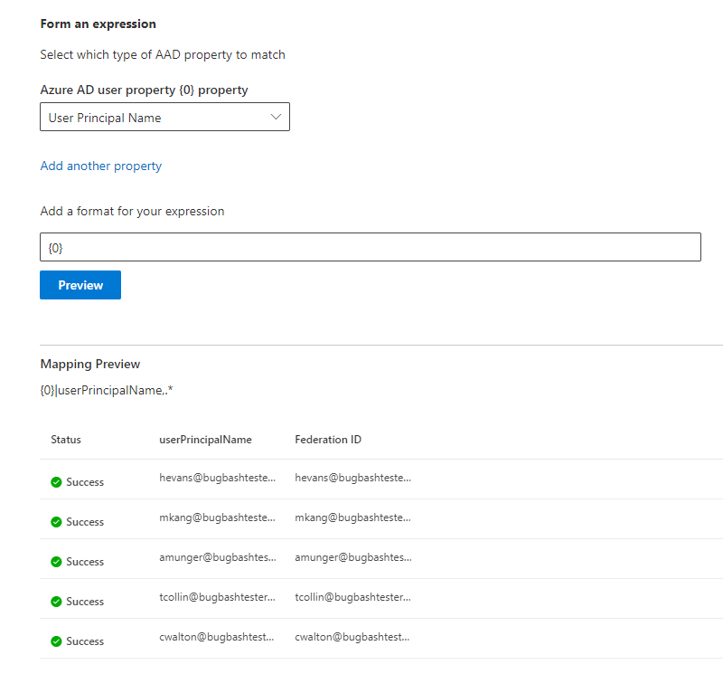

# Map your Microsoft Entra identities  

This article walks you through the steps of mapping your Microsoft Entra identities to a unique identifier for your data source (non-Azure AD identity) so that people in your Access Control List (ACL) with non-Azure AD identities can see connector search results scoped to them.

These steps are only relevant to search administrators who are setting up a [Salesforce](salesforce-connector.md) connector by Microsoft with search permissions for "Only people with access to this data source" and identity type "AAD." The following steps walk you through how to map your Microsoft Entra user properties to your users' **Federation IDs**.

>[!NOTE]
>If you are setting up a [Salesforce connector](salesforce-connector.md) and select **Only people with access to this data source** and identity type **non-AAD** on the search permissions screen, refer to the [Map your non-Azure AD Identities](map-non-aad.md) article for steps on how to map non-Azure AD identities.  

## Steps for mapping your Microsoft Entra properties

### 1. Select Microsoft Entra user properties to map

You can select the Microsoft Entra properties you need to map to the Federation ID.

You can select a Microsoft Entra user property from the dropdown. You can also add as many Microsoft Entra user properties as you would like if these properties are necessary to create the Federation ID mapping for your organization.

### 2. Create formula to complete mapping

You can combine the values of the Microsoft Entra user properties to form the unique Federation ID.

In the formula box, "{0}" corresponds to the *first* Microsoft Entra property you selected. "{1}" corresponds to the *second* Microsoft Entra property you selected. "{2}" corresponds to the *third* Microsoft Entra property, and so on.  

Below are some examples of formulas with sample regular expression outputs and formula outputs:

| Sample formula                  | Value of property {0} for a sample user                 | Value of property {1} for a sample user           | Output of formula                  |
| :------------------- | :------------------- |:---------------|:---------------|
| {0}.{1}@contoso.com  | firstname | lastname |firstname.lastname@contoso.com
| {0}@domain.com                 | userid                 |             |userid@domain.com

After you provide your formula, you can optionally click **Preview** to see a preview of 5 random users from your data source with their respective user mappings applied. The output of the preview includes the value of the Microsoft Entra user properties selected in step 1 for those users and the output of the final formula provided in step 2 for that user. It also indicates whether the output of the formula could be resolved to a Microsoft Entra user in your tenant via a "Success" or "Failed" icon.  

>[!NOTE]
>You can still proceed with creating your connection if one or more user mappings have a "Failed" status after you click **Preview**. The preview shows 5 random users and their mappings from your data source. If the mapping you provide does not map all users, you may experience this case.

## Sample Microsoft Entra ID mapping

See the snapshot below for a sample Microsoft Entra ID mapping.

## Limitations  

- Only one mapping is supported for all users. Conditional mappings are not supported.  

- You cannot change your mapping once the connection is published.  

- Regex-based expressions against the Microsoft Entra user properties are not supported for the Microsoft Entra ID to Federation ID transformation.
