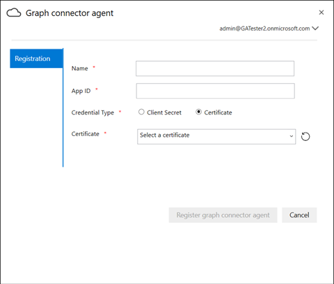

--- 
title: "On Prem Agent" 
ms.author: rusamai 
author: rsamai 
manager: jameslau 
ms.audience: Admin 
ms.topic: article 
ms.service: mssearch 
localization_priority: Normal 
search.appverid: 
- BFB160 
- MET150 
- MOE150 
ROBOTS: NoIndex
description: "On-Prem Agent" 
--- 

# On-Prem Agent

## Graph connector agent

On-prem Graph connectors require you to install *Graph connector agent* software. It allows quick and secure data transfer between on-premises data and cloud services. This article guides you through the steps of installing and configuring the software. Once configured, it will be available for creating connections to your on-prem data sources from the [Microsoft 365 admin center](https://admin.microsoft.com).

## Installation

Download the latest version of Graph connector agent using [this link](https://download.microsoft.com/download/d/d/e/dde18236-9c67-437d-a864-894a0a888ef2/AgentPackage.msi) and install the software using the installation wizard. With the recommended configuration of the machine described below, the software can seamlessly handle up to three connections. Any connections beyond that might degrade the performance.

Recommended configuration:

* Windows 10, Windows Server 2012 R2 and above
* 8 cores, 3GHz
* 16GB RAM, 1GB Disk Space
* Network access to data source and internet through 443

## Creating App for the agent  

The agent instance needs to be fed few critical parameters before you create connections. These parameters include authentication details required for using Graph ingestion APIs.  

Steps for creating App for the agent.

1. Go to the [Azure portal](https://portal.azure.com) and sign in with admin credentials for the tenant.
2. Navigate to **Azure Active Directory** -> **App registrations** from the navigation pane and select **New registration**.
3. Provide a name for the app and select **Register**.
4. Make a note of the Application (client) ID.
5. Open **API permissions** from the navigation pane and select **Add a permission**.
6. Select **Microsoft Graph** and then **Application permissions**.
7. Search for "ExternalItem.ReadWrite.All" and "Directory.Read.All" from the permissions and select **Add permissions**.
8. Select **Grant admin consent for [TenantName]** and confirm by selecting **Yes**.
9. Check that the permissions are in the granted state.
     

## Configuring Graph connector agent

Once you have created the App for the agent, you must configure the agent with appropriate authentication details.

Authentication details can be provided in one of the following forms.

### Configuring the client secret for authentication

1. Go to the [Azure portal](https://portal.azure.com) and sign in with admin credentials for the tenant.
2. Open **App Registration** from the navigation pane and go to the appropriate App. Under **Manage**, select **Certificates and secrets**.
3. Select **New Client secret** and select an expiry period for the secret. Copy the generated secret and save it because it will not be shown again.
4. Use this Client secret along with the Application ID to configure the agent. Do not use any blank spaces in the **Name** field of the agent. Alpha numeric characters are accepted.

## Using thumbprint certificate for authentication

If you have already configured the authentication details by following [Configuring the client secret for authentication](#configuring-the-client-secret-for-authentication) , then you can jump directly to [Setup overview](configure-connector.md).

1. Open **App registration** and select **Certificates and secrets** from the navigation pane. Copy the certificate thumbprint.

2. Use either the client secret or thumbprint to register the Graph connector agent.

