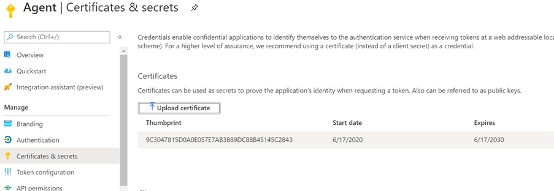

--- 
title: "On-Premises Agent" 
ms.author: rusamai 
author: rsamai 
manager: jameslau 
ms.audience: Admin 
ms.topic: article 
ms.service: mssearch 
localization_priority: Normal 
search.appverid: 
- BFB160 
- MET150 
- MOE150 
ROBOTS: NoIndex
description: "On-Prem Agent" 
--- 

# Graph connector agent

Using on-prem Graph connectors require you to install *Graph connector agent* software. It allows for secure data transfer between on-premises data and the Graph connector APIs. This article guides you through the installing and configuring the agent.

## Installation

Download the latest version of Graph connector agent [here](https://download.microsoft.com/download/d/d/e/dde18236-9c67-437d-a864-894a0a888ef2/AgentPackage.msi) and install the software using the installation wizard. With the recommended configuration of the machine described below, the software can handle up to three connections. Any connections beyond that might degrade the performance of all connections on the agent.

Recommended configuration:

* Windows 10, Windows Server 2012 R2 and above
* 8 cores, 3GHz
* 16GB RAM, 1GB Disk Space
* Network access to data source and internet through 443

## Create and configure an App for the agent  

Before using the agent, you must create an app and configure the authentication details.

### Create an app

1. Go to the [Azure portal](https://portal.azure.com) and sign in with admin credentials for the tenant.
2. Navigate to **Azure Active Directory** -> **App registrations** from the navigation pane and select **New registration**.
3. Provide a name for the app and select **Register**.
4. Make a note of the Application (client) ID.
5. Open **API permissions** from the navigation pane and select **Add a permission**.
6. Select **Microsoft Graph** and then **Application permissions**.
7. Search for "ExternalItem.ReadWrite.All" and "Directory.Read.All" from the permissions and select **Add permissions**.
8. Select **Grant admin consent for [TenantName]** and confirm by selecting **Yes**.
9. Check that the permissions are in the granted state.
     

### Configure Authentication

Authentication details can be provided using a client secret or a certificate. Follow the steps for your choice.

#### Configuring the client secret for authentication

1. Go to the [Azure portal](https://portal.azure.com) and sign in with admin credentials for the tenant.
2. Open **App Registration** from the navigation pane and go to the appropriate App. Under **Manage**, select **Certificates and secrets**.
3. Select **New Client secret** and select an expiry period for the secret. Copy the generated secret and save it because it will not be shown again.
4. Use this Client secret along with the Application ID to configure the agent. Do not use any blank spaces in the **Name** field of the agent. Alpha numeric characters are accepted.

#### Using a certificate for authentication

There are three simple steps for using certificate-based authentication:

1. Create or obtain a certificate
1. Upload the certificate to the Azure portal
1. Assign the certificate to the agent

##### Step 1: Get a certificate

The script below can be used to generate a self-signed certificate. However, your organization may not allow self-signed certificates. In that case, use this information to understand the requirements and acquire a certificate in accordance to your organization's policies.

```Powershell
$dnsName = "<TenantDomain like agent.onmicrosoft.com>" # Your DNS name
$password = "<password>" # Certificate password
$folderPath = "D:\New folder\" # Where do you want the files to get saved to? The folder needs to exist.
$fileName = "agentcert" # What do you want to call the cert files? without the file extension
$yearsValid = 10 # Number of years until you need to renew the certificate
$certStoreLocation = "cert:\LocalMachine\My"
$expirationDate = (Get-Date).AddYears($yearsValid)
$certificate = New-SelfSignedCertificate -DnsName $dnsName -CertStoreLocation $certStoreLocation -NotAfter $expirationDate -KeyExportPolicy Exportable -KeySpec Signature
$certificatePath = $certStoreLocation + '\' + $certificate.Thumbprint
$filePath = $folderPath + '\' + $fileName
$securePassword = ConvertTo-SecureString -String $password -Force -AsPlainText
Export-Certificate -Cert $certificatePath -FilePath ($filePath + '.cer')
Export-PfxCertificate -Cert $certificatePath -FilePath ($filePath + '.pfx') -Password $securePassword
```

##### Step 2: Upload the certificate in the Azure portal

1. Open the application and navigate to certificates and secrets section from left pane
1. Select 'Upload certificate' and upload the .cer file
1. Open **App registration** and select **Certificates and secrets** from the navigation pane. Copy the certificate thumbprint.



##### Step 3: Assign the certificate to the agent

If you used the sample script to generate a certificate, the PFX file canbe found in the location identified in the script.

1. Download the certificate pfx file onto the Agent machine.
1. Double click the pfx file to launch the certificate installation dialog.
1. Select 'Local Machine' for store location while installing the certificate.
1. After installing the certificate, open 'Manage computer certificates' through Start menu
1. Select the newly installed certificate under 'Personal' -> 'Certificates'
1. Right click on the cert and select 'All Tasks' -> 'Manage Private Keys…' Option
1. In the permissions dialog select add option. In the user selection dialog write: 'NT Service\GcaHostService' and click 'OK'. Do not click the 'Check Names' button.
1. Click okay on the permissions dialog. The agent machine is now configured for agent to generate tokens using the certificate.
