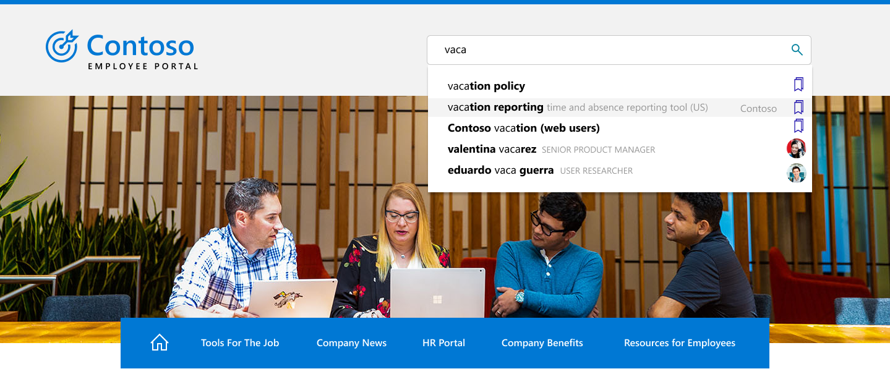

# Overview of Microsoft Search in Bing

Microsoft Search in Bing brings together the capabilities of Microsoft Search and Bing web search. It provides a familiar search experience that helps users find relevant results from your organization and the web. To help keep your users and your data private and secure, users must sign in to their work or school account on Bing before they can find internal results. Users already signed in to a Microsoft app, including Microsoft Edge, Outlook, and SharePoint, are automatically signed in when they go Bing.

## What users see

When people in your organization use Microsoft Search in Bing, there are two places they can see work or school results:

- ALL results page: if there's a relevant work or school result, it will appear at the top of the search results page, followed by public web results.
- WORK or SCHOOL results page: Only results from your organization appear on this page. It never includes public web results.

:::image type="content" alt-text="All and work results pages for Contoso and school results page for Contoso middle school." source="media/msb-overview/all-work-school-serps.gif" lightbox="media/msb-overview/all-work-school-serps.gif":::

Users can easily identify work or school results by looking for your organization's logo, name, or their profile image.

## Where users can start a search

To make finding work or school results easier, Microsoft Search in Bing support multiple entry points. Depending on the entry point, users may see the All results page or a Work or School results page:

|Search entry point|Takes users to|
|:-----|:-----|
|Bing homepage|All results page|
|[Work](https://www.bing.com/work) or [School](https://www.bing.com/school) search start page|Work or School results page|
|[Windows Search](https://support.microsoft.com/windows/search-for-anything-anywhere-b14cc5bf-c92a-1e73-ea18-2845891e6cc8)|An internal site, file, All results, or Work or School results page, depending on the match they select|
|Microsoft Edge address bar|All results page|
|[Microsoft Edge work shortcut](/microsoftsearch/edge-shortcuts)|Work or School results page|
|Microsoft Edge new tab page|All results page|
|[Embedded search box](/microsoftsearch/add-a-search-box-to-your-intranet-site) on your intranet or an internal app|Work or School results page|
|Microsoft Search in Bing extension|Work or School results page|

## Getting started with Microsoft Search in Bing

Microsoft Search in Bing is enabled by default for everyone in your organization. To help ensure your users are protected, Microsoft Search in Bing uses enhanced privacy and security measures. For more information, see [Security and Privacy for Microsoft Search in Bing](security-for-search.md).

If you're unfamiliar with Microsoft Search in Bing, we suggest reviewing the Microsoft Search in Bing [Admin Essentials Guide](https://aka.ms/SearchAdminEssentials) for configuration and deployment information. To help increase user awareness of Microsoft Search, our [adoption kit](https://aka.ms/SearchAdoptionKit) includes training and communication resources.

## Search experiences for work and school

Microsoft Search in Bing provides search experiences tailored to the needs of work and school users. In organizations with enterprise service plans, users will get a search experience designed for work, including organizational charts and Power BI answers.

Users in organizations with education service plans will get an experience designed for searching school, including answers about classes and upcoming assignments.

If your organization has education and enterprise service plans, you can select a Microsoft Search in Bing experience for your users, either school or work. For more information, see [Select a school or work search experience](/microsoftsearch/select-work-school-search-experience).

## Add Microsoft Search in Bing to your intranet

Microsoft Search is designed to make internal information easy to access everywhere your users are searching. If people in your organization use your intranet site to start a work or school search, consider adding an embedded search box to your site.

With a simple script, you can add a customized search box and even direct it to a custom vertical. To learn more, see [Add a search box to your intranet site](add-a-search-box-to-your-intranet-site.md).

## Add the Microsoft Search extension to Google Chrome

If your organization uses Google Chrome, the Microsoft Search extension gives users easy access to work results from their browser. You don't need to change any search or browser defaults. For information about using group policy or the Microsoft 365 admin center to deploy the extension, see [Microsoft Search in Bing and Microsoft 365 Apps for enterprise](https://docs.microsoft.com/deployoffice/microsoft-search-bing).

Users can also add the Microsoft Search extension from the [Chrome web store](https://chrome.google.com/webstore/detail/microsoft-search-in-bing/obdappnhkfoejojnmcohppfnoeagadna).

## Set defaults to make searching work or school easier

To help increase adoption of Microsoft Search in Bing, consider ways to make it a seamless part of your user's day by setting defaults.

**Default browser**: When you make Microsoft Edge your default browser, your users can search your organization, and get relevant search suggestions, right from the address bar. Searching from the address bar is a fast and easy to find information, and they don't need to go to Bing to start a search. For more information, see [Set Microsoft Edge as the default browser](/deployedge/edge-default-browser).

**Default search engine**: If changing your default browser isn't an option, you can enable work or school search from the address bar by setting Bing as your default search engine. For details, see [Make Bing the default search engine](set-default-search-engine.md).

**Default homepage**: Setting Bing as your organization's default homepage won't enable searching work or school from the address bar, but it does provide any easy way to access bing.com. For more information, see [Make Bing.com the default home page](set-default-homepage.md).

## Security and privacy

Microsoft Search in Bing uses enhanced security and privacy measures to help protect your organization's data and your users. For more information, see [Security and Privacy for Microsoft Search in Bing](security-for-search.md) and [How Microsoft Search in Bing helps keep your info secure](https://support.microsoft.com/office/how-microsoft-search-in-bing-helps-keep-your-info-secure-cbce46ae-bb1f-4d0e-86f1-5984f4589113).

## See also

- [Overview of Microsoft Search](overview-microsoft-search.md)
- [Plan your content](plan-your-content.md)
