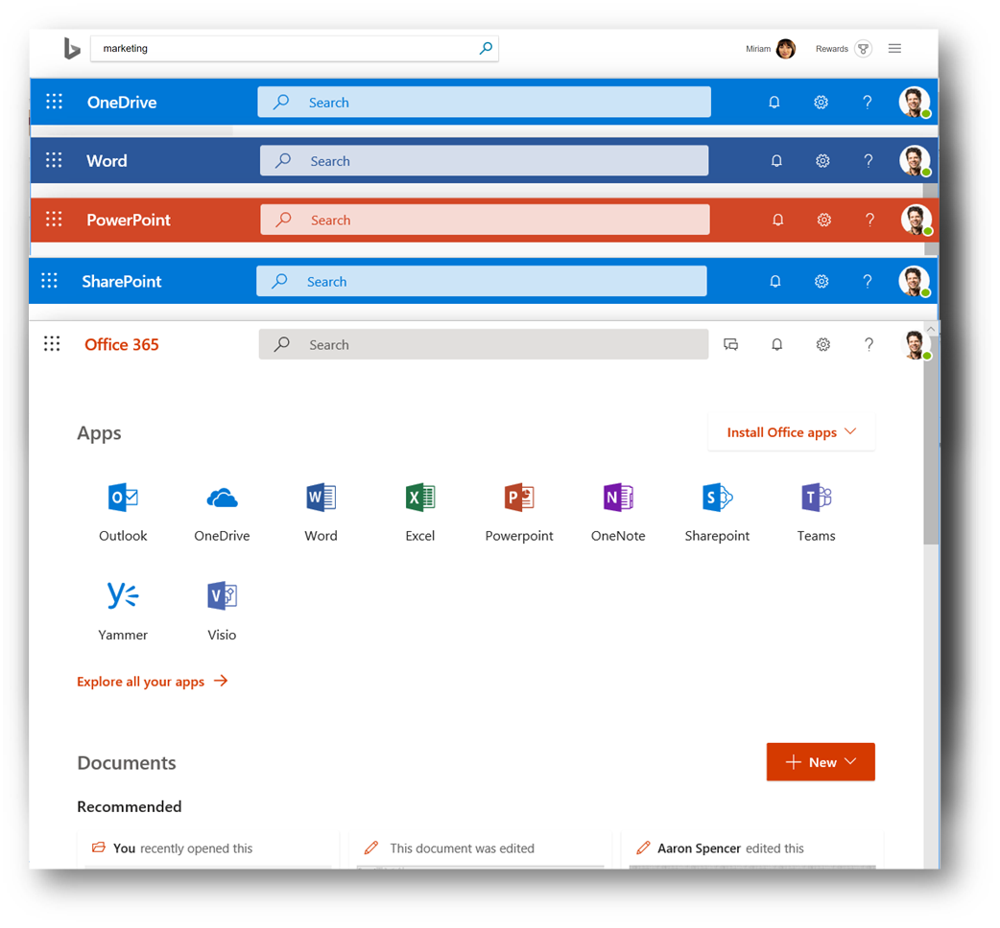

# Overview of Microsoft Search

Microsoft Search is the unified search capability in the Microsoft 365 productivity apps and the broader Microsoft ecosystem.

Users find the Microsoft Search box in the header bar.

Microsoft Search helps users find the right answers, people, and content to complete their tasks in the app they’re already working in. With Microsoft Search: 
- Users get results that are relevant in the context of the app they search from. For example, when they search in Outlook, they find mails, not sites in SharePoint. When they search in SharePoint, they find sites, pages, and files, not mails.  
- Users don’t need to remember where the information is located. For example, a user is working in Word and wants to reuse information from a presentation that a colleague shared from their OneDrive. There’s no need to switch to OneDrive and search for that presentation, they can simply search from Word.  
- When searching from Bing, users can get results both from the public web and from within their organization. They can even enter their query in the address bar of Edge to start searching from Bing. 

Whichever app they’re working in, Microsoft Search is personal.  Microsoft Search uses insights from the Microsoft Graph to show results that are relevant to each user. Each user will see different results, even if they search for the same words. Users only see results that they already have access to, Microsoft Search doesn’t change permissions.

When users click in the search box, search suggests results based on their previous activity in Office 365 and based on content that’s trending in your organization. Files they were working on recently, commands they’ve used recently as well as people they collaborate with are examples of activity that search considers. As users start typing in the search box, the suggested results update. Users can open search results right from the search box.

If the suggestions in the search box aren’t what they’re looking for, clicking Enter opens the full list of results. They can use metadata such as who last modified the item and when, where the items is located, as well as preview it to determine if it’s what they’re looking for.

## Benefits 
**Search across Microsoft 365 from any Microsoft Search box** – Users can search from any Microsoft Search box and get quickly back to what they were doing. Microsoft Search brings together results from data sources in Office 365, including SharePoint, OneDrive for Business, and Exchange - as well as from the public web.

**Easy to search** - Microsoft Search suggests results based on users’ previous activity in Office 365, right in the search box. Admins can promote information and answers that users need to complete tasks, for example policies, benefits, resources, tools, and more.

**Find shared files** - Microsoft Search uses advanced query understanding to make finding shared files simple. Users can easily find files they’re collaborating on.

**Show relevant content** - Promote the information and answers your users need to complete tasks, for example policies, benefits, resources, tools, and more. You can also target specific groups, like new hires or remote workers.

**Administer across all apps** - Microsoft Search is on by default and any administration you do applies to Microsoft Search in all the apps.

## Which apps offer Microsoft Search today? 
Over time Microsoft Search will be available in more and more apps across Microsoft 365.
The following Office 365 apps currently offer Microsoft Search:
- SharePoint Online 
- OneDrive for Business 
- Outlook on the web 
- Word, Excel, and PowerPoint desktop apps 

In addition, users find Microsoft Search in: 
- Bing 
- Windows 
- The Office 365 home page 
- The starting pages for Word, Excel, and PowerPoint 

Users can also initiate a search in Bing from the Edge address bar.

## What can users find with Microsoft Search? 
Microsoft Search searches in content that’s stored in Outlook, OneDrive, and SharePoint Online, including people from the global address list and Office 365 groups. If you use cloud hybrid search to set up a hybrid SharePoint environment, users of Microsoft Search can also get results from on-premises SharePoint content, including any external content you’ve connected to your SharePoint Server environment. Learn more about hybrid search environments.

When users search from the SharePoint home page or the Office 365 home page, Microsoft Search searches across their organization and presents all organizational results it finds. This is known as the universal search scope.

When they search from Bing, Microsoft Search searches both across their organization and the public web. They get a wide range of the most relevant results from their organization embedded in the result list. If they need to see all organizational results, the universal search scope is only a click away.

When users search from an app, they get results that are relevant to the context they’re working in. For example, they’ll find emails when they search from Outlook, sites, news and content in lists when they search from SharePoint, and actions or words in the presentation they’re working on when they search from PowerPoint.

Here’s an overview of the type of results users get in each app:

**Outlook**: Emails, file attachments, and people.

**Word, Excel, and PowerPoint**: Actions in the app, people in your organization and on the public web, files, word explanations, matches for the query inside the file or in help content, content on the public web. Word, Excel, PowerPoint, Visio, and OneNote files can be found.

**OneDrive**: Files of the same type as in SharePoint can be found.

**SharePoint**: Files, folders, people, organization charts, sites, site pages, news, lists and list items. If defined, answers to common questions, bookmarks that lead to authoritative information, map locations, and tools. Learn which types of files you can find.

**Bing**: Content on the public web, files, Office 365 groups, people, Yammer and Teams conversations, organization charts, SharePoint sites. If defined, answers to common questions, bookmarks that lead to authoritative information, map locations, and tools.  Word, Excel, PowerPoint, OneNote, and PDF files can be found.

**Windows**: Files and people.

**The Office 365 home page and Word, Excel, and PowerPoint start pages**: Apps, files, folders, people, organization charts, SharePoint sites, site pages, lists and list items. If defined, answers to common questions, bookmarks that lead to authoritative information, map locations, and tools. The same file types can be found here as in SharePoint.

## Requirements 
Your organization must have an Office 365 tenant with one of the following subscriptions: 
- Business Essentials 
- Business Premium 
- Office 365 F1 
- Office 365 E1/E2/E3/E5 
- Microsoft 365 Business 
- Microsoft 365 Enterprise F1/E3/E5 
- Microsoft 365 Education for Faculty A3/A5 
- Office 365 Education for Faculty A1/A1 Plus/A3/A5 
- Office 365 Education for Faculty E1/E3 
- Office 365 for Non-Profits NPBE/NPBP/NPE1/NPE3/NPE5 

Your tenant must have:
- Azure Active Directory
- SharePoint Online
- Exchange Online

Only users with active accounts can use Microsoft Search, and they must be **signed in**.

## Tailoring Microsoft Search to your organization?
You administer Microsoft Search from the Microsoft Search Admin Center for all apps that have the Microsoft Search box.  
### Make it easy to find content
As an admin you can make it easy for your users to get good organization-specific results when they search from their SharePoint or Office 365 home page or from Bing.

**Show useful content** - Help users find important tools and resources within your organization by bookmarking them. Just as you can create a bookmark to a public webpage, you can create a bookmark for any internal webpage, which your users can search for. You can also integrate a Power App in the bookmark so users can complete their task directly from the bookmark.

**Offer answers to common questions** – Give the best answer for your the most frequently asked questions. When users enter a common question in the search box, Microsoft Search shows the answer as a result instead of just providing a link to the web page.

**Show useful locations** - Show map results and address information for your organization's buildings, offices, and other workspaces on a map. Users can use the maps to get directions, see what's nearby, and more.

### Adjust how content can be found
As an admin you can define which content that users can search for and get results for. For example, a user can search for “Smith” and get results that contain the word “Smith” as well as results that were authored by a person by name “Smith”. But you can also let users can search specifically for content authored by a person named “Smith”. Or, you can define that certain content shouldn’t show up in the search results. It’s the search schema that contains these settings. The default settings are a good starting point.

Both Microsoft Search and classic search in SharePoint can find the same content, and they use the same search schema. If you need to make changes to the search schema to tailor certain parts of the search experience for your organization, you do this in the SharePoint Online Admin Center. Learn about managing the search schema.

### Search features that aren't available
If you’ve familiar with managing search in SharePoint Online, there are some classic SharePoint search features that Microsoft Search doesn’t support: Custom result sources, custom result types and display templates, custom refiners, and custom verticals.

Unlike the classic search results page, the Microsoft Search results page in SharePoint isn’t built with web parts. You can’t customize the search results page or create additional search results pages in Microsoft Search. 

## How does Microsoft Search work?
Microsoft Search automatically finds the content in SharePoint Online, OneDrive for Business, and Exchange. If you have set up a hybrid SharePoint Server and SharePoint Online search environment, using cloud hybrid search, then Microsoft Search also can find content from your on-premises SharePoint, including content via on-premises connectors.

When a user searches, Microsoft Search processes the query and parses search intent from larger phrases, using Artificial Intelligence (AI) to learn common superfluous phrases users add to their queries that don't impact their search intent. For example, when a user searches for "tell me more about how to change my password please" we extract the less important words from the query and trigger based on the relevant ones like "change password".  

The search results that the user has permission to see are presented on the search results page. Microsoft Search uses intelligent ranking algorithms to order results based on relevance.

## Microsoft Search in SharePoint 
Microsoft Search is the modern search experience in SharePoint Online. SharePoint Online also offers a classic search experience. As a search administrator you can’t turn on or off neither the modern nor the classic search experience. They are both on by default. Which search experience your users get depends on where they search from:

- Users get the Microsoft Search box on the SharePoint home page, hub sites, communication sites, and modern team sites.
- Users get the classic search box on publishing sites, classic team sites, and in the Search Center.

Certain classic search settings **also** apply to Microsoft search: 
- The search schema determines how content is collected in and retrieved from the search index. Because both search experiences use the same search index to find search results, any changes you make to the search schema, apply to both search experiences. Microsoft Search doesn't support changing the sort order of results or building refiners based on metadata. Therefore, the following search schema settings don’t affect the Microsoft Search experience: sortable, refinable, company name extraction. 
- The Microsoft Search experience shows results from the same default result source as classic search in SharePoint. If you change the default result source in classic search, both search experiences are impacted. 
- If you temporarily remove a search result from the classic search results page, the result is also temporarily removed from the Microsoft Search results pages in SharePoint.
 
## Microsoft Search in Bing 
When users search in Bing, they get both web results and results from within your organization, when they’re signed into Office 365.  

Because work-related searches may be sensitive, Microsoft Search has implemented a set of trust measures for how these are handled by the public web results part of Bing. 
Regardless of whether a user query contains one or more work results in the returned response, the following measures are taken: 
### Logging 
All search logs pertaining to Microsoft Search traffic are de-identified and stored separately from public, non-Microsoft Search traffic. They're retained for 18 months, and access is restricted for debugging purposes only. 
The queries in these logs are not used to model or train public features such as autosuggest or related searches for the public web. 
Restricted access is managed via various secure mechanisms, including security groups and other layers within the engineering system. 
### Search history 
When signed in with a work or school account, a user's search history won't be available on other computers or devices. 
### Advertising
Enterprise search queries are never shared with or suggested to advertisers. 
Search Ads logs pertaining to Microsoft Search are stored separately from public traffic. 
Ads are never targeted to a user based on their work identity or organization. 
