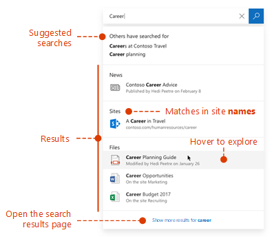
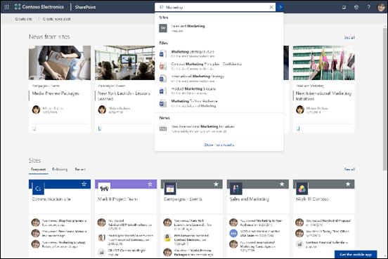

# Overview of Microsoft Search

Microsoft Search is the unified search capability in the Microsoft 365 productivity apps and the broader Microsoft ecosystem. Over time Microsoft Search will be available in more and more apps across Microsoft 365.

Microsoft Search helps users find the right answers, people, and content to complete their tasks in the app they’re already working in.

- Users get results that are relevant in the **context** of the app they search from. For example, when they search in Outlook, they find emails, not sites in SharePoint. When they search in SharePoint, they find sites, pages, and files.
- Whichever app users are working in; Microsoft Search is **personal**.  Microsoft Search uses insights from the Microsoft Graph to show results that are relevant to each user. Each user might see different results, even if they search for the same words. They only see results that they already have access to, Microsoft Search doesn’t change permissions.
- Users don’t need to remember where the information is located. For example, a user is working in Word and wants to reuse information from a presentation that a colleague shared from their OneDrive. There’s no need to switch to OneDrive and search for that presentation, they can simply search from Word.  
- When in [Bing](https://bing.com), users get results from within their organization in addition to the public web results.

## What users see

In Bing, users use the same search box as for web searches. In the Microsoft 365 apps, users find the Microsoft Search box in the header bar. It looks like this:

When users click in the search box, search suggests results based on their previous activity in Office 365 and based on content that’s trending in your organization. Files they were working on recently, commands they’ve used recently as well as people they collaborate with are examples of activity that search considers. As users start typing in the search box, the suggested results update. Users can open search results right from the search box. Here's an example of a search in SharePoint.

If the suggestions in the search box aren’t what they’re looking for, **Enter** opens the full list of results. They can use metadata such as who last modified the item and when, where the items is located, as well as preview it to determine if it’s what they’re looking for.

## Benefits of Microsoft Search

**Search across Microsoft 365 from any Microsoft Search box** – Users can search from any Microsoft Search box and get quickly back to what they were doing. Microsoft Search brings together results from data sources in Office 365, including SharePoint, OneDrive for Business, and Exchange.

**Easy to search** – Microsoft Search suggests results based on users’ previous activity in Office 365, right in the search box.

**Find shared files** – Microsoft Search uses advanced query understanding to make finding shared files simple. Users can easily find files they’re collaborating on.

**Show relevant content** – Promote the information and answers your users need to complete tasks, for example policies, benefits, resources, tools, and more. You can also target specific groups, like new hires or remote workers.

**Microsoft Search evolves** – The set of content types users can search for and the intelligence of the search box will grow over time.

**Administer across all apps** – Microsoft Search is **on** by default and any administration you do applies to Microsoft Search in all the apps.

## Apps that currently have Microsoft Search

 Microsoft Search is turned on by default for all Microsoft apps that support it. All a user needs to do is to sign in with a work or school account.

The following apps currently offer Microsoft Search:
- SharePoint Online
- OneDrive for Business
- Outlook on the web
- Office apps on Windows

In addition, signed-in users find Microsoft Search in:

- Bing homepage
- Office.com
- The starting pages for Word, Excel, and PowerPoint Online

Users can also initiate a search in Bing from the Edge address bar, if they are using Bing as their default search engine.

## Requirements

You must have one of the following Office 365 or Microsoft 365 subscriptions:

- Office 365 Business Essentials and Business Premium
- Office 365 A1/A3/A5
- Office 365 Education E1/E3
- Office 365 Enterprise E1/E3/E3 developer/E5
- Office 365 F1
- Microsoft 365 Business
- Microsoft 365 A3/A5
- Microsoft 365 F1/E3/E5

Both users and search admins must be assigned on of these licenses. Only users with active accounts can use Microsoft Search, and they must be **signed in**, because Microsoft Search requires Azure Active Directory

## Tailoring Microsoft Search to your organization

As an admin you can make it easy for your users to get good organization-specific results when they search from their SharePoint start page, Office.com, or Bing. You do this by defining answers that Microsoft Search shows in response to certain keywords in queries. There are several types of answer that you can define: 

**Show useful content** – Help users find important tools and resources within your organization by bookmarking them. Just as you can create a bookmark to a public webpage, you can create a bookmark for any internal webpage, which your users can search for. You can also integrate a Power App in the bookmark so users can complete their task directly from the bookmark.

**Offer answers to common questions** – Give the best answer for the most frequently asked questions in your organization. When users enter a common question in the search box, Microsoft Search shows the answer as a result instead of just providing a link to the web page.

**Show useful locations** – Show map results and address information for your organization's buildings, offices, and other workspaces on a map. Users can use the maps to get directions, see what's nearby, and more.

You can view usage statistics that show how users are engaging with your answers and whether users are finding what they were looking for. Based on this you can fine-tune answers or add new answers.

For more information about using keywords and reserved keywords, see [Make content easy to find](make-content-easy-to-find.md).

## What content is searched?

Microsoft Search searches in an the content that your organization has stored in SharePoint Online, OneDrive for Business, and Exchange, including the global address list and Office 365 groups. Microsoft Search does not search across tenants or show results from content that's shared by organizations. If your organization has set up a hybrid SharePoint environment using cloud hybrid search, Microsoft Search returns search results from both online and on-premises SharePoint content, including any external content you’ve connected to your SharePoint Server environment. [Learn more about hybrid search environments](https://docs.microsoft.com/sharepoint/hybrid/learn-about-cloud-hybrid-search-for-sharepoint).

When users search from the SharePoint start page or Office.com, Microsoft Search searches across all the content in their organization and presents the results that the user has permission to see. This is known as the **global search scope**.

When users search from Bing, users get the most relevant results from all the content in their organization embedded in the list of results from the **web**. If they need to see **all** organizational results, the global search scope is only a click away.

## What types of results can users find?
Users find the following types of results when they search from:

**SharePoint**: Files, folders, people in your organization, organization charts, sites, site pages, news, lists and list items. If defined, answers to common questions, bookmarks that lead to authoritative information, locations, and tools. [Learn which types of files you can find](https://docs.microsoft.com/SharePoint/technical-reference/default-crawled-file-name-extensions-and-parsed-file-types).

**Office.com and Word, Excel, and PowerPoint Online start pages**: Apps, files, folders, people, organization charts, SharePoint sites, site pages, lists and list items. If defined, answers to common questions, bookmarks that lead to authoritative information, locations, and tools. Files of the same type as in SharePoint can be found.

**Bing**: Content on the public web, files, Office 365 groups, people, Yammer and Teams conversations, organization charts, SharePoint sites. If defined, answers to common questions, bookmarks that lead to authoritative information, locations, and tools.  Word, Excel, PowerPoint, Visio, OneNote, and PDF files can be found.

**Outlook**: Emails, attachments, and people in your organization.

**Office apps on Windows**: Actions in the app, people in your organization and on the web, files, word explanations, matches for the query inside the file or in help content, content on the web. Word, Excel, PowerPoint, Visio, and OneNote files can be found.

**OneDrive**: Files of the same type as in SharePoint can be found.

## How does Microsoft Search work?

When a user searches, Microsoft Search processes the query and parses search intent from larger phrases, using Artificial Intelligence (AI) to learn common superfluous phrases users add to their queries that don't impact their search intent. For example, when a user searches for "how to change my password" we extract the less important words from the query and trigger based on the relevant ones like "change password".  

Microsoft Search does not create a new index, it searches the existing indexes of SharePoint Online, OneDrive for Business, and Exchange content.

The search results that the user has **permission** to see are presented on the search results page. Microsoft Search uses intelligent ranking algorithms to order results based on relevance.

## Microsoft Search in SharePoint

Microsoft Search in SharePoint is the modern search experience in SharePoint Online. SharePoint Online also offers a classic search experience. Both experiences are on by default and both search the same content. As a search administrator you can’t turn on either experience in SharePoint Online. Which search experience your users get depends on where they search from:

- Users get the Microsoft Search box on the SharePoint start page, hub sites, communication sites, and modern team sites.
- Users get the classic search box on publishing sites, classic team sites, and in the [SharePoint Search Center](https://docs.microsoft.com/en-us/sharepoint/manage-search-center).

You can customize the classic search experience, for example by adding custom refiners to the search results page or displaying a certain type of result differently. You can’t customize the Microsoft Search experience in SharePoint like that. Some of the customizations you make for classic search might impact Microsoft Search in SharePoint. If your organization will use both search experiences in SharePoint, [learn about the differences and how to avoid impacting Microsoft Search in SharePoint](https://docs.microsoft.com/sharepoint/differences-classic-modern-search).

## Microsoft Search in Bing protects enterprise searches 
When a user enters an enterprise search query in Microsoft Search, two simultaneous search requests occur: (1) a search of the enterprise’s internal resources, and (2) a separate search of public results from Bing.com. Because enterprise searches might be sensitive, Microsoft Search has implemented a set of trust measures that describe how the separate search of public results from Bing.com is handled. 
-	**Logging**
    - All search logs that pertain to Microsoft Search in Bing traffic are disassociated from your workplace identity.
    - If a set of restrictions or frequency thresholds are met which give us confidence that the query is not specific to a particular organization, the query will be treated as described in the Bing services section of the [Privacy Statement](https://privacy.microsoft.com/privacystatement). For example, such queries will be used to model and train public features such as autosuggest or related searches. 
    - Queries that do not meet the set of restrictions or frequency thresholds will be stored separately from public, non-Microsoft Search traffic.
-	**Advertising**
    - Advertising shown on Bing.com in connection with enterprise searches is solely related to the content of the search queries. Ads are never targeted to users based on their workplace identity.

## See also

[Set up Microsoft Search](setup-microsoft-search.md)

[Make content easy to find](make-content-easy-to-find.md)
