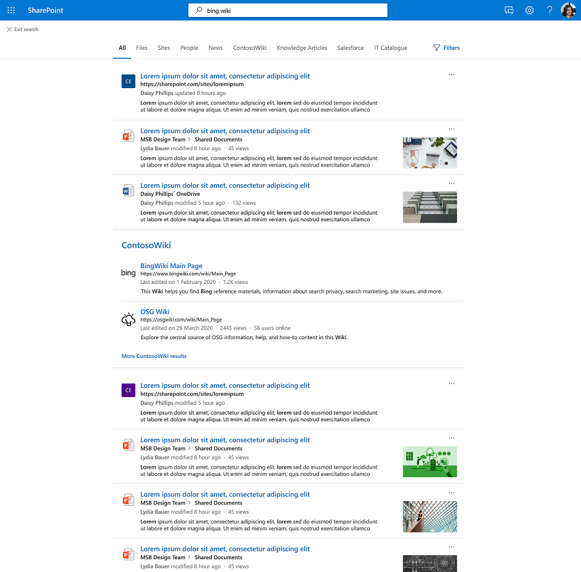

# Graph connectors result cluster

## Overview 

With Graph connectors result clusters, you can search for content from third-party data sources in the **All-tab**, in SharePoint, Office.com, and Microsoft Search in Bing. 

Results shown in a result cluster are grouped together based on the search vertical configuration. Connector results provided in the result cluster come from one single custom search vertical that hosts connected content. To ensure discovery of content, we recommend providing meaningful titles for your items.

## Check list for result clusters
### Step 1: Check connection schema property settings
Please ensure that your connected content meets the following two criteria, because only then can it show up in a result cluster:

1.	The external connection and its items must have the (body) [“content” property](/graph/api/resources/externalconnectors-externalitem?view=graph-rest-beta#properties) populated with textual content. The content property should be a meaningful and plain-text representation of the item.
2.	One of the source properties must be mapped to the [semantic label “title”](configure-connector.md?#step-6-assign-property-labels).

Related documentation:
- [Schema resource type](/graph/api/resources/externalconnectors-externalitem?view=graph-rest-beta)
- [Set up Microsoft Graph connectors in the Microsoft 365 admin center](configure-connector.md?#step-6-assign-property-labels)

### Step 2: Check result type definition to adjust user experience

You own the search results’ UX in the result cluster, i.e., how the results appear in the result cluster, by defining a [result type](/manage-result-types). If no result type is configured, a [system generated layout](/customize-search-page#default-search-result-layout) is used.

Related documentation:
- [Manage result types](/manage-result-types)
- [Manage search verticals](/manage-verticals#create-your-own-result-type)

### Step 3: Check if result clusters trigger in the All-tab

Result clusters are displayed on the All vertical and can include maximum two results from a custom vertical. It also has a heading with the name of the custom vertical from where the results are taken, and a link to the custom vertical itself (‘more _CustomVerticalName_ results’). Please note that you can see updates related to result clusters e.g. schema updates or experience modifications via result cluster, only after some time (~10 minutes). 

Below is an example of a result cluster from the 'ContosoWiki' vertical for the query {bing wiki}, containing two results (‘BingWiki Main page' and 'OSG Wiki')

### How connector results are selected and displayed
Connector results provided in the result cluster come from one single custom search vertical that hosts connected content. When you issue a query, the system will try to identify which of the custom verticals has the most relevant connected content results for this query. The system therefore looks at how much the query terms overlap 
- with the "title" property and 
- the displayed "content" property

of each item in a custom vertical. Then, one vertical is picked based on the overlap of its single results with the title and content properties and the two top ranking results from that vertical are passed to the All-page in a result cluster. 

In the below example you can see that the query terms {bing wiki} are occurring in both title and (displayed) body content of the results, and so they are brought onto the All-page from the ContosoWiki vertical.

Please note:
- For single term-queries the likelihood is low that a result cluster is shown with an item whose title or body content does not contain the single query term. Of course, for longer queries where only one query term matches the item’s title or body content, the likelihood that a result cluster is shown is higher. 
- Please note that in some cases an overlap in just the title or only the content triggers a result cluster because there are no higher relevant results on other verticals.
- On the other hand, even if there was an overlap in both title and content, a result cluster might not be shown for a specific custom vertical because other custom verticals have results with higher overlap in title and content properties.

### Recommendations
To ensure discovery of content from the search verticals, we recommend attributing the semantic label “title” to a property that describes well the item and functions as the “title” of an item. The "content" property should also represent well the item, for example, it could be the description of the items of a connection. Choosing well both the title and content priorities will provide the best experience for your users through accurate triggering of the result cluster and most relevant results in the cluster.

Some more tips: 
- Please ensure to provide meaningful titles for your items, which summarizes well an item. This increases the likelihood of the desired content showing up in a result cluster. For example, avoid the use of IDs as values for the property "title" unless your users are using IDs to look for content.
- If your content does not have meaningful titles, you can create a “dummy” field that describes better what the content is about and can function as “title”. 
- Please also ensure that the body “content” of your items is a meaningful, representative summary or description of the item. Concatenating incoherent or disjoint pieces of text can have a detrimental effect on the result cluster triggering.

## Result clusters experience is enabled by default
  
The result cluster experience is turned on by default.  

If you would like to disable it, follow these steps to turn off the experience at the organization level:

1. In the [Microsoft 365 admin center](https://admin.microsoft.com), go to [**Verticals**](https://admin.microsoft.com/Adminportal/Home#/MicrosoftSearch/verticals).
1. Select  the **All** vertical, then enable **Hide connector results**.

Follow these steps to turn off the experience at the SharePoint site level:

1. Go to **Settings** in the SharePoint site
2. Go to **Site information**>**View all site settings**.
3. Go to the Microsoft Search section, then select **Configure Microsoft Search for this site collection**.
4. In the navigation pane, go to **Custom experience**, then select **Verticals**.
5. Select the **All** vertical, then enable **Hide connector results**.
