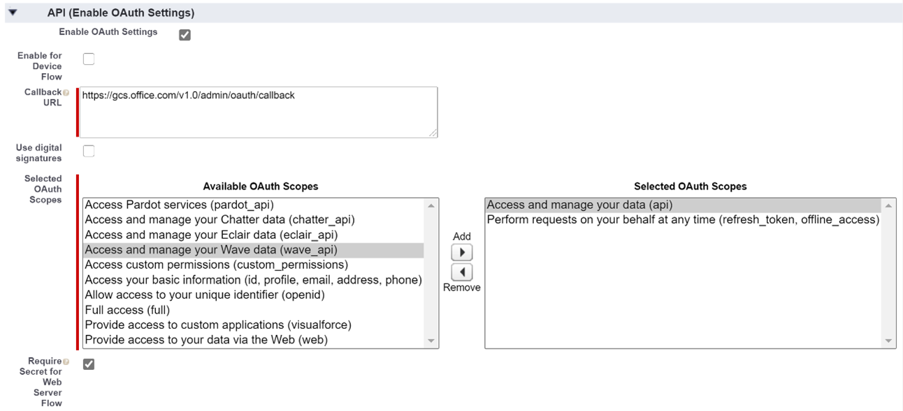
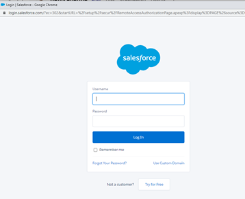

# Salesforce connector

With the Salesforce Graph connector, your organization can index Contacts, Opportunities, Leads and Accounts objects in your Salesforce instance. After you configure the connector and index content from Salesforce, end users can search for those items from any Microsoft Search client

This article is for [Microsoft 365](https://www.microsoft.com/microsoft-365) administrators or anyone who configures, runs, and monitors a Salesforce connector. It explains how to configure your connector and connector capabilities, limitations, and troubleshooting techniques.

>[!IMPORTANT]
> The Salesforce Graph connector currently supports Summer ’20, Spring’20, Winter’20, and Summer ’19 versions.

## Connection settings

To connect to your Salesforce instance, you need your Salesforce instance URL, the Client ID, and Client Secret for OAuth authentication. The following steps explain how you or your Salesforce administrator can get this information from your Salesforce account:

- Log in to your Salesforce instance and go to Setup

- Navigate to Apps -> App Manager.

- Select **New connected app**.

- Complete the API section as follows:

    - Select the checkbox for **Enable Oauth Settings**.

    - Specify the Callback URL as: [https://gcs.office.com/v1.0/admin/oauth/callback](https://gcs.office.com/v1.0/admin/oauth/callback)

    - Select these required OAuth scopes. 

        - Access and manage your data (api) 

        - Perform requests on your behalf at any time (refresh_token, offline_access) 

    - Select the checkbox for **Require secret for web server flow**. 

    - Save the app. 
    

-	Copy the consumer key and the consumer secret. These will be used as the Client ID and the Client Secret when you configure the Connection Settings for your Graph Connector in the Microsoft 365 admin portal.

- Before closing your Salesforce instance, perform the following steps to ensure that refresh tokens do not expire: 
	- Go to Apps -> App Manager
	- Find the app you just created and select the drop down on the right. Select **Manage**
	- Select **edit policies**
	- For refresh token policy, select **Refresh token is valid until revoked**

You can now use the [M365 Admin Center](https://admin.microsoft.com/) to complete the rest of the setup process for your Graph connector.  

Configure the Connection settings for your Graph connector as follows:

- For the Instance URL, use https://[domain].my.salesforce.com where domain would be the Salesforce domain for your organization. 
- Enter the Client ID and Client Secret you obtained from your Salesforce instance and select Sign in.
- If this is the first time you have attempted to Sign in with these settings, you will get a pop up asking you to login to Salesforce with your admin username and password. The screenshot below shows the popup. Enter your credentials and select Log in.

>[!NOTE] If the pop up does not appear, it might be getting blocked in your browser, so you must allow pop-ups and redirects.

>[!NOTE] If your organization uses single sign-on (SSO), you can select **Use Custom Domain** in the bottom, right-hand corner of the login interface. Enter the domain and then select **Continue**. It will go to your organization specific login page where you will have an option to login with SSO. 
- Check that the connection was successful by searching for a green banner that says "Connection successful" as show in the screenshot below. 

## Manage search permissions
You will need to choose which users will see search results from this data source. If you allow only certain Azure Active Directory (AAD) or Non-AAD users to see the search results, you will then need to map the identities.

### Select Permissions
You can choose to ingest Access Control Lists (ACLs) from your Salesforce instance, or you can allow everyone in your organization to see search results from this data source. ACLs can include Azure Active Directory (AAD) identities, Non-AAD identities, or both.

### Map non-AAD identities 
If you chose to ingest an ACL from your Salesforce instance and selected "non-AAD" for the identity type see [Map your non-Azure AD Identities ](map-non-aad.md) for instructions on mapping the identities.

### Map AAD identities
If you chose to ingest an ACL from your Salesforce instance and selected "AAD" for the identity type see [Map your Azure AD Identities](map-aad.md) for instructions on mapping the identities.

## Assign property labels 
You can assign a source property to each label by choosing from a menu of options. While this step is not mandatory, having some property labels will improve the search relevance and ensure more accurate search results for end users. By default, some of the Labels like ”Title”, “url”, and  “LastModifiedBy” have already been assigned source properties.

 

## Manage Schema
You can select what source properties should be indexed so that they can show up in search results. The connection wizard by default selects a search schema based on a set of source properties. You can modify it by selecting the check boxes for each property and attribute in the search schema page. Search schema attributes include Search, Query, Retrieve and Refine. 
Refine allows you to define the properties which can be later used as custom refiners or filters in the search experience.  

## Set the refresh schedule

The Salesforce connector only supports refresh schedules for full crawls currently.

>[!Important] A full crawl finds deleted objects and users that were previously synced to the Microsoft Search index.

The recommended schedule is one week for a full crawl.

## Limitations

- The Graph connector does not currently support Apex based , territory-based sharing and sharing using personal groups from Salesforce.
- There is a known bug in the Salesforce API that the Graph connector uses where the private org wide defaults for leads is not honored currently.  
- If a field has field level security (FLS) set for a profile, the Graph connector will not ingest that field for any profiles in that Salesforce org. Users will thus not be able to search on values for those fields, nor will it  show up in the results.  
- Any FLS set up will be honored during the Full syncs of the connector.
- In the Manage Schema screen these common standard property names are listed once and the selection done to make them queryable, searchable and retrievable apply to all or none.
    - Name
    - Url 
    - Description
    - Fax
    - Phone
    - MobilePhone
    - Email
    - Type
    - Title
    - AccountId
    - AccountName
    - AccountUrl
    - AccountOwner
    - AccountOwnerUrl
    - Owner
    - OwnerUrl
    - CreatedBy 
    - CreatedByUrl 
    - LastModifiedBy 
    - LastModifiedByUrl 
    - LastModifiedDate
    - ObjectName 
