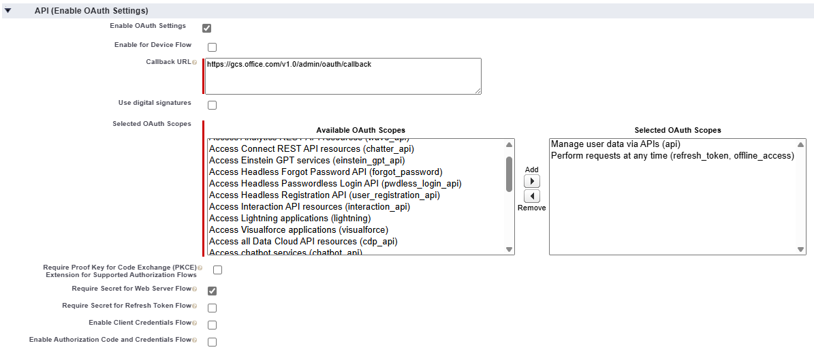
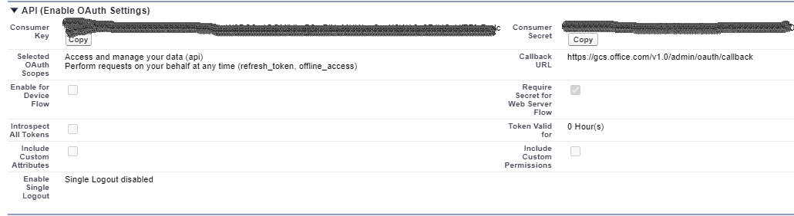
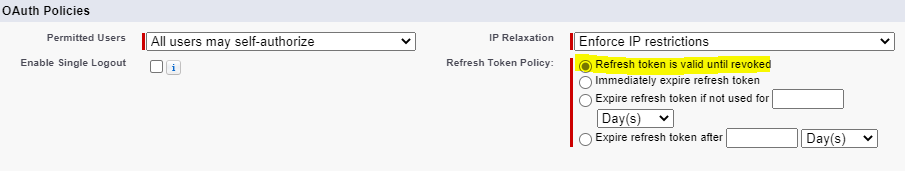
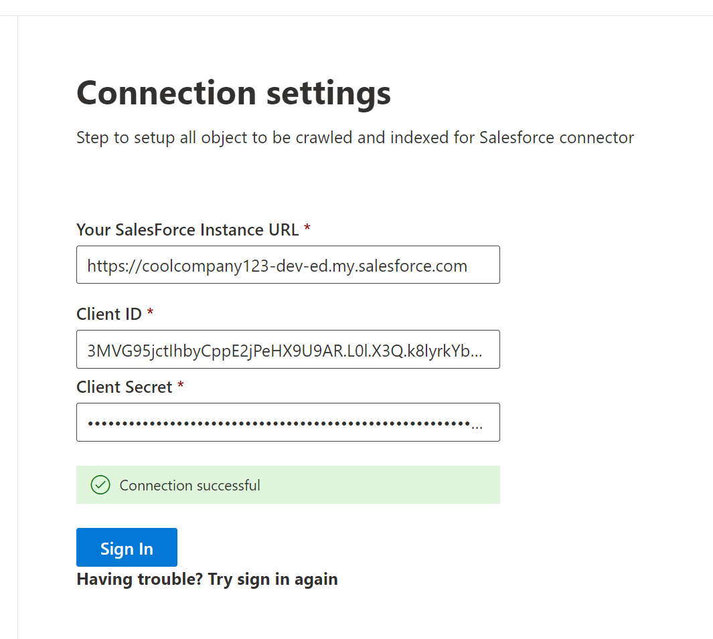
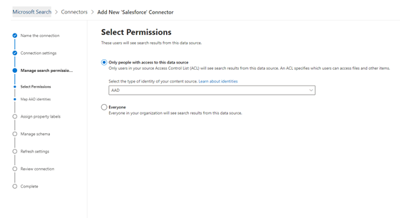
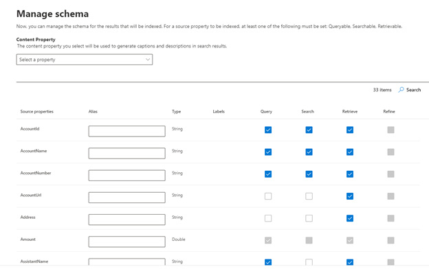

<!---Previous ms.author: rusamai --->

# Salesforce Microsoft Graph connector

The Salesforce Microsoft Graph connector, allows your organization to index contacts, opportunities, leads, cases, and accounts objects in your Salesforce instance. After you configure the connector and index content from Salesforce, end users can search for those items from any Microsoft Search and Microsoft 365 Copilot client.

This article is for anyone who configures, runs, and monitors a Salesforce Microsoft Graph connector. It supplements the general setup process and shows instructions that apply only to the Salesforce Microsoft Graph connector. This article also includes information about [Limitations](#limitations).

>[!IMPORTANT]
>The Salesforce Microsoft Graph connector currently supports Summer '19 or later.

## Before you get started

To connect to your Salesforce instance, you need your Salesforce instance URL, the client ID, and the client secret for OAuth authentication. The following steps explain how you or your Salesforce administrator can get this information from your Salesforce account:

- Log in to your Salesforce instance and go to Setup

- Navigate to Apps -> App Manager.

- Select **New connected app**.

- Complete the API section as follows:

    - Select the checkbox for **Enable Oauth settings**.

    - Specify the Callback URL as: For **M365 Enterprise**: `https://gcs.office.com/v1.0/admin/oauth/callback`, for **M365 Government**: `https://gcsgcc.office.com/v1.0/admin/oauth/callback`

    - Select these required OAuth scopes.

        - Access and manage your data (API).

        - Perform requests on your behalf at any time (refresh_token, offline_access).

    - Select the checkbox for **Require secret for web server flow**.

    - Save the app.
    
      > [!div class="mx-imgBorder"]
      > 

- Copy the consumer key and the consumer secret. This information is used as the client ID and the client secret when you configure the connection ettings for your Salesforce Microsoft Graph connector in the Microsoft 365 admin portal.

  > [!div class="mx-imgBorder"]
  > 
  
- Before closing your Salesforce instance, follow these steps to ensure that refresh tokens don't expire:
    - Go to Apps -> App Manager.
    - Find the app you created and select the drop-down on the right. Select **Manage**.
    - Select **edit policies**.
    - For the refresh token policy, select **Refresh token is valid until revoked**.

  > [!div class="mx-imgBorder"]
  > 

You can now use the [Microsoft 365 Admin Center](https://admin.microsoft.com/) to complete the rest of the setup process for your Microsoft Graph connector.

## Step 1: Add a connector in the Microsoft 365 admin center

[Add Salesforce connector](https://admin.microsoft.com/adminportal/home#/MicrosoftSearch/Connectors/add?ms_search_referrer=MicrosoftSearchDocs_Salesforce&type=Salesforce)

Follow the general [setup instructions](./configure-connector.md).
<!---If the above phrase does not apply, delete it and insert specific details for your data source that are different from general setup instructions.-->

## Step 2: Name the connection

Follow the general [setup instructions](./configure-connector.md).
<!---If the above phrase does not apply, delete it and insert specific details for your data source that are different from general setup instructions.-->

## Step 3: Configure the connection settings

For the Instance URL, use https://[domain].my.salesforce.com where the domain would be the Salesforce domain for your organization.

Enter the client ID and client Secret you obtained from your Salesforce instance and select Sign in.

The first time you've attempted to sign in with these settings, you'll get a pop-up asking you to log in to Salesforce with your admin username and password. The screenshot below shows the popup. Enter your credentials and select "Log In".

  

  >[!NOTE]
  >If the pop-up does not appear, it might be getting blocked in your browser, so you must allow pop-ups and redirects.

Check that the connection was successful by searching for a green banner that says "connection successful" as shown in the screenshot below.

  > [!div class="mx-imgBorder"]
  > 

## Step 4: Select properties

Select the Salesforce objects that you want the connector to crawl and include in search results. If Contact is selected, Account is automatically selected as well.

*The list of properties that you select here, can impact how you can filter, search, and view your results in Microsoft 365 Copilot.*

**Source property** | **Label** | **Description**
--- | --- | ---
Authors   | `authors` | Name of people who participated/collaborated on the item in the data source.
CreatedBy   | `createdBy` | Name of the person who created the item in the data source.
CreatedDate   | `createdDateTime` | Date and time that the item was created in the data source.
Url  | `url` | The target URL of the item in the data source.
LastModifiedBy   | `lastModifiedBy` | Name of the person who most recently edited the item in the data source.
LastModifiedDateTime  | `lastModifiedDateTime` | Date and time the item was last modified in the data source.
Name   | `title` | The title of the item that you want to show in search and other experiences.

>[!NOTE]
>If a field has field level security (FLS) set for a profile, the connector won't ingest that field for any profiles in that Salesforce org. As a result, users won't be able to search for values for those fields or show up in the results.

## Step 5: Manage search permissions

You'll need to choose which users see search results from this data source. If you allow only certain Microsoft Entra ID or non-Azure AD users to see the search results, make sure you map the identities.

### Step 5.a: Select permissions

You can choose to ingest Access Control Lists (ACLs) from your Salesforce instance or allow everyone in your organization to see search results from this data source. ACLs can include Microsoft Entra identities (users who are federated from Microsoft Entra ID to Salesforce), non-Azure AD identities (native Salesforce users who have corresponding identities in Microsoft Entra ID), or both.

>[!NOTE]
>If you use a third-party Identity Provider like Ping ID or secureAuth, you should select "non-AAD" as the identity type.

> [!div class="mx-imgBorder"]
> 

If you chose to ingest an ACL from your Salesforce instance and selected "non-AAD" for the identity type, see [Map your non-Azure AD Identities](map-non-aad.md) for instructions on mapping the identities.

### Step 5.b: Map Microsoft Entra identities

If you chose to ingest an ACL from your Salesforce instance and selected "AAD" for the identity type, see [Map your Microsoft Entra identities](map-aad.md) for instructions on mapping the identities. To learn how to set up Microsoft Entra SSO for Salesforce, see this [tutorial](/azure/active-directory/saas-apps/salesforce-tutorial).

### Apply user mapping to sync your Salesforce identities to Microsoft Entra identities

In this video, you can see the process to authenticate to your Salesforce instance, sync your non-Microsoft Entra identities to your Microsoft Entra identities, and apply the proper security trimmings to your Salesforce items.

> [!VIDEO https://www.youtube-nocookie.com/embed/SZYiFxZMKcM]

## Step 6: Assign property labels

You can assign a source property to each label by choosing from a menu of options. While this step is not mandatory, having some property labels improves the search relevance and ensures better search results for end users. By default, some of the Labels like "Title," "URL," "CreatedBy," and  "LastModifiedBy" have already been assigned source properties.

## Step 7: Manage schema

You can select what source properties should be indexed so that they show up in search results. The connection wizard by default selects a search schema based on a set of source properties. You can modify it by selecting the check boxes for each property and attribute in the search schema page. Search schema attributes include Search, Query, Retrieve, and Refine.
Refine allows you to define the properties that can be later used as custom refiners or filters in the search experience.  

> [!div class="mx-imgBorder"]
> 

## Step 8: Set the refresh schedule

The Salesforce connector only supports refresh schedules for full crawls currently.

>[!IMPORTANT]
>A full crawl finds deleted objects and users that were previously synced to the Microsoft Search index.

The recommended schedule is one week for a full crawl.

## Step 9: Review connection

Follow the general [setup instructions](./configure-connector.md).

>[!TIP]
>**Default result type**
>* The Salesforce connector automatically registers a [result type](./customize-search-page.md#step-2-create-result-types) once the connector is published. The result type uses a dynamically generated [result layout](./customize-results-layout.md) based on the fields selected in step 3.
>* You can manage the result type by navigating to [**Result types**](https://admin.microsoft.com/Adminportal/Home#/MicrosoftSearch/resulttypes) in the [Microsoft 365 admin center](https://admin.microsoft.com). The default result type is named "`ConnectionId`Default". For example, if your connection ID is `Salesforce`, your result layout is named: "SalesforceDefault".
>* Also, you can choose to create your own result type if needed.
<!---If the above phrase does not apply, delete it and insert specific details for your data source that are different from general setup instructions.-->

<!---## Troubleshooting-->
<!---Insert troubleshooting recommendations for this data source-->

## Limitations

- The Salesforce Microsoft Graph connector doesn't currently support Apex-based, territory-based sharing and sharing using personal groups from Salesforce.
- There's a known bug in the Salesforce API the connector uses, where the private org-wide defaults for leads aren't honored currently.  
- If a field has field level security (FLS) set for a profile, the connector won't ingest that field for any profiles in that Salesforce org. As a result, users won't be able to search for values for those fields or  show up in the results.  
- In the manage schema screen these common standard property names are listed once, the options are **Query**, **Search**, **Retrieve**, and **Refine**, and apply to all or none.
    - Name
    - Url
    - Description
    - Fax
    - Phone
    - MobilePhone
    - Email
    - Type
    - Title
    - AccountId
    - AccountName
    - AccountUrl
    - AccountOwner
    - AccountOwnerUrl
    - Owner
    - OwnerUrl
    - CreatedBy
    - CreatedByUrl
    - LastModifiedBy
    - LastModifiedByUrl
    - LastModifiedDate
    - ObjectName

## Troubleshooting
After publishing your connection, you can review the status under the **Data sources** tab in the [admin center](https://admin.microsoft.com). To learn how to make updates and deletions, see [Manage your connector](manage-connector.md).

If you have any other issues or want to provide feedback, write to us [aka.ms/TalkToConnectors](https://aka.ms/TalkToConnectors).
