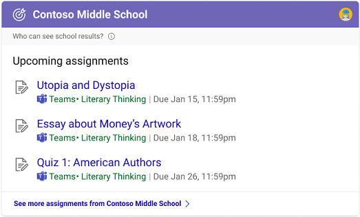

# Select a school or work search experience

If your organization has education and enterprise service plans, you can select a Microsoft Search in Bing experience for your users, either school or work. Because this setting will apply to all users, we suggest you select the option that aligns with most people in your organization.

1. In the [Microsoft 365 admin center](https://admin.microsoft.com), go to [Configurations](https://admin.microsoft.com/Adminportal/Home#/MicrosoftSearch/configurations).
1. Under Microsoft Search in Bing for work or school, select **Change**.
1. In the panel, select a search experience, either **School search** or **Work search**. It may take up to 72 hours for this change to appear in Bing.

## Differences between school and work search

For the most part, the school and work search experiences on Microsoft Search in Bing are similar. Users can find people, files, sites, answers, and more. But there are a few key differences:

### School search

The school search experience includes two unique answers, classes and assignments. In the classes answer, students and teachers can see a full list of their classes and use the links to join their class on Microsoft Teams. In the assignments answer, they can see a list of upcoming assignments sorted by due date.

School users can get to class and assignment answers by entering these queries in the search box on [Bing](https://Bing.com):

- My classes
- Classes
- My assignments
- My homework

Also, for school search users, SafeSearch is set to strict by default. For more information about SafeSearch, see [Block adult content with SafeSearch](https://support.microsoft.com/topic/946059ed-992b-46a0-944a-28e8fb8f1814).

**Manage school type**

If you select ‘School search’ in the Microsoft 365 admin center, identify the type of educational institution you're affiliated with. This will help us further tailor the search and chat experience for your users. We suggest you select the option that best aligns with your institution. Options include: 

- Higher education
- Primary/Secondary/K-12 
- Other (research institution, academic library, etc.)

### Work search

The work search experience includes organizational charts and Power BI answers. They aren't available in the school search experience.

For information about Power BI answers, see [Manage Power BI answers](manage-powerbi.md).
