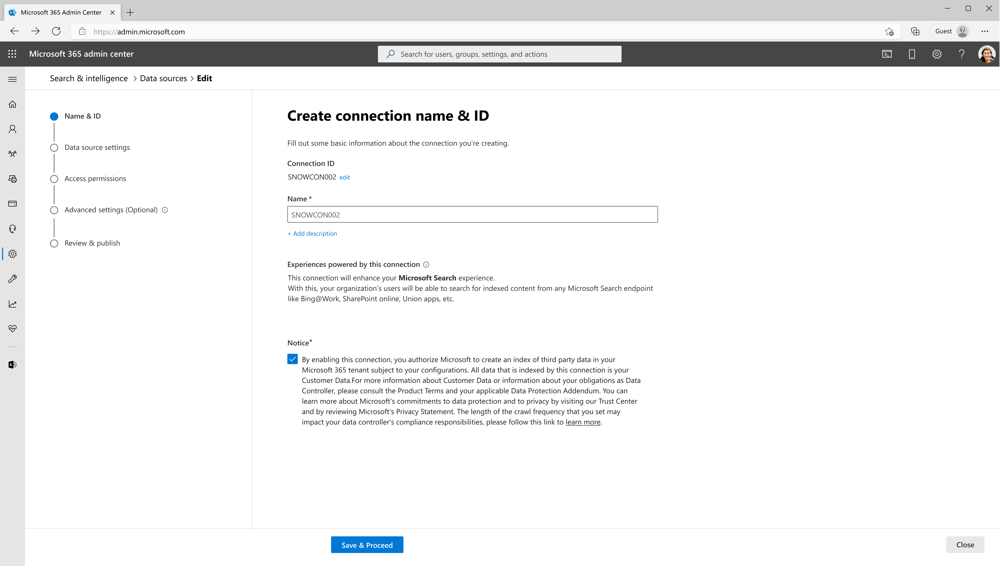
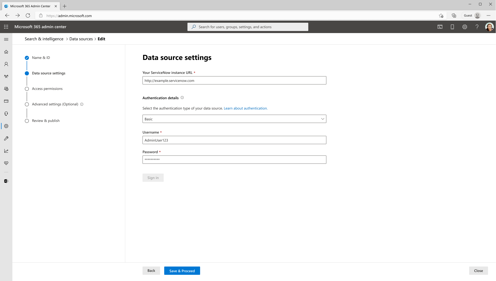
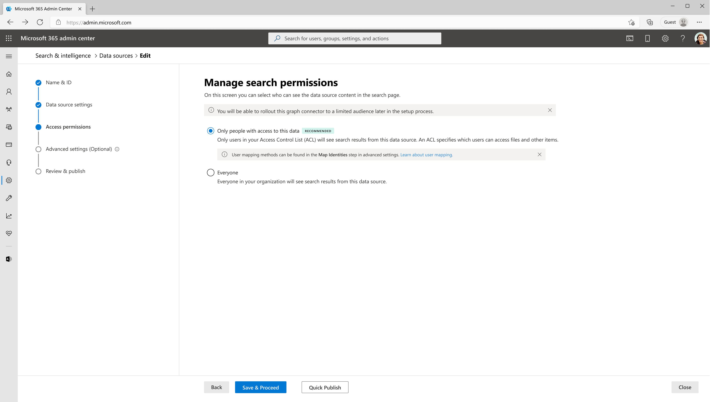
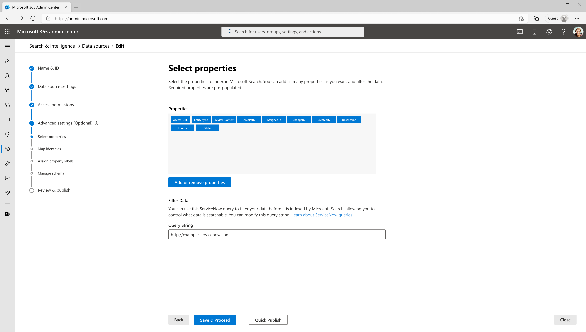

<!---Previous ms.author: kam1 --->

# ServiceNow Knowledge Microsoft Graph connector

With the Microsoft Graph connector for ServiceNow, your organization can index knowledge-base articles that are visible to all users or restricted with user criteria permissions within your organization. After you configure the connector and index content from ServiceNow, end users can search for those articles in Microsoft Copilot and from any Microsoft Search client.  

You can also refer [this video](https://www.youtube.com/watch?v=TVSkJpk1RiE) to learn more about Graph Connector's capability in managing search permissions.

This article is for Microsoft 365 administrators or anyone who configures, runs, and monitors a ServiceNow Knowledge Graph  connector. It supplements the general instructions provided in the [Set up Microsoft Graph connectors in the Microsoft 365 admin center](configure-connector.md) article. If you haven't already done so, read the entire Setup your Graph Connector article to understand the general setup process.

Each step in the setup process is listed below along with either a note that indicates you should follow the general setup instructions OR 
other instructions that apply to only ServiceNow connector including information about [Troubleshooting](#troubleshooting) 
and [Limitations](#limitations).

## Mandatory and Optional Settings
To get you quickly started with Microsoft Graph connectors, the steps in the setup process are split into two groups:

**Mandatory settings** - You must provide some input for these steps to make the connection. The inputs (connection name, data source settings etc.) vary based on your organization's context and use-case.

**Advanced settings (Optional)** - As the name suggests, Advanced settings are optional steps. For your convenience, these settings in the setup process are preconfigured with default values based on the most common selections made by admins. You can choose to accept the default values or modify them to suit your organization's needs.

## Get Started

[Add ServiceNow Knowledge Connector](https://admin.microsoft.com/adminportal/home#/MicrosoftSearch/Connectors/add?ms_search_referrer=MicrosoftSearchDocs_ServiceNowKB&type=ServiceNowKB)

(For more details, see general [setup instructions](./configure-connector.md))

## Mandatory Settings

   ### 1. Name & ID:
   **Connection Id**: Edit the Connection ID  if necessary(prefilled with a default and unique string). You can't edit it after you click on the **'Save and Proceed'** button.
    
   **Name**: Enter a name for your connection (prefilled with a default name). You can always edit it later (even after the connection is published).
 
   

   ### 2. Data Source Settings:

   **ServiceNow instance URL**: To connect to your ServiceNow data, you need your organization's **ServiceNow    instance URL**. Your organization's ServiceNow instance URL typically looks like **https://&lt;your-organization-domain>.service-now.com**. 

   

   Along with this URL, you need a **service account** for setting up the connection to ServiceNow and for allowing Microsoft Search to periodically update the knowledge articles based on the refresh schedule. The service account needs read access to the following **ServiceNow table records** to successfully crawl various entities.

   **Feature** | **Read access required tables** | **Description**
   --- | --- | ---
   Index knowledge articles available to <em>Everyone</em> | kb_knowledge | For crawling knowledge articles
   Index and support user criteria permissions | kb_uc_can_read_mtom | Who can read this knowledge base
   | | kb_uc_can_contribute_mtom | Who can contribute to this knowledge base
   | | kb_uc_cannot_read_mtom | Who cannot read this knowledge base
   | | kb_uc_cannot_contribute_mtom | Who cannot contribute to this knowledge base
   | | sys_user | Read user table
   | | sys_user_has_role | Read role information of users
   | | sys_user_grmember | Read group membership of users
   | | user_criteria | Read user criteria permissions
   | | kb_knowledge_base | Read knowledge base information
   | | sys_user_group | Read user group segments
   | | sys_user_role | Read user roles
   | | cmn_location | Read location information
   | | cmn_department | Read department information
   | | core_company | Read company attributes
   Index extended table properties (optional) | sys_db_object | Read extended table details
   | | sys_dictionary | Read extended table properties

   You can **create and assign a role** for the service account you use to connect with Microsoft Search. [Learn how to assign role for ServiceNow accounts](https://docs.servicenow.com/bundle/vancouver-platform-administration/page/administer/users-and-groups/task/t_AssignARoleToAUser.html). Read access to the tables can be assigned on the created role. To learn about setting read access to table records, see [Securing Table Records](https://developer.servicenow.com/dev.do#!/learn/learning-plans/vancouver/new_to_servicenow/app_store_learnv2_securingapps_vancouver_creating_and_editing_access_controls). 

   If you want to index properties from [extended tables](https://docs.servicenow.com/bundle/vancouver-platform-administration/page/administer/table-administration/concept/table-extension-and-classes.html) of *kb_knowledge*, provide read access to sys_dictionary and sys_db_object. This is an optional feature. You can index *kb_knowledge* table properties without access to the two additional tables.

   >[!NOTE]
   > ServiceNow Microsoft Graph connector can index knowledge articles and user criteria permissions without advanced scripts. If a user criteria contains advanced script all the related knowledge articles will be hidden from search results.

   **Authentication details**: To authenticate and sync content from ServiceNow, choose **one of three** supported methods:
   - [Basic authentication](#1-basic-authentication)
   - [ServiceNow OAuth (recommended)](#2-servicenow-oauth)
   - [Microsoft Entra ID OpenID Connect](#3-microsoft-entra-id-openid-connect)

      #### 1. **Basic authentication**

      Enter the username and password of ServiceNow account with **knowledge** role to authenticate to your instance.

      #### 2. **ServiceNow OAuth**

      <details>
      <summary>To use the ServiceNow OAuth for authentication, follow the steps below.</summary>

      A ServiceNow admin will need to provision an endpoint in your ServiceNow instance, so that the Microsoft Search app can access it. To learn more, see [Create an endpoint for clients to access the instance](https://docs.servicenow.com/bundle/vancouver-platform-security/page/administer/security/task/t_CreateEndpointforExternalClients.html) in the ServiceNow documentation.

      The following table provides guidance on how to fill out the endpoint creation form:

      Field | Description | Recommended Value
       --- | --- | ---
      Name | Unique value that identifies the application that you require OAuth access for. | Microsoft Search
      Client ID | A read-only, auto generated unique ID for the application. The instance uses the client ID when it requests an access token. | NA
      Client secret | With this shared secret string, the ServiceNow instance and Microsoft Search authorize communications with each other. | Follow security best-practices by treating the secret as a password.
      Redirect URL | A required callback URL that the authorization server redirects to. | For **M365 Enterprise**: https://<span>gcs.office.</span>com/v1.0/admin/oauth/callback,</br> For **M365 Government**: https://<span>gcsgcc.office.<span>com/v1.0/admin/oauth/callback
      Logo URL | A URL that contains the image for the application logo. | NA
      Active | Select the check box to make the application registry active. | Set to active
      Refresh token lifespan | The number of seconds that a refresh token is valid. By default, refresh tokens expire in 100 days (8,640,000 seconds). | 31,536,000 (one year)
      Access token lifespan | The number of seconds that an access token is valid. | 43,200 (12 hours)

      Enter the client id and client secret to connect to your instance. After connecting, use a ServiceNow account credential to authenticate permission to crawl. The account should at least have **knowledge** role. Refer to the table in the beginning of [Step 2: Data Source Settings](#2-data-source-settings) for providing read access to more ServiceNow table records and index user criteria permissions.

      </details>

     #### 3. **Microsoft Entra ID OpenID Connect**

      <details>

      <summary>To use Microsoft Entra ID OpenID Connect for authentication, follow the steps below.</summary>

      <a name='step-331-register-a-new-application-in-azure-active-directory'></a>

       1. Register a new application in Microsoft Entra ID

          To learn about registering a new application in Microsoft Entra ID, see [Register an application](/azure/active-directory/develop/quickstart-register-app#register-an-application). Select single tenant organizational directory. Redirect URI isn't needed. After registration, note down the Application (client) ID and Directory (tenant) ID.

      2. Create a client secret

         To learn about creating a client secret, see [Creating a client secret](/azure/active-directory/develop/quickstart-register-app#add-a-client-secret). Take a note of client secret.

      3. Retrieve Service Principal Object Identifier

         Follow the steps to retrieve Service Principal Object Identifier

         1. Run PowerShell.

         1. Install Azure PowerShell using the following command.

            ```powershell
            Install-Module -Name Az -AllowClobber -Scope CurrentUser
            ```

          1. Connect to Azure.

             ```powershell
             Connect-AzAccount
             ```

          1. Get Service Principal Object Identifier.

             ```powershell
             Get-AzADServicePrincipal -ApplicationId "Application-ID"
             ```
   
             Replace "Application-ID" with Application (client) ID (without quotes) of the application you registered in step 1. Note the value of ID object from PowerShell output. It's the Service Principal ID.

            Now you have all the information required from Azure portal. A quick summary of the information is given in the table below.

         Property | Description
         --- | ---
         Directory ID (Tenant ID) | Unique ID of the Microsoft Entra tenant, from step 3.a.
         Application ID (Client ID) | Unique ID of the application registered in step 3.a.
         Client Secret | The secret key of the application (from step 3.b). Treat it like a password.
         Service Principal ID | An identity for the application running as a service. (from step 3.c)

      4. Register ServiceNow Application

         The ServiceNow instance needs the following configuration:

           1. Register a new OAuth OIDC entity. To learn, see [Create an OAuth OIDC provider](https://docs.servicenow.com/bundle/vancouver-platform-security/page/administer/security/task/add-OIDC-entity.html).

           1. The following table provides guidance on how to fill out OIDC provider registration form

              Field | Description | Recommended Value
              --- | --- | ---
              Name | A unique name that identifies the OAuth OIDC entity. | Microsoft Entra ID
              Client ID | The client ID of the application registered in the third-party OAuth OIDC server. The instance uses the client ID when requesting an access token. | Application (Client) ID from step 3.a
              Client Secret | The client secret of the application registered in the third-party OAuth OIDC server. | Client Secret from step 3.b

              All other values can be default.

          1. In the OIDC provider registration form, you need to add a new OIDC provider configuration. Select the search icon against *OAuth OIDC Provider Configuration* field to open the records of OIDC configurations. Select New.

          1. The following table provides guidance on how to fill out OIDC provider configuration form

             Field | Recommended Value
             --- | ---
             OIDC Provider |  Microsoft Entra ID
             OIDC Metadata URL | The URL must be in the form https\://login.microsoftonline.com/<tenandId">/.well-known/openid-configuration <br/>Replace "tenantID" with Directory (tenant) ID from step 3.a.
             OIDC Configuration Cache Life Span |  120
             Application | Global
             User Claim | sub
             User Field | User ID
             Enable JTI claim verification | Disabled

          1. Select Submit and Update the OAuth OIDC Entity form.

      5. Create a ServiceNow account

         Refer the instructions to create a ServiceNow account, [create a user in ServiceNow](https://docs.servicenow.com/bundle/vancouver-platform-administration/page/administer/users-and-groups/task/t_CreateAUser.html).

         The following table provides guidance on how to fill out the ServiceNow user account registration

         Field | Recommended Value
          --- | ---
         User ID | Service Principal ID from step 3.c 
          Web service access only | Checked

            All other values can be left to default.

      6. Enable Knowledge role for the ServiceNow account

         Access the ServiceNow account you created with ServiceNow Principal ID as User ID and assign the knowledge role. Instructions to assigning a role to a ServiceNow account can be found here, [assign a role to a user](https://docs.servicenow.com/bundle/vancouver-platform-administration/page/administer/users-and-groups/task/t_AssignARoleToAUser.html). Refer to the table in the beginning of [Step 2: Data Source Settings](#2-data-source-settings) for providing read access to more ServiceNow table records and index user criteria permissions.

         Use Application ID as Client ID (from step 3.1), and Client secret (from step 3.2) in admin center configuration wizard to authenticate to your ServiceNow instance using Microsoft Entra ID OpenID Connect.
</details>

### 3. Access permissions

The ServiceNow connector supports access permissions visible to **Everyone** or **Only people with access to this data source**. Indexed data appears in the search results and is visible to all users in the organization or users who have access to them via user criteria permission respectively. If a knowledge article isn't enabled with a user criteria, it appears in search results of everyone in the organization.



To access the Knowledge base articles in ServiceNow, users need both Article-level permissions and KB-level permissions. When using the ServiceNow Knowledge Base connector, if there are no Article-level restrictions, it applies the Knowledge Base-level permissions. However, if there are Article-level restrictions, they take priority over the Knowledge Base-level restrictions.

>[!IMPORTANT]
>* The connector supports default user criteria permissions without advanced scripts. When the connector encounters a user criteria with advanced script, all data using that user criteria will not appear in search results.
>* The connector does not apply intersection of Knowledge base-level and Article-level permissions, instead honors Article-level permissions directly.


If you choose **Only people with access to this data source**, you need to further choose whether your ServiceNow instance has Microsoft Entra ID provisioned users or Non-AAD users.

To identify which option is suitable for your organization:

1. Choose the **Microsoft Entra ID** option if the Email ID of ServiceNow users is **same** as the UserPrincipalName (UPN) of users in Microsoft Entra ID.
2. Choose the **Non-AAD** option if the email ID of ServiceNow users is **different** from the UserPrincipalName (UPN) of users in Microsoft Entra ID. 

>[!NOTE]
> * If you choose Microsoft Entra ID as the type of identity source, the connector maps the Email IDs of users obtained from ServiceNow directly to UPN property from Microsoft Entra ID.
> * If you choose "Non-AAD" for the identity type see [Map your non-Azure AD Identities](map-non-aad.md) for instructions on mapping the identities. You can use this option to provide the mapping regular expression from Email ID to UPN.
> * Updates to users or groups governing access permissions are synced in full crawls only. Incremental crawls do not currently support processing of updates to permissions.

## Advanced Settings (Optional)

### 1. Select properties

In this step, you can add or remove available properties from your ServiceNow data source. Microsoft 365 selects few properties by default.



With a ServiceNow query string, you can specify conditions for syncing articles. It's like a **Where** clause in a **SQL Select** statement. For example, you can choose to index only articles that are published and active. To learn about creating your own query string, see [Generate an encoded query string using a filter](https://docs.servicenow.com/bundle/vancouver-platform-user-interface/page/use/using-lists/task/t_GenEncodQueryStringFilter.html).

Use the preview results button to verify the sample values of the selected properties and query filter.

### 2. Map Identities

In this step, you can map identities for both Microsoft Entra ID and Non Microsoft Entra ID identity types.

* If you choose Microsoft Entra ID as the type of identity source, the connector maps the Email IDs of users obtained from ServiceNow directly to UPN property from Microsoft Entra ID.
* If you choose "Non-AAD" for the identity type see [Map your non-Azure AD Identities](map-non-aad.md) for instructions on mapping the identities.


### 3. Assign property labels

Follow the general [setup instructions](./configure-connector.md#step-6-assign-property-labels).

### 4. Manage schema

Follow the general [setup instructions](./configure-connector.md#step-7-manage-schema).

### 5. Refresh settings

Follow the general [setup instructions](./configure-connector.md#step-8-refresh-settings).

>[!NOTE]
>For identities, only full crawl scheduled will be applied.

## Review & Publish

Follow the general [setup instructions](./configure-connector.md#step-9-review-connection).

After publishing the connection, you need to customize the search results page. To learn about customizing search results, see [Customize the search results page](/microsoftsearch/configure-connector#next-steps-customize-the-search-results-page).

## Limitations
>[!IMPORTANT]
>The ServiceNow Knowledge Microsoft Graph connector has the following limitations in its latest release:
>- *Only people with access to this data source* feature under Manage Search permissions step processes only [user criteria](https://hi.service-now.com/kb_view.do?sysparm_article=KB0550924) permissions. Any other type of access permissions aren't applied in the search results.
>- User criteria with advanced scripts aren't supported in the current version. Any knowledge articles with such an access restriction are indexed with deny everyone access that is, they do not appear in search results to any user until we support them.

## Troubleshooting
After publishing your connection, customizing the results page, you can review the status under the **Data Sources** tab in the [admin center](https://admin.microsoft.com). To learn how to make updates and deletions, see [Manage your connector](manage-connector.md).
You can find troubleshooting steps for commonly seen issues below.
### 1. Unable to log in due to Single Sign-On enabled ServiceNow instance

If your organization has enabled Single Sign-On (SSO) to ServiceNow, you may have trouble logging in with the service account. You can bring up username and password based login by adding <em> `login.do`</em> to the ServiceNow instance URL. Example. `https://<your-organization-domain>.service-now.com./login.do`

### 2. Unauthorized or forbidden response to API request

#### 2.1. Check table access permissions
If you see forbidden or unauthorized response in connection status, check if the service account has the required access to the tables mentioned in [Step 2: Data Source Settings](#2-data-source-settings). Check whether all the columns in the tables have read access.

#### 2.2. Change in account password
The Microsoft Graph connector uses access token fetched on behalf of service account for crawl. The access token refreshes every 12 hours. Ensure that service account password isn't changed after publishing the connection. You may need to reauthenticate the connection if there's a change in password.

#### 2.3. Check if ServiceNow instance behind firewall
The Microsoft Graph Connector may not be able to reach your ServiceNow instance if it is behind a network firewall. You need to explicitly allow access to connector service. You can find public IP address range of connector service in the table below. Based on your tenant region, add it to your ServiceNow instance network allow list.

**Environment** | **Region** | **Range**
--- | --- | ---
PROD | North America | 52.250.92.252/30, 52.224.250.216/30
PROD | Europe | 20.54.41.208/30, 51.105.159.88/30
PROD | Asia Pacific | 52.139.188.212/30, 20.43.146.44/30

#### 2.4. Access permissions not working as expected

If you observe discrepancies in access permissions applied to search results, verify access flow chart for user criteria in [managing access to knowledge bases and articles](https://docs.servicenow.com/bundle/vancouver-servicenow-platform/page/product/knowledge-management/concept/user-access-knowledge.html).

### 3. Change the URL of the knowledge article to view it in the support portal

ServiceNow Knowledge connector computes the AccessUrl property using sys_id in the `<instance_url>/kb_view.do?sys_kb_id<sysId>` format. It opens the knowledge article in the backend system view. If you prefer redirecting the article to a different URL, follow the instructions below.
#### 3.1 Edit your result type
In customization tab in *Search & Intelligence* section of Microsoft 365 admin center, navigate to edit the result type configured for your ServiceNow Knowledge connection.


When the edit result type dialog opens, click on **Edit** next to the result layout section. 


#### 3.2 Find the items block
Find the items block containing text property with `shortDescription` and `AccessUrl` values.


#### 3.3 Edit AccessUrl property

To change the destination URL, edit the `AccessUrl` part of the text property in the items block. For example, if a ServiceNow Knowledge article should be redirected to `https://contoso.service-now.com/sp` where `sp` is the service URL portal prefix, follow the steps below.

**Original value** | **New value**
--- | ---
`"[{shortdescription}]({AccessUrl})"` | `"[{shortdescription}](https://contoso.service-now.com/sp?id=kb_article_view&sysparm_article={number})"`

Where `number` is the knowledge article number property. It should be marked as *retrieve* in Manage Schema screen during connection creation.

Finish reviewing your result type updates and hit **Submit**. Give it a minute or two to pick up the changes. Your search results should now redirect to the desired URLs.

### 4. Issues with *Only people with access to this data source* permission

#### 4.1 Unable to choose *Only people with access to this data source*

You may not be able to choose *Only people with access to this data source* option if the service account doesn't have read permissions to the required tables in [Step 2: Data Source Settings](#2-data-source-settings). Check whether the service account can read tables mentioned under *Index and support user criteria permissions* feature.

#### 4.2 User mapping failures

 ServiceNow user accounts that don't have an M365 user in Microsoft Entra ID will not map. Non-user, service accounts are expected to fail user mapping. Number of user mapping failures can be accessed in identity stats area in connection detail window. Log of failed user mappings can be downloaded from Error tab.

### 5. Issues with user criteria access flow

If you see differences in the user criteria validation between ServiceNow and Microsoft Search, set `glide.knowman.block_access_with_no_user_criteria` system property to `no`.

If you have any other issues or want to provide feedback, write to us [aka.ms/TalkToGraphConnectors](https://aka.ms/TalkToGraphConnectors)
