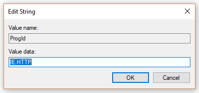
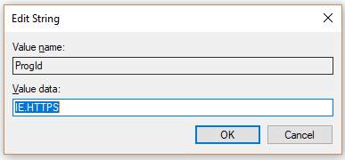

# Set default browser

Configuring the default browser, default search engine, and default homepage will help your users discover Microsoft Search capabilities, encourage more usage, and provide a smoother experience.
  
To set the default browser for your organization, follow the steps below.
  
## Windows 8 and above

To set Internet Explorer or Microsoft Edge as the default browser, follow these steps:
  
### Create default associations file

1. Open an administrative PowerShell console.
    
2.  `New-Item -Path "\\$env:USERDOMAIN\SYSVOL\$env:USERDNSDOMAIN" -Type Directory -Name "Settings"`
    
3.  `$SettingsPath="\\$env:USERDOMAIN\SYSVOL\$env:USERDNSDOMAIN\Settings"`
    
4.  `Start-Process Dism.exe -PassThru "/Online /Export-DefaultAppAssociations:$SettingsPath\AppAssoc.xml"`
    
These steps try and create the default associations file in the SYSVOL folder of the domain controller.
  
### Add or edit the default associations file

1. `Notepad "$SettingsPath\AppAssoc.xml"`
    
2. Edit the following entries (.htm, .html, http, https), and remove other entries if they're not needed.
    
  - **Microsoft Edge**
    
     `<Association Identifier=".htm" ProgId="AppX4hxtad77fbk3jkkeerkrm0ze94wjf3s9" ApplicationName="Microsoft Edge" />`
  
     `<Association Identifier=".html" ProgId="AppX4hxtad77fbk3jkkeerkrm0ze94wjf3s9" ApplicationName="Microsoft Edge" />`
  
     `<Association Identifier="http" ProgId="AppXq0fevzme2pys62n3e0fbqa7peapykr8v" ApplicationName="Microsoft Edge" />`
    
  - **Internet Explorer**
    
     `<Association Identifier=".htm" ProgId="htmlfile" ApplicationName="Internet Explorer" />`
  
     `<Association Identifier=".html" ProgId="htmlfile" ApplicationName="Internet Explorer" />`
  
     `<Association Identifier="http" ProgId="IE.HTTP" ApplicationName="Internet Explorer" />`
  
     `<Association Identifier="https" ProgId="IE.HTTPS" ApplicationName="Internet Explorer" />`
    
3. Open Group Policy Management Console (gpmc.msc) and switch to editing any existing policy or creating a new one.
    
1. Navigate to **Computer Configuration\Administrative Templates\Windows Components\File Explorer**
    
2. Double-click **Set a default associations configuration file**, set it to **Enabled**, and enter the path to AppAssoc.xml (for example %USERDOMAIN%\SYSVOL\%USERDNSDOMAIN%\Settings\AppAssoc.xml)
    
4. Enforce the resultant GPO by linking it to the appropriate domain.
    
Users will be able to change the browser after this policy is set.
  
## Windows 7

1. Configure the local machine that will be used to set the GPO.
    
1. Open **Control Panel\Programs\Default Programs\Set Default Programs** and set Internet Explorer as the default. 
    
2. Open Group Policy Management Console (gpmc.msc) and switch to editing any existing policy or creating a new one.
    
1. Navigate to **\<Computer/User\> Configuration\Policies\Preferences\Windows Settings**.
    
2. Right-click on **Registry\New** and select **Registry Wizard**.
    
3. From the Registry Browser window, select **Local Computer** and click **Next**.
    
4. Navigate to **HKEY_CURRENT_USER\Software\Microsoft\Windows\Shell\Associations\UrlAssociations\https** and select the ProgId value. Make sure the value looks like the one below: 
    
    
  
5. Navigate to **HKEY_CURRENT_USER\Software\Microsoft\Windows\Shell\Associations\UrlAssociations\https** and select the ProgId value. Make sure that the value looks like the one below: 
    
    
  
3. Enforce the resultant GPO by linking it to the appropriate domain.
    
Users will be able to change the browser after this policy is set.