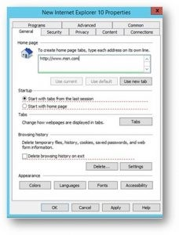

# Make Bing.com the default home page

This article explains how to set Bing.com as the default home page for Microsoft Edge, Google Chrome, and Internet Explorer browsers. 
  
 
## Microsoft Edge on Windows 10, Version 1511 or later

Users won't be able to change this once this policy is set. 

1. Open the Group Policy Management Console (gpmc.msc) and switch to editing any existing policy or creating a new one. 
1. Navigate to **Administrative Templates\Windows Components\Microsoft Edge**.    
1. Double-click **Configure Start pages**, set it to **Enabled**, and enter `https://www.bing.com/business`
1.  Enforce the resultant GPO by linking it to the appropriate domain.

  
## Google Chrome on Windows XP SP2 or later

The Windows Support article on managing ADMX files and the latest ADMX files for different versions of Windows can be found [on Microsoft Support](https://support.microsoft.com/help/3087759/how-to-create-and-manage-the-central-store-for-group-policy-administra).

You'll also need the latest Google policy file, which you can find on [Google Chrome Enterprise Help](https://support.google.com/chrome/a/answer/187202).
  
If the settings described in this section can't be found inside of GPMC, download the appropriate ADMX and copy them to the [central store](/previous-versions/windows/it-pro/windows-vista/cc748955%28v%3dws.10%29). Central store on the controller is a folder with the following naming convention:
  
 **%systemroot%\sysvol\\<domain\>\policies\PolicyDefinitions**
  
Each domain your controller handles should get a separate folder. The following command can be used to copy the ADMX file from the command prompt:
  
 `Copy <path_to_ADMX.ADMX> %systemroot%\sysvol\<domain>\policies\PolicyDefinitions`
  
1. Open the Group Policy Management Console (gpmc.msc) and switch to editing any existing policy or creating a new one.
1. Make sure the following folders appear in the **Administrative Templates** section of both *User/Computer Configuration*: Google Chrome and Google Chrome - Default Settings (users can override).
   - The settings of the first section are fixed and the local administrator won't be able to change them.
   - The settings of the latter section of policies can be changed by users in their browser settings.
   You should decide if users can override your default setting. In the following steps, change in the setting in the folder that corresponds to your organization policy and needs. The steps below use the Google Chrome - Default Settings as the default.

1. Navigate to **&lt;Computer/User Configuration&gt;\Administrative Templates\Google Chrome - Default Settings\Home Page**. 
1. Double-click **Use New Tab Page as homepage**, and set it to **Enabled**. 
1. Navigate to **&lt;Computer/User Configuration&gt;\Administrative Templates\Google Chrome - Default Settings\New Tab Page**. 
1. Double-click **Configure the New Tab Page URL**, set it to **Enabled**, and enter `https://www.bing.com/business?form=BFBSPR` 
1. Enforce the resultant GPO by linking it to the appropriate domain.

## Internet Explorer 5.0 or later
Users can still change the home page after this policy is set. 

1. Open the Group Policy Management Console (gpmc.msc) and switch to editing any existing policy or creating a new one.
    
2. Navigate to **User Configuration\Preferences\Control Panel Settings\Internet Settings**.
    
3. Right-click on **Internet Settings** and select **Internet Explorer 10**.
    
    > [!NOTE]
    > You need to select the option of Internet Explorer 10 to apply the settings for Internet Explorer 11 as the same settings apply to Internet Explorer 11. 
  
4. Settings which are underlined in red are not configured at the target machine, while settings underlined in green are configured at the target machine. To change the underlining, use the following function keys:
    
    F5 - Enable all settings on the current tab
    
    F6 - Enable the currently selected setting
    
    F7 - Disable the currently selected setting
    
    F8 - Disable all settings on the current tab
    
5. Press **F8** to disable all settings before configuring anything. The screen should look like this: 
    
    
  
6. Press **F6** on the Home page setting and enter `https://www.bing.com/business?form=BFBSPR`
    
7. Enforce the resultant GPO by linking it to the appropriate domain.