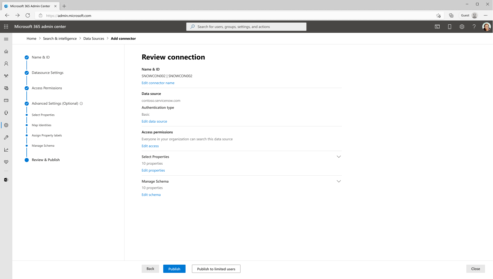
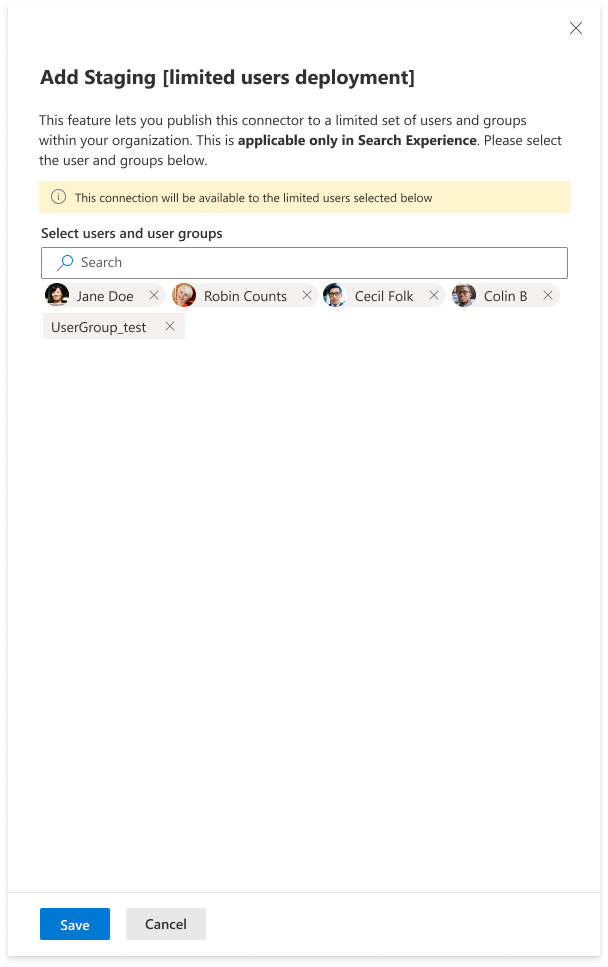
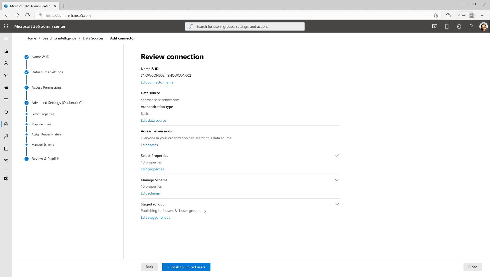
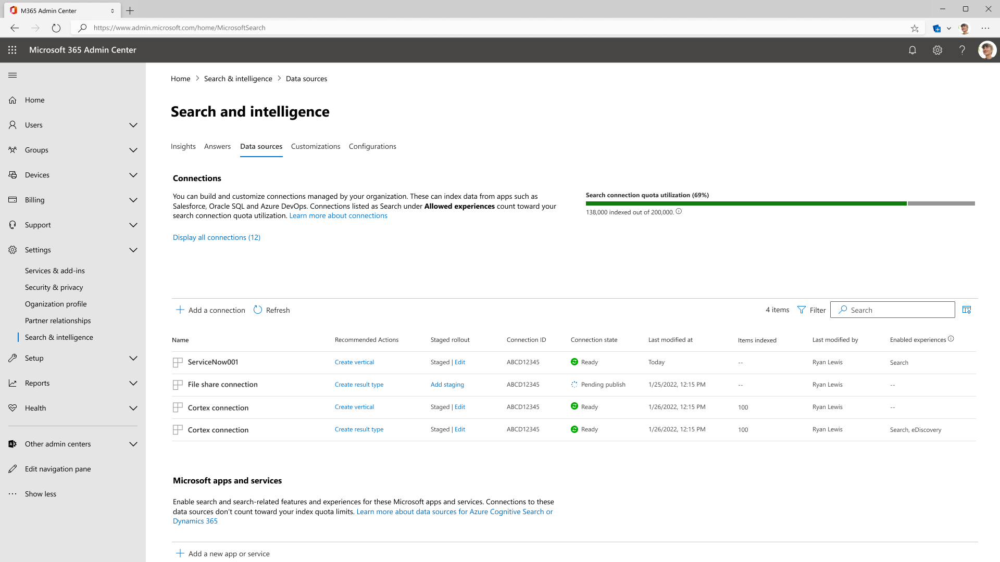
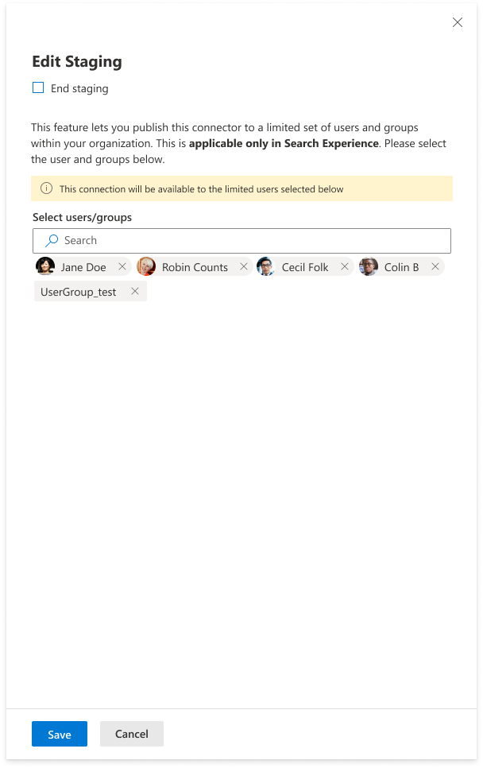

--- 
ms.date: 10/26/2023
title: "Staged rollout for Microsoft Graph connectors" 
ms.author: souravpoddar 
author: souravpoddar 
manager: srramam
audience: Admin
ms.audience: Admin 
ms.topic: article 
ms.service: mssearch 
ms.localizationpriority: medium 
search.appverid: 
- BFB160 
- MET150 
- MOE150 
description: "Use Stage Rollout to gradually roll out a Microsoft Graph connector to your users." 
---

# Staged rollout for Microsoft Graph connectors

Staged rollout is a feature that allows you to gradually introduce Microsoft Graph connectors to a select group of users in your production environment. 

Microsoft Graph connectors enable you to connect and index data from various external sources, such as ServiceNow, Salesforce, Azure Data Lake Storage, Jira Cloud, Confluence Cloud, and more. With Microsoft Graph connectors, you can enrich your Microsoft Search experience with relevant and diverse content from your organization.

> [!NOTE]
> For details about how to set up Microsoft Graph connectors, see [**Setup for your Microsoft Graph connector**](configure-connector.md).

This document guides you through the steps to apply staged rollout to a connection, monitor and modify the rollout, and remove the rollout if needed.

>[!IMPORTANT]
>You must be a Search Admin, Global Admin, or Search Editor to access this feature.

<!---## Steps to apply staged rollout to a connection-->
## Apply staged rollout to a connection

Go to the [Microsoft 365 admin center](https://admin.microsoft.com) and complete the following steps to apply a staged rollout to a Microsoft Graph connector.

### Step 1: Go to the Search & Intelligence portal

Choose **Show all** on the left panel and under **Settings**, select **Search & Intelligence**.

<!---If the above phrase does not apply, delete it and insert specific details for your data source that are different from general setup 
instructions.-->

### Step 2: Select the connection

Go to the **Data Sources** tab and select the connection that you want to apply staged rollout to. If you want to apply staging to a new connection, follow the [general setup instructions](./configure-connector.md) to create a connection.
<!---If the above phrase does not apply, delete it and insert specific details for your data source that are different from general setup 
instructions.-->

### Step 3: Configure the connection settings

After you configure all the connection settings, on the **Review & Publish** step, you see a new button **Publish to limited users**, which allows you to deploy the connector to a limited audience. Choose this button.

### Step 4: Add users or Microsoft 365 groups

Add the users or security groups to whom you want to give access to the connector. Currently, you can add up to **100 users and 15 Microsoft 365 groups**. For details, see [Overview of Microsoft 365 Groups for administrators](/microsoft-365/admin/create-groups/office-365-groups).

### Step 5: Review changes

After you add the list of users or groups for a given connection, choose **Save** to apply your changes. The portal shows you a confirmation screen with the list of users and groups included in the deployment.

### Step 6: Publish the connection

Choose **Publish to limited users** to complete the connection set-up.

The portal starts the staged rollout process. Depending on the size of your organization and the number of users selected, the rollout process might take some time. You can check the status on the **Display all connections** section in the **Data sources** tab. After the connection is published, only the users who are included in the rollout will be able to see the connector results (if they have access permissions) in Microsoft Search.

<!---If the above phrase does not apply, delete it and insert specific details for your data source that are different from general setup 
instructions.-->

## Modify or stop staged rollout

### Step 1: Go to the Data Sources tab

In the **Display all connections** section, you see a new column in the connection table named **Staged rollout**.

<!---If the above phrase does not apply, delete it and insert specific details for your data source that are different from general setup 
instructions.-->

### Step 2: Check the status in the Staged rollout column

Connections that are currently staged show the status **Staged** in the **Staged rollout** column.

### Step 3: Add or remove users
Choose **Edit** to add or remove users from the staged rollout.

### Stop the staged rollout
If you want to stop the staged rollout and you're ready to deploy the connection to the entire organization, in the **Staged rollout** column, choose **Edit**. On the **Staged rollout** settings panel, choose **End staging**.

In the confirmation modal, choose **End** to confirm the action. Note that when you end staging, the connection results start ***appearing to everyone in the organization or those who have access to the items***. This depends on the option you chose in the **Manage search permissions** section in the [connection creation flow](./configure-connector.md).

## Limitations

The staged rollout feature has the following limitations in the current release:

- You can only add up to 100 users and 15 Microsoft 365 groups to the staged rollout list.
- The rtaged rollout settings are currently only applicable to Search and Copilot experiences.

## Conclusion

Staged rollout is a powerful and flexible way to introduce Microsoft Graph connectors to your organization. It also reduces the risk of disrupting your existing search experience and allows you to fine-tune your connection settings before you roll it out to the entire organization. We hope you find this feature useful and valuable.

<!---Insert limitations for this data source-->

