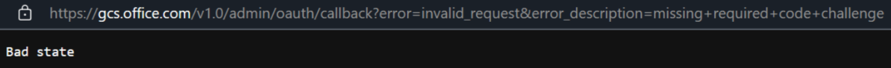
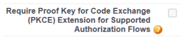
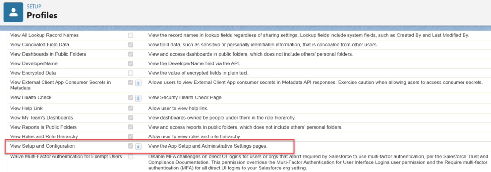

--- 
ms.date: 09/11/2024 
title: "Troubleshooting guide for Salesforce Microsoft Graph connector" 
ms.author: gladysa
author: gladysa
manager: brian.jackett 
audience: Admin 
ms.audience: Admin 
ms.topic: article 
ms.service: mssearch 
ms.localizationpriority: medium 
description: "Troubleshoot issues with the Salesforce Graph connector for Microsoft Search" 
--- 

# Troubleshooting guide for Salesforce Microsoft Graph connector 

### 1. **Bad state error while signing-in to create a connection**

This happens because the PKCE option is checked in your application, to fix this, please check this off in the app registration in Salesforce.

### 2. **OAuth app scope names have changed**
The name of the selected OAuth scopes changed to the following names: 

- Access and manage your data (api) is now = **Manage user data via APIs (api)**

- Perform requests on your behalf at any time (refresh_token, offline_access) is now = **Perform requests at any time**

### 3. **Insufficient permissions. Please make sure that the user’s profile is given “View setup and configuration” permission, API is enabled for Org and Profile”**
Review the setup of the user profile configured. The "View Setup and Configuration” must be checked.
 

To get more information on the types of errors, go to the **error details** page after selecting the connection. Select the **error code** to see more detailed errors. Also refer to [Monitor your connections](./manage-connector.md) to learn more.