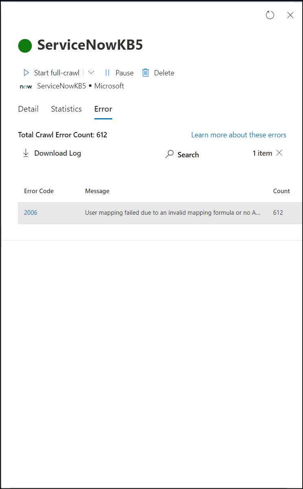
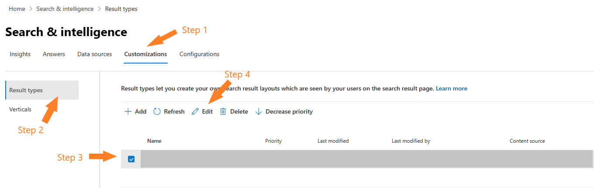
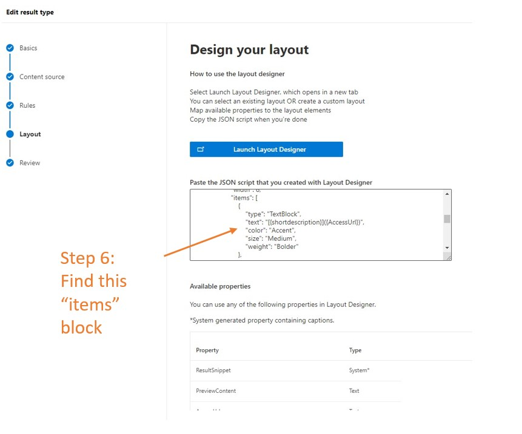

# Troubleshooting the ServiceNow Knowledge Microsoft Graph connector

The following common errors are observed while configuring the connector, or during crawling and their possible reasons.

### 1. Not able to find ServiceNow Knowledge articles in Microsoft 365 Copilot or Microsoft Search.
   

(Click to expand) Follow the troubleshooting steps to identify the root cause.
 

1. Check if the user searching for the article has the required permissions to access the ServiceNow Knowledge articles. You can do that by using the [User criteria diagnostics](https://docs.servicenow.com/bundle/washingtondc-servicenow-platform/page/product/knowledge-management/concept/diagnose-knowledge-user-criteria.html) tool in ServiceNow.

2. Check if the user is correctly mapped to a Microsoft Entra identity. Mapping issues usually show up as a '2006' error in the Error tab. Check the user mapping formula and if needed, change the mapping method. 

   

3. Check if there's an Advanced script in any of the user criteria granting access to the article. (Note: Advanced scripts aren't supported in the current version of the ServiceNow Knowledge Microsoft Graph connector.)
    1. If there's an Advanced script configured in any of the '_Cannot Read_' user criteria in the knowledge base level, all articles in the knowledge base are stamped with deny access in the indexed data.

    2. If there's an Advanced script configured in any of the '_Cannot Read_' user criteria in the article level, the article is stamped with deny access in the indexed data.

4. Check if there's an empty criterion present at the knowledge base level - '_Cannot Read_', "_Cannot Contribute_'. Also, check if there's an empty criterion at the article level - '_Cannot Read_'. Empty criteria is a user criterion with empty fields. If there's an empty criterion present, the article is stamped with deny access in the indexed data.

5. If you're still not able to identify the root cause, reach out to [the Microsoft Graph connector support team](mailto:MicrosoftGraphConnectorsFeedback@service.microsoft.com) with the following details.
    1. Tenant ID
    2. Connection ID
    3. Article Sys ID
    4. Knowledge base Sys ID
    5. For the knowledge base collect:
        1. List of user criteria sys_id available in the kb_uc_can_read_mtom (Who Can Read Knowledge Base) table
        2. List of user criteria sys_id available in the kb_uc_cannot_read_mtom (Who Cannot Read Knowledge Base) table
        3. List of user criteria sys_id available in the kb_uc_cannot_contribute_mtom (Who Cannot Contribute To Knowledge Base) table
        4. List of user criteria sys_id available in the kb_uc_can_contribute_mtom 
    6. Also, for the Item sys_id collected in step 3, share:
        1. List of user criteria sys_id in the can_read_user_criteria field of the article
        2. List of user criteria sys_id in the cannot_read_user_criteria field of the article

### 2. Unable to log in due to single sign-on enabled ServiceNow instance
    
If your organization uses single sign-on (SSO) to ServiceNow, you may have trouble logging in with the service account. You can bring up a username and password-based login by adding <em> `login.do`</em> to the ServiceNow instance URL. Example. `https://<your-organization-domain>.service-now.com./login.do`

### 3. Unauthorized or forbidden response to API request

(Click to expand) Follow the steps to troubleshoot this issue.
 

1. **Check table access permissions:** If you see a forbidden or unauthorized response in connection status, check if the service account has the required access to the tables mentioned in [Step 2: Data Source Settings](/MicrosoftSearch/servicenow-knowledge-connector/#2-data-source-settings). Check whether the service account has 'read' access to all the tables in the column.

2. **Change in account password:** The ServiceNow Knowledge Microsoft Graph connector uses an access token fetched on behalf of the service account for the crawl. The access token refreshes every 12 hours. Ensure that the service account password isn't changed after publishing the connection. You may need to reauthenticate the connection if there's a change in the password.

3. **Check if the ServiceNow instance is behind a firewall:** The ServiceNow Knowledge Microsoft Graph connector may not be able to reach your ServiceNow instance if it is behind a network firewall. You need to explicitly allow access to the connector service. You can find the public IP address range of the connector service in this table. Based on your tenant region, add it to your ServiceNow instance network allowlist.

   **Environment** | **Region** | **Range**
   --- | --- | ---
   PROD | North America | 52.250.92.252/30, 52.224.250.216/30
   PROD | Europe | 20.54.41.208/30, 51.105.159.88/30
   PROD | Asia Pacific | 52.139.188.212/30, 20.43.146.44/30

4. **Access permissions not working as expected:** If you observe discrepancies in access permissions applied to Microsoft Search or Microsoft 365 Copilot results, check if the user searching for the article has the required permissions to access the ServiceNow Knowledge articles. You can do that by using the [User criteria diagnostics](https://docs.servicenow.com/bundle/washingtondc-servicenow-platform/page/product/knowledge-management/concept/diagnose-knowledge-user-criteria.html) tool in ServiceNow.

### 4. To view URL of the knowledge article, change it in the support portal

(Click to expand) Follow the steps to change the URL of the knowledge article.
 

The ServiceNow Knowledge Microsoft Graph connector computes the AccessUrl property using sys_id in the `<instance_url>/kb_view.do?sys_kb_id<sysId>` format. It opens the knowledge article in the backend system view. If you prefer redirecting the article to a different URL, follow these instructions.
1. In the customization tab in the *Search & Intelligence* section of the Microsoft 365 admin center, navigate to edit the result type configured for your ServiceNow Knowledge connection.

   When the 'Edit result type' dialog opens, click on **Edit** next to the result layout section. 

2. Find the items block containing text property with `shortDescription` and `AccessUrl` values.

   

3. Edit AccessUrl property
To change the destination URL, edit the `AccessUrl` part of the text property in the items block. For example, if a ServiceNow Knowledge article should be redirected to `https://contoso.service-now.com/sp` where `sp` is the service URL portal prefix, follow these steps.

   Original value|New value
   |:--- |:---|
   |`"[{shortdescription}]({AccessUrl})"` | `"[{shortdescription}](https://contoso.service-now.com/sp?id=kb_article_view&sysparm_article={number})"`

   Where `number` is the knowledge article number property. It should be marked as *retrieve* in the Manage Schema screen during connection creation.

4. Finish reviewing your result type updates and hit **Submit**. Give it a minute or two to pick up the changes. Your search results should now redirect to the desired URLs.

### 5. Issues with '_Only people with access to this data source_' permission

If you see differences in the user criteria validation between ServiceNow and Microsoft Search or Microsoft 365 Copilot, set `glide.knowman.block_access_with_no_user_criteria` system property to `no`.

If you have any other issues or want to provide feedback, write to us [aka.ms/TalkToGraphConnectors](https://aka.ms/TalkToGraphConnectors).

