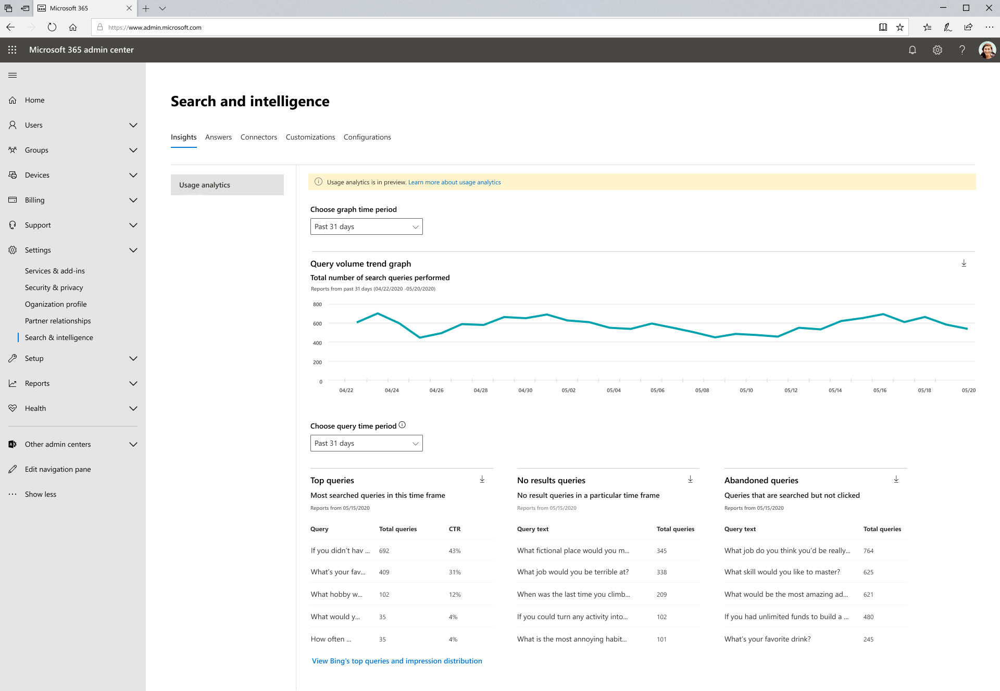

# Microsoft Search Usage Reports

Search usage reports enable you to gain more understanding of how search is functioning in your organization. The insights generated from these reports will help you take actions that will make search a more useful and delightful experience for your users.

> [!IMPORTANT]
> Microsoft Search usage reports are currently in preview

The [Microsoft Search usage reports](https://admin.microsoft.com/Adminportal/Home?#/MicrosoftSearch/insights) include graphs and tables generated from searches that are executed from SharePoint Home (the site with URL ending in /SharePoint.aspx), Office.com, and Microsoft Search in Bing search boxes. You can see data from the past 31 days, per day, or monthly for the previous year. These reports are just rolling out so it will take time to accrue the historical data.

> [!div class="mx-imgBorder"]
> 

## Overview of search reports

| Report | Description |
|:-----|:-----|
|Query Volume|This report shows the number of search queries performed. Use this report to identify search query volume trends and to determine periods of high and low search activity.|
|Top Queries|This report shows the most popular search queries. A query is added to this report when it is searched at least three times with a click on a result. Use this report to understand what types of information your users are searching for.|
|Abandoned Queries|This report shows popular search queries that receive low click-through. Use this report to identify search queries that might create user dissatisfaction and to improve the discoverability of content. You can then determine if creating an answer, like a Bookmark, or ingesting new content through a Graph connector is the right action.|
|No Results Queries|This report shows popular search queries that returned no results. Use this report to identify search queries that might create user dissatisfaction and to improve the discoverability of content. You can then determine if creating an answer, like a Bookmark, or ingesting new content through a Graph connector is the right action.|

>[!NOTE]
>There is currently a known issue where queries satisfied by an answer like a Bookmark are counted as an abandoned query.

## Viewing reports

When you navigate to the usage reports page, all the reports are available to view. You can use the date filter to pick a specific day or month to view.

Downloading a report will allow you to see reports from a broader range of time. Click on the download arrow and select **past 31 days** or **past 12 months**. The report downloads as an Excel spreadsheet. If you selected past 31 days, the spreadsheet will have an individual tab for each day. The past 12 months download will have a tab for each month.

## Frequently asked questions

**When I select past 31 days or past 12 months, why do I then have to choose a specific day or specific month.**

The calendar view, today, in Microsoft search usage reports is a two-step process. First select the date range from the dropdown (past 31 days or past 12 months) and then select the start day or month.

The top, abandoned, and failed query tables show results from either the day or the month you choose.

**When will I see aggregate data for past 7 days, past 30 days, and so on...?**

We are considering this type of aggregation and simplifying the data range filtering for future versions of these reports.

**Why can’t I see a breakdown of usage reports by different apps (sources)?**

Currently, filtering by source is not available. The reports combine searches from SharePoint Home and Office.com. Our next release will include source filtering so you can see metrics specific to each application.

**What other filtering for usage reports is coming?**

We're working on more filters that will help make sense of search usage at a more granular level of your organization. For example, you will be able to see query volume for a specific geography or department.
